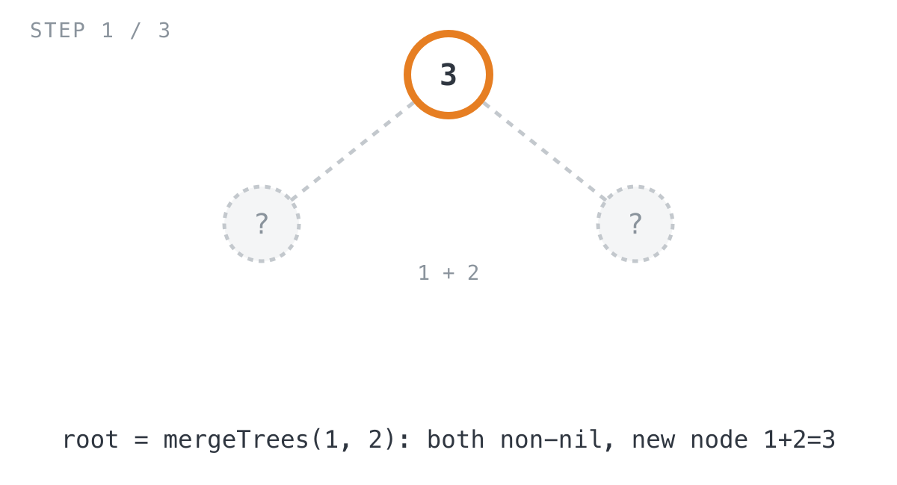
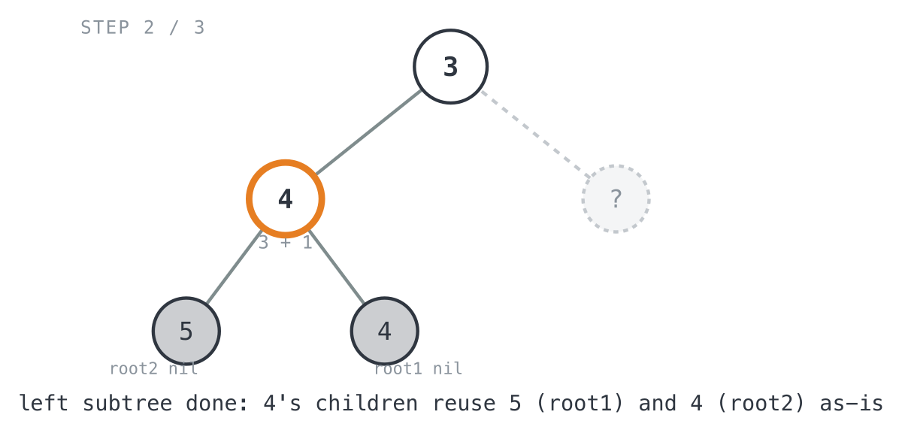
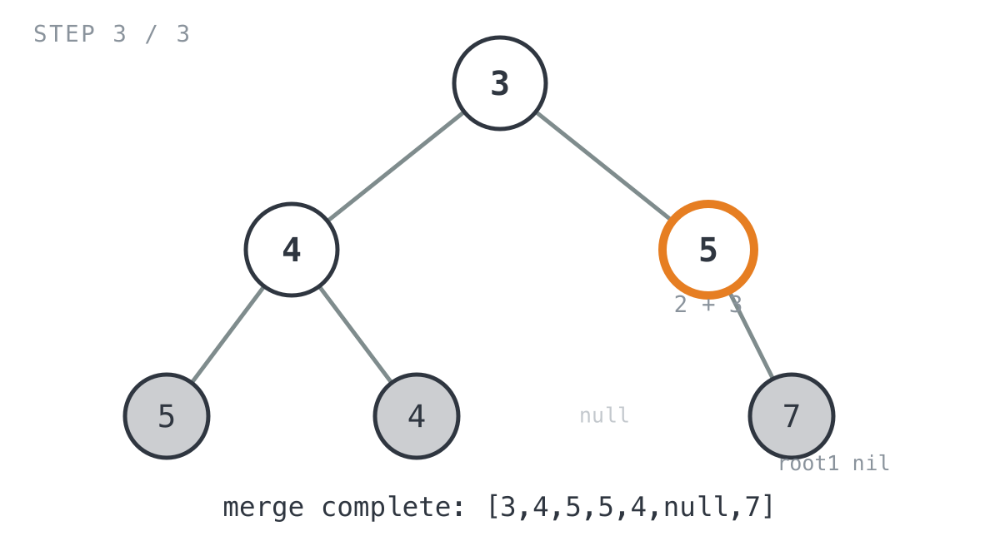

## 365 Days of LeetCode Challenge — Day 15/365

# Merge Two Binary Trees

🔗 https://leetcode.com/problems/merge-two-binary-trees/ · Difficulty: Easy

### The problem

You get two binary trees, `root1` and `root2`, and overlay one on top of the other.
Wherever both trees have a node at the same position, the merged tree's value there is
the sum of the two. Wherever only one tree has a node, you just take that one as-is.
Return the merged tree.

### The intuition

The actual combine step is nothing: add two numbers. The part that takes a second to
reason through is what happens when one side of the merge is empty.

At every pair of positions `(root1, root2)`, there are three things that can happen.
Both nodes exist, so the merged value is their sum and both children still need
merging one level down. Only `root1` exists, so there's nothing to add and the merged
subtree from here on is just `root1`. Only `root2` exists, same thing in reverse.

The part I like about this one: a nil subtree just loses to whatever the other tree has
at that spot. You don't copy anything for the non-overlapping bits, you hand back the
existing subtree from whichever side is real and let it get reused straight into the
result. New nodes only get built where both trees actually overlap and their values
need adding.

The recursion runs in preorder: settle the current node's value first, so the merged
parent exists before its children get attached, then recurse into the left pair and
the right pair to build those subtrees, then wire the results in as `Left`/`Right`.

### The solution


```go
func mergeTrees(root1 *TreeNode, root2 *TreeNode) *TreeNode {
	// If one side is missing at this position, the merged subtree is just
	// whatever the other tree already has here — reused as-is, no new nodes.
	if root1 == nil {
		return root2
	}
	if root2 == nil {
		return root1
	}
	// Both nodes exist: this is the only case where a new node is allocated,
	// and its value is simply the sum of the two overlapping values.
	root := &TreeNode{Val: root1.Val + root2.Val}
	// Recurse in preorder so the merged parent exists before its children
	// are attached; each recursive call resolves to either a brand new
	// summed node or a reused subtree from whichever side is non-nil.
	root.Left = mergeTrees(root1.Left, root2.Left)
	root.Right = mergeTrees(root1.Right, root2.Right)
	return root
}
```

Tracing it through `root1 = [1,3,2,5]`, `root2 = [2,1,3,null,4,null,7]` (expected
`[3,4,5,5,4,null,7]`):

- `mergeTrees(1, 2)`: both non-nil, so a new node `1+2 = 3`. Its children aren't
  merged yet.

  

  - `root.Left = mergeTrees(3, 1)`: both non-nil, new node `3+1 = 4`. Its own
    children come straight from base cases: `mergeTrees(5, nil)` hands back root1's
    `5` untouched, and `mergeTrees(nil, 4)` hands back root2's `4` untouched.

    

  - `root.Right = mergeTrees(2, 3)`: both non-nil, new node `2+3 = 5`. Left child
    comes from `mergeTrees(nil, nil)`, which is just nil, so no left child at all.
    Right child comes from `mergeTrees(nil, 7)`, root2's `7` untouched.

    

- Back at the root, `root.Left = 4` and `root.Right = 5` get wired in, giving the
  final merged tree `[3,4,5,5,4,null,7]`, which matches what's expected.

**Complexity:** O(min(m, n)) time and space, where `m` and `n` are the node counts of
the two input trees. The recursion only goes as deep as both trees still have a node
at that position; the moment either side hits `nil`, that branch stops right there, no
matter how much tree is still sitting on the other side.

Full code: `easy_problems/601_700/merge_two_binary_trees/` in the repo.

#DSA #LeetCode #100DaysOfCode #BinaryTree #Recursion #Golang #CodingInterview #Algorithms

---

*Solution and code by Archit Agarwal. Write-up drafted with AI assistance from the code and problem statement.*
