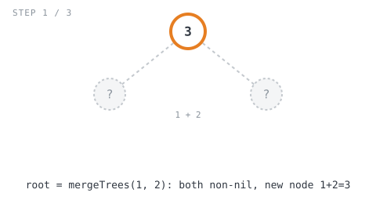
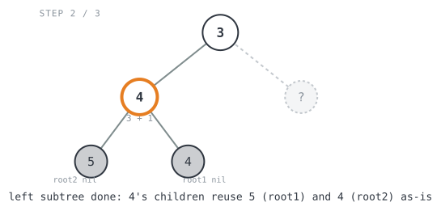
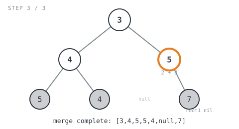

## Solution walkthrough

The implementation is `mergeTrees(root1 *TreeNode, root2 *TreeNode) *TreeNode` in
`main.go`.

We'll trace it on the example above: `root1 = [1,3,2,5]`, `root2 = [2,1,3,null,4,null,7]`,
expected output `[3,4,5,5,4,null,7]`.

1. **Base case: `root1` is nil.** `if root1 == nil { return root2 }` — if the first
   tree has nothing here, the merged subtree is just whatever the second tree has,
   used as-is (no copying, no new nodes).

2. **Base case: `root2` is nil.** `if root2 == nil { return root1 }` — the symmetric
   case: if the second tree has nothing here, hand back the first tree's subtree
   unchanged.

3. **Both nodes exist: create the merged node.**
   `root := &TreeNode{Val: root1.Val + root2.Val}` — this is the only place a brand
   new node gets allocated, and it only happens where both trees actually overlap.

4. **Recurse into the left pair.** `root.Left = mergeTrees(root1.Left, root2.Left)`
   builds the merged left subtree the same way, one level down, and wires it directly
   into the new node.

5. **Recurse into the right pair.** `root.Right = mergeTrees(root1.Right, root2.Right)`
   — same idea for the right subtree.

6. **Return the merged node.** `return root` — bubbles the freshly built (or reused)
   subtree back up to the caller.

Walking it through `root1 = [1,3,2,5]`, `root2 = [2,1,3,null,4,null,7]`:

- `mergeTrees(1, 2)`: both non-nil → new node `1+2 = 3`. Its children aren't merged
  yet.

  

  - `root.Left = mergeTrees(3, 1)`: both non-nil → new node `3+1 = 4`.
    - `mergeTrees(5, nil)`: `root2` is nil → returns `root1`'s subtree, `5`, untouched.
    - `mergeTrees(nil, 4)`: `root1` is nil → returns `root2`'s subtree, `4`, untouched.
    - Node `4`'s children are wired in: left `5`, right `4`.

    

  - `root.Right = mergeTrees(2, 3)`: both non-nil → new node `2+3 = 5`.
    - `mergeTrees(nil, nil)`: `root1` is nil → returns `root2`'s subtree, which is
      also `nil` — no left child on the merged node.
    - `mergeTrees(nil, 7)`: `root1` is nil → returns `root2`'s subtree, `7`,
      untouched.
    - Node `5`'s children are wired in: left `nil`, right `7`.

    

- Back at the root, `root.Left = 4` (with children `5`, `4`) and `root.Right = 5`
  (with children `nil`, `7`) are both wired in, giving the final merged tree
  `[3,4,5,5,4,null,7]`. ✓

**Complexity:** O(min(m, n)) time and space, where `m` and `n` are the node counts of
the two input trees — recursion only descends as far as *both* trees still have a node
at that position; once either side is `nil`, that branch returns immediately.
