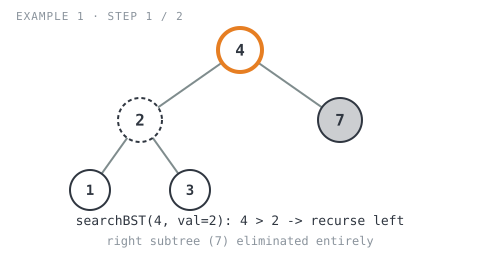
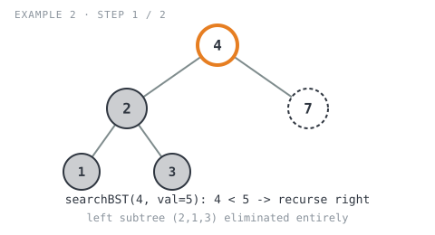
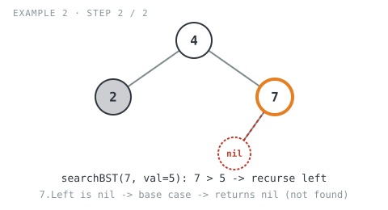

## 365 Days of LeetCode Challenge — Day 19/365

# Search in a Binary Search Tree

🔗 https://leetcode.com/problems/search-in-a-binary-search-tree/ · Difficulty: Easy

### The problem

Given the `root` of a binary search tree (BST) and an integer `val`, find the node whose
value equals `val` and return the subtree rooted at that node. If no such node exists,
return `null`.

### The intuition

A binary search tree already tells you which way to go — that's the entire point of the
"search" property. At every node, comparing the target `val` against `root.Val` doesn't
just say "match or no match," it says "the value you want, if it exists, can only live
in one specific subtree."

- If `root.Val > val`, everything in the right subtree is even bigger than `root.Val`,
  so it's automatically too big too. The only place `val` could still be hiding is the
  **left** subtree.
- If `root.Val < val`, symmetrically, `val` can only be hiding in the **right** subtree.
- If neither is true, they're equal — the node has been found, and since the problem
  asks for the *subtree* rooted there (not just a boolean), returning the node itself is
  enough; its `Left`/`Right` pointers already carry the rest of that subtree with it.

This is what makes BST search different from searching a plain binary tree: no need to
check both children, no backtracking. Each comparison eliminates an entire half of the
remaining tree, so the recursion always walks a single root-to-node path.

### The solution

```go
func searchBST(root *TreeNode, val int) *TreeNode {
	// Ran off the tree without finding val.
	if root == nil {
		return nil
	}
	// BST property: everything in root.Right is >= root.Val, so if root.Val
	// is already too big, val (if present) can only live in the left subtree.
	// The right subtree is ruled out without ever visiting it.
	if root.Val > val {
		return searchBST(root.Left, val)
	}
	// Mirror image: root.Val is too small, so only the right subtree is
	// still worth checking.
	if root.Val < val {
		return searchBST(root.Right, val)
	}
	// Neither comparison fired, so root.Val == val. Return root itself (not
	// just a bool) so its Left/Right pointers carry the whole subtree along,
	// which is what the problem asks for.
	return root
}
```

**Example 1 — value found**


```
Input: root = [4,2,7,1,3], val = 2
Output: [2,1,3]
```

- `searchBST(4, val=2)`: `4 > 2` → recurse left into `2`. The right subtree (`7`) is
  eliminated in this single comparison, never even visited.

  

- `searchBST(2, val=2)`: `2 == 2` → `return root` hands back node `2` with its `Left`
  (`1`) and `Right` (`3`) still attached — the expected `[2,1,3]`.

  ![Step 2: at node 2, match found, returns subtree [2,1,3]](images/walkthrough-2.svg)

**Example 2 — value not found**


```
Input: root = [4,2,7,1,3], val = 5
Output: []
```

- `searchBST(4, val=5)`: `4 < 5` → recurse right into `7`. This time the *left* subtree
  (`2,1,3`) is the one eliminated.

  

- `searchBST(7, val=5)`: `7 > 5` → recurse left into `7.Left`, which is `nil`. That call
  hits the base case immediately and returns `nil`, which propagates straight back up as
  the final answer.

  

Both traces show the same shape: one comparison per level, one subtree eliminated per
comparison, no branch ever explored twice.

**Complexity:** O(h) time and O(h) space, where h is the tree's height — O(log n) for a
balanced BST, O(n) for a completely skewed one.

Full code: `easy_problems/601_700/search_in_a_binary_search_tree/` in the repo.
