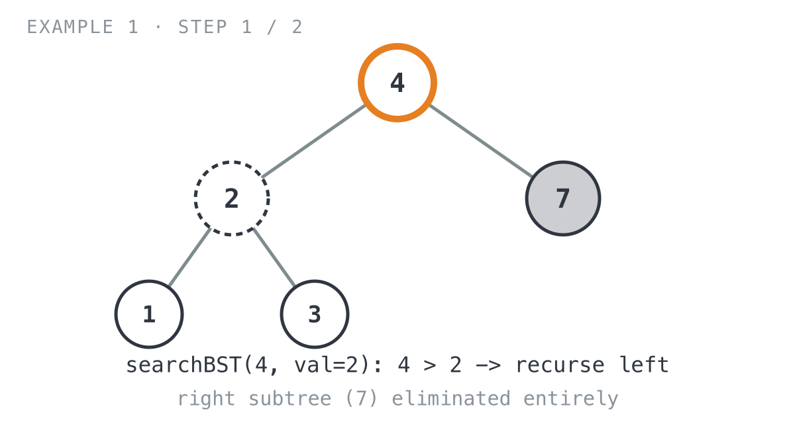
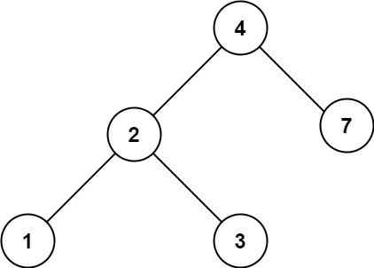
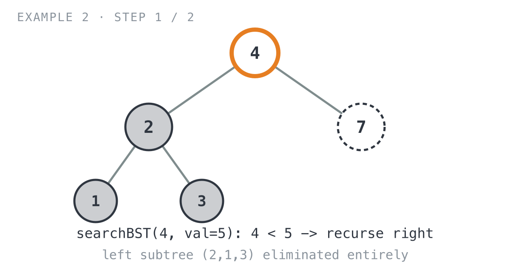
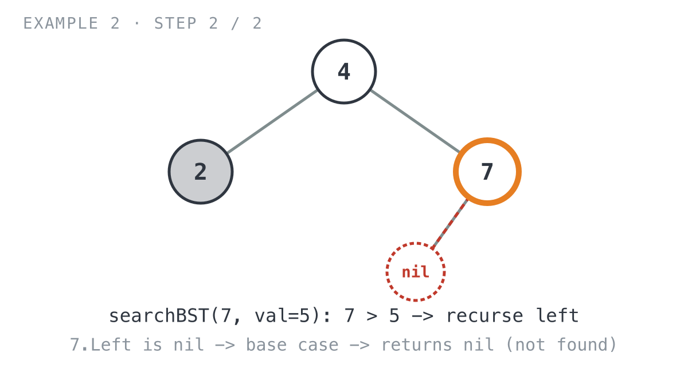

## 365 Days of LeetCode Challenge — Day 26/365

# Search in a Binary Search Tree

🔗 https://leetcode.com/problems/search-in-a-binary-search-tree/ · Difficulty: Easy

### The problem

Given the `root` of a binary search tree (BST) and an integer `val`, find the node whose
value equals `val` and return the subtree rooted at that node. If no such node exists,
return `null`.

### The intuition

A binary search tree tells you where to look before you even ask. Compare `val` against
`root.Val` and you learn, in one step, which entire subtree can possibly hold the answer
and which one is a waste of time to visit. I like this problem as a warm-up for exactly
that reason: it's about as clean a demonstration as you'll find of one comparison
throwing away half your search space.

Say `root.Val` is bigger than `val`. Everything in the right subtree is even bigger than
`root.Val` already, so `val` has no way of being over there. Only the left subtree is
still worth checking. Flip the comparison and the same logic runs in reverse: if
`root.Val` is smaller, only the right side matters. And if neither holds, you're
standing on the match itself. The problem asks for the whole subtree rooted at that
node, not a yes-or-no answer, so returning `root` as-is is enough — its `Left` and
`Right` pointers are already carrying everything below it.

Compare that to a plain binary tree, where you'd have to check both children at every
node because nothing rules either one out ahead of time. Here the recursion just walks a
straight line down from the root to wherever `val` lives, or down to `nil` if it never
shows up. No branching, no backtracking, no wasted visits.

### The solution

```go
func searchBST(root *TreeNode, val int) *TreeNode {
	// Ran off the tree without finding val.
	if root == nil {
		return nil
	}
	// BST property: everything in root.Right is >= root.Val, so if root.Val
	// is already too big, val (if present) can only live in the left subtree.
	// The right subtree is ruled out without ever visiting it.
	if root.Val > val {
		return searchBST(root.Left, val)
	}
	// Mirror image: root.Val is too small, so only the right subtree is
	// still worth checking.
	if root.Val < val {
		return searchBST(root.Right, val)
	}
	// Neither comparison fired, so root.Val == val. Return root itself (not
	// just a bool) so its Left/Right pointers carry the whole subtree along,
	// which is what the problem asks for.
	return root
}
```

**Example 1: value found**


```
Input: root = [4,2,7,1,3], val = 2
Output: [2,1,3]
```

- `searchBST(4, val=2)`: `4 > 2` → recurse left into `2`. The right subtree (`7`) is
  eliminated in this single comparison, never even visited.

  

- `searchBST(2, val=2)`: `2 == 2` → `return root` hands back node `2` with its `Left`
  (`1`) and `Right` (`3`) still attached, giving the expected `[2,1,3]`.

  ![Step 2: at node 2, match found, returns subtree [2,1,3]](images/walkthrough-2.png)

**Example 2: value not found**



```
Input: root = [4,2,7,1,3], val = 5
Output: []
```

- `searchBST(4, val=5)`: `4 < 5` → recurse right into `7`. This time the *left* subtree
  (`2,1,3`) is the one eliminated.

  

- `searchBST(7, val=5)`: `7 > 5` → recurse left into `7.Left`, which is `nil`. That call
  hits the base case immediately and returns `nil`, which propagates straight back up as
  the final answer.

  

Both traces have the same shape: one comparison per level, one subtree thrown away per
comparison, nothing ever revisited. That's the part I find satisfying about tracing it by
hand: whichever way you turn at each node, you're guaranteed to be cutting your work in
half.

**Complexity:** O(h) time and O(h) space, where h is the tree's height. For a balanced
BST that's O(log n); a completely skewed tree degrades to O(n).

Full code and the step-by-step walkthrough:
[search_in_a_binary_search_tree](https://github.com/architagr/leetcode_solutions/blob/main/easy_problems/601_700/search_in_a_binary_search_tree/SOLUTION.md)

#DSA #LeetCode #100DaysOfCode #CodingInterview #BinarySearchTree #Golang #Algorithms

---

*Solution and code by Archit Agarwal. Write-up drafted with AI assistance from the code and problem statement.*
