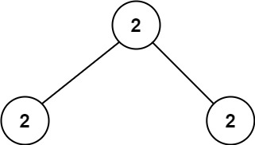
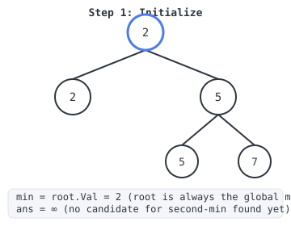
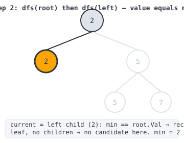
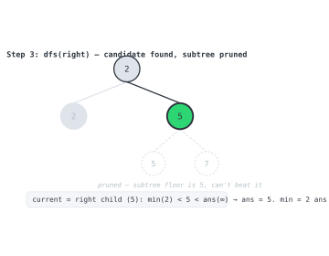
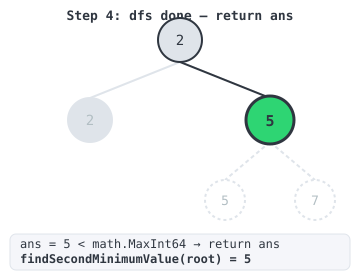

# 365 Days of LeetCode Challenge — Day 18/365

## Second Minimum Node In a Binary Tree (Easy)

🔗 https://leetcode.com/problems/second-minimum-node-in-a-binary-tree/

---

### The problem

You're given a non-empty binary tree with an odd shape rule baked in: every node has
either **zero** or **two** children, and whenever a node has two children, its own value
is the smaller of its two children's values:

```
root.val = min(root.left.val, root.right.val)
```

Given a tree like this, find the **second smallest distinct value** among all the node
values in the tree. If no such value exists, return `-1`.

Two examples from the problem statement:


```
Input: root = [2,2,5,null,null,5,7]
Output: 5
Explanation: The smallest value is 2, the second smallest value is 5.
```



```
Input: root = [2,2,2]
Output: -1
Explanation: The smallest value is 2, but there isn't any second smallest value.
```

---

### The intuition

My first instinct was the boring one: throw every value into a set, sort it, take the
second element. That works fine. But the problem statement is handing you something for
free here, and ignoring it feels wasteful. The rule is `root.val = min(root.left.val,
root.right.val)` for every node with two children, and once you sit with what that
actually implies, a much cheaper solution falls out.

First, the root is always the global minimum. Every parent's value is the smaller of its
two children's, so the smallest value in the whole tree can't be buried somewhere deep,
it has to bubble all the way up to the root. `root.Val` is the minimum, full stop, no
search required.

Second, and this is the part that actually matters: the same logic applies to any
subtree. Whatever value sits at a subtree's root is also the smallest value anywhere
inside that subtree. Values never shrink as you go down, only stay flat or grow.

That second fact is what makes pruning possible. Walk the tree, and the moment you land
on a node whose value is strictly bigger than the known minimum, two things are true at
once: this node's value is a real candidate for the second-minimum answer, and nothing
below it can ever beat that candidate, because the subtree's floor is this node's own
value. So you record the candidate and stop. No reason to walk into that branch.

The only reason to keep going deeper is when the current node's value still equals the
global minimum. That means the tree hasn't branched away from the minimum yet, so the
second-minimum value, if it exists, is still hiding further down.

Complexity-wise this is O(n) in the worst case (picture a tree where only one deep leaf
differs from the minimum, you still have to walk all the way down to find it), and O(h)
space for the recursion stack, where h is the tree's height. No set, no sort, nothing
extra stored.

---

### The actual code

```go
var (
	ans int // best candidate found so far for the second-minimum value; math.MaxInt64 means "none yet"
	min int // global minimum value in the tree; by the tree's invariant this always equals root.Val
)

func dfs(root *TreeNode) {
	if root == nil {
		return
	}
	if min < root.Val && root.Val < ans {
		// root.Val is strictly between the known min and our best candidate so far,
		// so it's a new best candidate. Because root.val = min(left.val, right.val)
		// holds throughout the tree, this node's value is also the minimum of its
		// entire subtree, so nothing further down can beat this candidate — prune
		// by not recursing into root.Left/root.Right.
		ans = root.Val
	} else if min == root.Val {
		// Haven't branched away from the global minimum yet: the second-minimum
		// value, if any, must be further down, so keep searching both children.
		dfs(root.Left)
		dfs(root.Right)
	}
	// else: root.Val >= ans already, so this subtree can't improve ans either — dead end.
}

func findSecondMinimumValue(root *TreeNode) int {
	min = root.Val   // the tree invariant guarantees the root always holds the global minimum
	ans = math.MaxInt64 // sentinel: no second-minimum candidate found yet
	dfs(root)
	if ans < math.MaxInt64 {
		return ans
	}
	return -1 // every value in the tree equals min, so there is no second minimum
}
```

Two package-level variables, `min` and `ans`, carry state across recursive calls instead
of threading it through return values. Not the prettiest pattern on its own, but it keeps
`dfs` down to one job.

### Tracing it against Example 1

`root = [2,2,5,null,null,5,7]` looks like this:

```
        2
       / \
      2   5
         / \
        5   7
```

Step 1: initialize. `min` gets pinned to `root.Val`, which is 2. `ans` starts at
infinity, meaning no candidate yet.



Step 2: `dfs(root)`, then the left child. At the root, `root.Val` (2) equals `min`, so we
skip the `if` and take the `else if`, recursing into both children. The left child is
also 2, same story, recurse again. It's a leaf though, so both of its recursive calls
just hit the `nil` base case and do nothing.



Step 3: the right child, value 5. This is the part I like. Back at the root we visit the
right child, value 5, and now `min < root.Val && root.Val < ans` holds (2 < 5 < ∞), so
`ans = 5`. Notice this branch does not recurse into its own children, the 5 and 7 sitting
underneath it. That's the pruning, and it's the whole reason this beats sorting
everything.



Step 4: unwind and return. Nothing left on the stack, so control returns to
`findSecondMinimumValue`. `ans` is 5, less than the sentinel, so the function returns 5,
matching the expected output.



### Why Example 2 returns -1

For `root = [2,2,2]`, every node has value 2, so `min` matches at every step. `dfs` never
leaves the `else if` branch, it just recurses to the leaves without ever tripping
`min < root.Val < ans`. `ans` sits untouched at `math.MaxInt64`, so
`findSecondMinimumValue` falls through to `-1`.

---

### Takeaway

What I like about this problem is that the invariant isn't flavor text, it's the whole
algorithm. `root.val = min(root.left.val, root.right.val)` looks like a throwaway
constraint until you realize it hands you two free facts: the root is the global
minimum, and a subtree's minimum equals its own root. Those two facts are enough to turn
collect-everything-and-sort into a single DFS pass with early termination. Next time a
problem statement includes a weird structural rule like this one, it's worth asking what
it lets you skip, not just what it guarantees.

#DSA #LeetCode #100DaysOfCode #BinaryTree #DFS #Golang #CodingInterview

---

*Solution and code by Archit Agarwal. Write-up drafted with AI assistance from the code and problem statement.*
