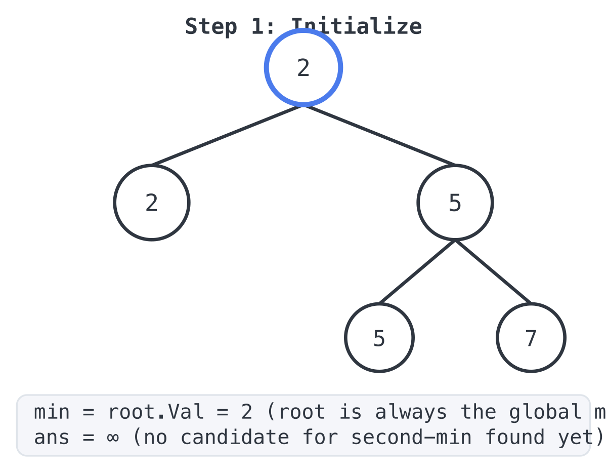
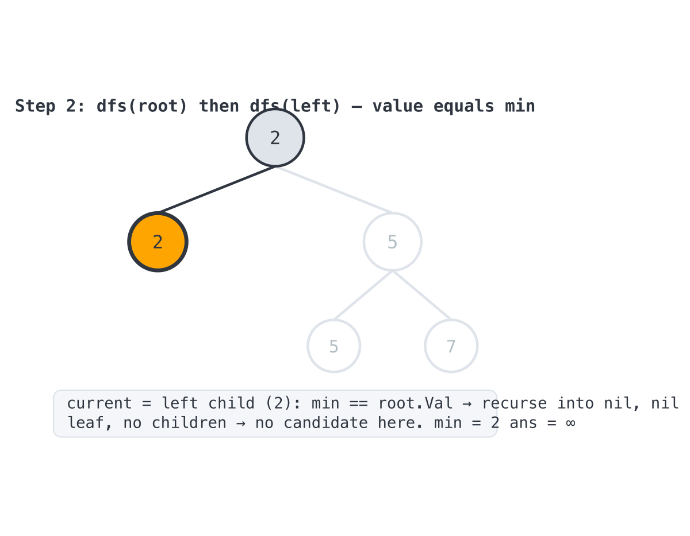
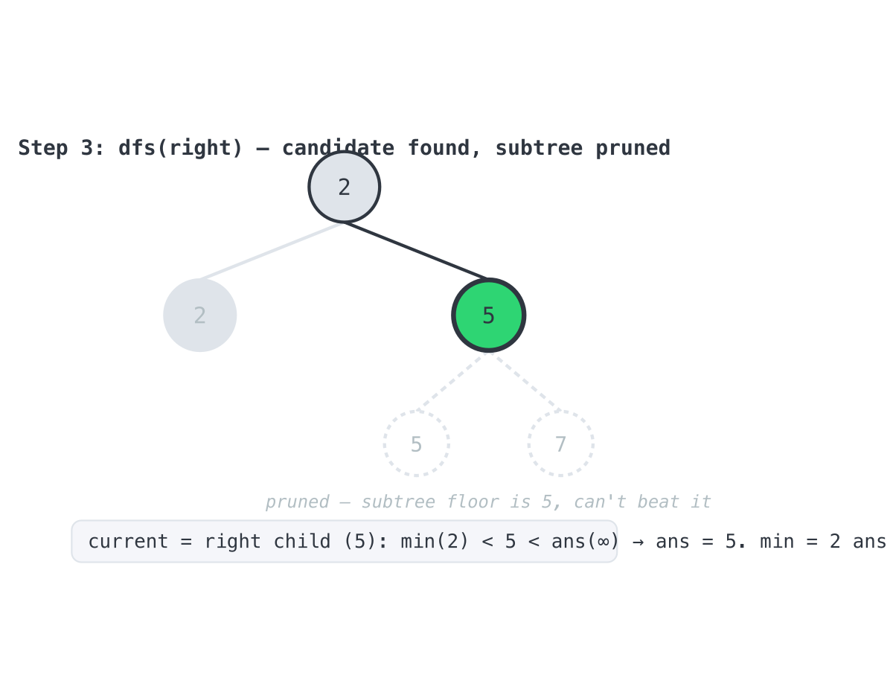
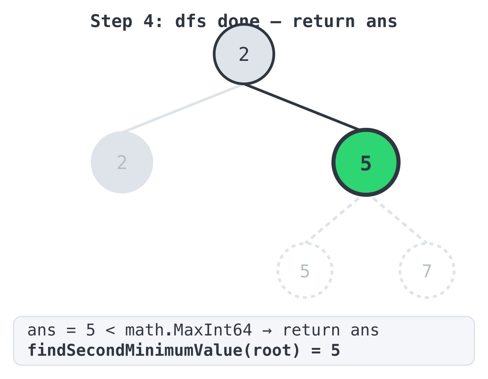

## Solution

The implementation lives in `main.go`. It uses two package-level variables, `min` and
`ans`, so the recursive helper `dfs` doesn't need to thread state through return values.

```go
var (
	ans int
	min int
)

func dfs(root *TreeNode) {
	if root == nil {
		return
	}
	if min < root.Val && root.Val < ans {
		ans = root.Val
	} else if min == root.Val {
		dfs(root.Left)
		dfs(root.Right)
	}
}

func findSecondMinimumValue(root *TreeNode) int {
	min = root.Val
	ans = math.MaxInt64
	dfs(root)
	if ans < math.MaxInt64 {
		return ans
	}
	return -1
}
```

### Walking through the code

**Setup.** `findSecondMinimumValue` sets `min = root.Val`. As explained in
`INTUITION.md`, the tree's structural invariant (`root.val = min(left.val, right.val)`)
guarantees the root always holds the smallest value in the whole tree, so there's no
search needed to find it. `ans` starts at `math.MaxInt64` — "no candidate found yet."

We'll trace the whole run against LeetCode's first example, `root = [2,2,5,null,null,5,7]`:


```
        2
       / \
      2   5
         / \
        5   7
```

**Step 1 — initialize.**



`min` is pinned to `root.Val` (2), and `ans` starts at infinity.

**Step 2 — `dfs(root)`, then `dfs(left child)`.** At the root, `root.Val` (2) is not
strictly greater than `min` (2), so the `if` branch is skipped. But `min == root.Val` is
true, so the `else if` fires and we recurse into both children. Following the left branch
first: the left child also has value 2, so the same thing happens — `min == root.Val`
holds again, and we recurse into *its* children. But this node is a leaf (`Left` and
`Right` are both `nil`), so both recursive calls hit the `if root == nil { return }` base
case immediately and do nothing.



This is the "haven't branched away from the minimum yet" case from the intuition —
nothing to record, just keep descending.

**Step 3 — `dfs(right child)`, value 5.** Back at the root, we now recurse into the right
child, value 5. This time `min < root.Val && root.Val < ans` — that is, `2 < 5 < ∞` — is
true, so we take the `if` branch: `ans = 5`. Crucially, this branch does **not** recurse
into `root.Left`/`root.Right`. That's the pruning from the intuition write-up in action:
because this subtree's own minimum is 5 (by the tree invariant), nothing underneath it —
the 5 and 7 further down — can possibly produce a smaller second-minimum candidate than 5
itself, so descending into it would be wasted work.



**Step 4 — unwind and return.** `dfs` has no more calls left on the stack (every branch
either hit a `nil` base case or found a candidate and stopped), so control returns to
`findSecondMinimumValue`. `ans` is now `5`, which is less than `math.MaxInt64`, so the
function returns `5` — matching the expected output.



### The other example — no second minimum

For `root = [2,2,2]`:


Every node has value 2, which equals `min` at every step, so `dfs` only ever takes the
`else if` branch, recursing all the way down without ever satisfying
`min < root.Val < ans`. `ans` is never touched, so it's still `math.MaxInt64` when
`findSecondMinimumValue` checks it, and the function correctly falls through to
`return -1`.

### Complexity

- **Time:** O(n) in the worst case — every node is visited at most once, either because
  it equals `min` (and we must keep looking) or because it doesn't (and we stop there).
- **Space:** O(h), the recursion depth, where `h` is the tree's height. No extra
  collections are allocated.
