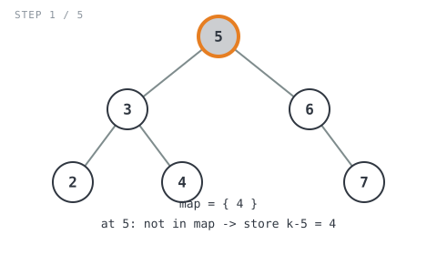
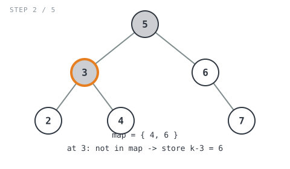
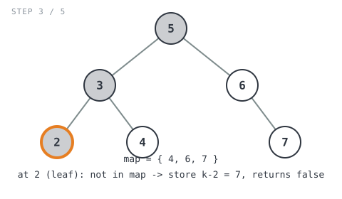
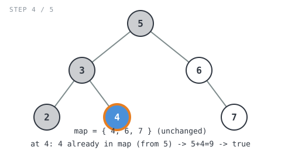
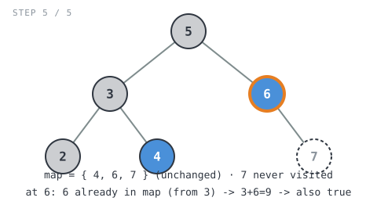

**365 Days of LeetCode Challenge — Day 17/365**
**Two Sum IV - Input is a BST** (Easy)
🔗 https://leetcode.com/problems/two-sum-iv-input-is-a-bst/

**Intuition:** Strip away the "BST" label and this is plain Two Sum. Walk the tree
preorder, keeping a hash map of the complements each node still needs
(`k - node.Val`). For every new node, check whether its own value is already
sitting in the map. If so, some earlier node's value plus this one equals `k`.
The map is shared across the whole recursion, so a match can show up between
totally unrelated branches, not just siblings, which is the part I find genuinely
neat about this approach.


**Full solution:**
```go
func findTarget(root *TreeNode, k int) bool {
	// One map shared across the whole recursion (maps are reference types
	// in Go), so a complement stored while visiting one branch is still
	// visible when a completely different branch is visited later.
	var hashMap map[int]bool = make(map[int]bool)

	return find(root, k, hashMap)
}

// find walks the tree preorder (this node, then left subtree, then right
// subtree). It's the classic single-pass Two Sum hash-set trick ported onto
// a tree traversal instead of an array iteration -- it never relies on the
// BST ordering, so it would work on any binary tree.
func find(root *TreeNode, k int, hashMap map[int]bool) bool {
	if root == nil {
		// Empty subtree can't contain a matching pair.
		return false
	}
	if _, ok := hashMap[root.Val]; ok {
		// Some earlier-visited node already recorded root.Val as the
		// complement it needed (i.e. that node's value + root.Val == k).
		// Return immediately without recursing into this node's subtree.
		return true
	}
	// No match yet: remember what value this node would need to see later
	// in order to complete a pair.
	hashMap[k-root.Val] = true
	// Note: left and right are separate statements, not a single
	// short-circuited `find(...) || find(...)` expression, so right is
	// always evaluated even when left already found a match.
	left := find(root.Left, k, hashMap)
	right := find(root.Right, k, hashMap)
	return left || right
}
```

**Walkthrough** on `[5,3,6,2,4,null,7]`, `k = 9` (expected `true`):

- At `5` (root): map is empty, not found, store `k-5=4`



- At `3`: not found, store `k-3=6`



- At `2` (leaf): not found, store `k-2=7`, returns `false`



- At `4`: found (`4` was stored by `5`), so `5+4=9`, returns `true`



- At `6`: right subtree still runs even though left already found `true`, no
  short-circuit here, and `6` was stored by `3` so it's found too: `3+6=9`, also
  `true`, and `7` never gets visited



`true || true` → **true** ✓

O(n) time, O(n) space for the map plus O(h) for the recursion stack. Simple trick,
and it never even looks at the fact that this is a BST.
