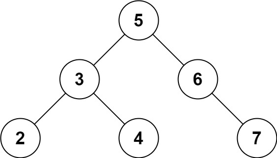

## Two Sum IV - Input is a BST

### Description

Given the `root` of a binary search tree and an integer `k`, return `true` if there
exist two elements in the BST such that their sum is equal to `k`, or `false`
otherwise.

#### Example 1:

```
Input: root = [5,3,6,2,4,null,7], k = 9
Output: true
```

#### Example 2:

```
Input: root = [5,3,6,2,4,null,7], k = 28
Output: false
```

#### Constraints:

- The number of nodes in the tree is in the range `[1, 10^4]`.
- `-10^4 <= Node.val <= 10^4`
- `root` is guaranteed to be a **valid** binary search tree.
- `-10^5 <= k <= 10^5`
