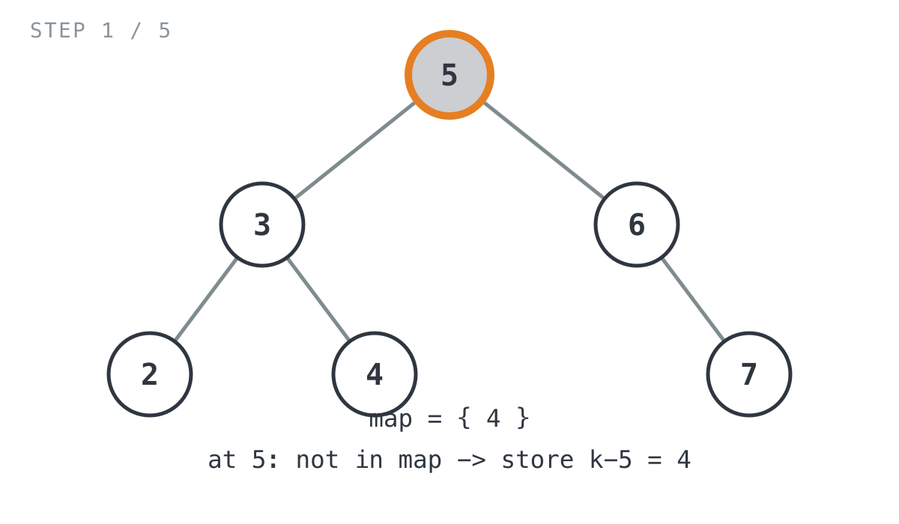
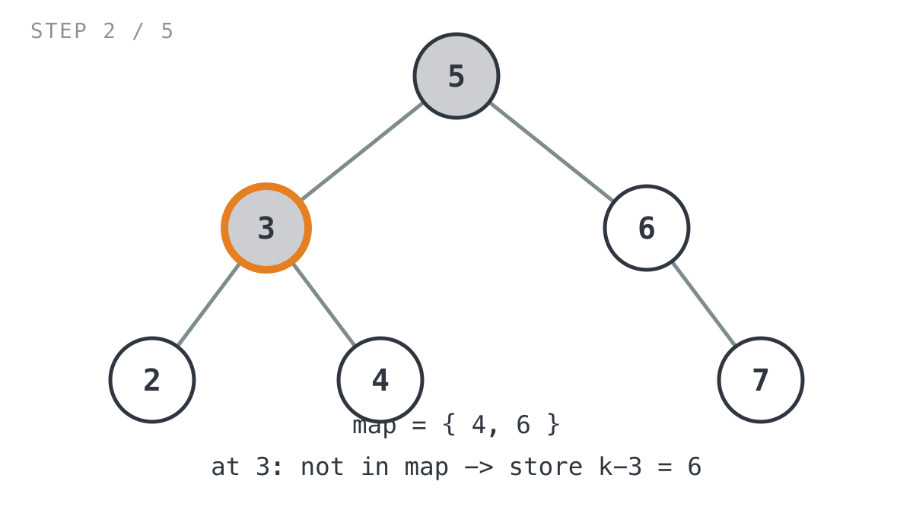
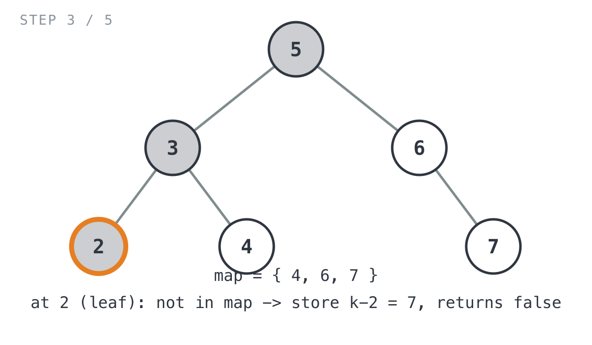
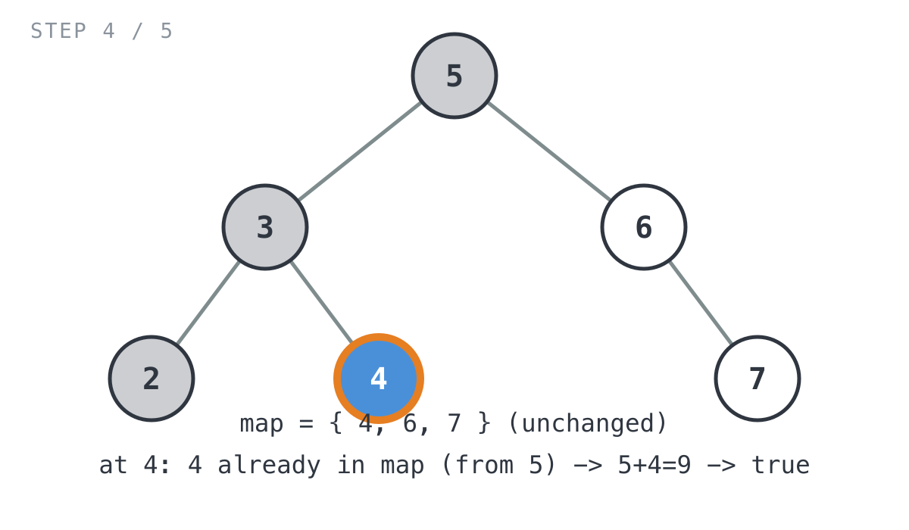
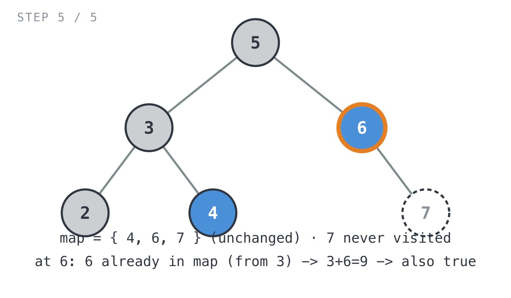

## Solution walkthrough

The implementation is `findTarget(root *TreeNode, k int) bool` plus its recursive
helper `find(root *TreeNode, k int, hashMap map[int]bool) bool` in
`two_sum_iv_input_is_a_bst.go`.

We'll trace it on the example above, `root = [5,3,6,2,4,null,7]`, `k = 9`.

1. **Set up the shared map.** `findTarget` creates one `hashMap map[int]bool` and hands
   it to `find`. Every recursive call shares this same map (Go maps are reference
   types), so anything stored while visiting one branch stays visible when a later,
   unrelated branch is visited.

2. **Base case.** `if root == nil { return false }` — an empty subtree can't contain a
   matching pair.

3. **Check for a match first.** `if _, ok := hashMap[root.Val]; ok { return true }` —
   before doing anything else with the current node, check whether some *earlier*
   node already recorded `root.Val` as the complement it needed. If so, that earlier
   node's value plus this node's value equals `k`, so return `true` immediately
   without recursing any further into this node's subtree.

4. **Record this node's complement.** `hashMap[k-root.Val] = true` — if no match was
   found, store what value *this* node would need to see later in order to complete a
   pair (`k - root.Val`), so a node visited afterward can find it.

5. **Recurse into both children, unconditionally.** `left := find(root.Left, k,
   hashMap)` then `right := find(root.Right, k, hashMap)` — note these are two
   separate statements, not a single short-circuited `find(root.Left, ...) ||
   find(root.Right, ...)` expression. That means `right` is always evaluated even when
   `left` already came back `true`.

6. **Combine.** `return left || right`.

Now the full trace, following `find(5, 9, {})`:

- **At node `5` (root).** `hashMap` is empty, so `5` isn't in it. Store the complement
  it needs: `hashMap[9-5] = hashMap[4] = true`.

  

- **Recurse left, into `3`.** `3` isn't in `{4}`. Store `hashMap[9-3] = hashMap[6] =
  true`.

  

  - **Recurse left, into `2` (a leaf).** `2` isn't in `{4, 6}`. Store
    `hashMap[9-2] = hashMap[7] = true`. Both of `2`'s children are `nil`, so its own
    `left`/`right` calls immediately return `false`, and `find(2, ...)` returns
    `false`.

    

  - **Recurse right, into `4`.** `4` **is already in** `hashMap` (`{4, 6, 7}`) — it was
    stored two levels up, while visiting `5`. So `find(4, ...)` hits the match check on
    line 3 and returns `true` immediately, without storing anything or recursing into
    `4`'s (nil) children. This is the actual pair: `5 + 4 = 9`.

    

  - Back in `find(3, ...)`: `left = false` (from `2`), `right = true` (from `4`).
    `return left || right` → `true`.

- **Recurse right, into `6`.** Because `left` and `right` are computed as two separate
  statements at the root, `find(6, ...)` still runs even though the left subtree
  already produced `true`. `6` **is also already in** `hashMap` (stored while visiting
  `3`, since `9 - 3 = 6`) — another valid pair, `3 + 6 = 9`. `find(6, ...)` returns
  `true` immediately, so its own right child `7` is never visited at all.

  

- Back in `find(5, ...)`: `left = true` (from `3`), `right = true` (from `6`).
  `return left || right` → `true`. ✓ Matches the expected output.

This also shows why `findTarget([5,3,6,2,4,null,7], 28)` (the problem's second
example) comes back `false`: the preorder walk visits every node — `5, 3, 2, 4, 6,
7` — storing each one's complement (`23, 25, 26, 24, 22, 21`), and none of those six
complements ever equals a node value that's visited afterward, so the match check
on line 3 never succeeds and the recursion bottoms out with `false || false` all the
way back up.
