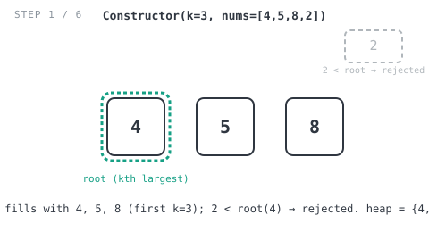
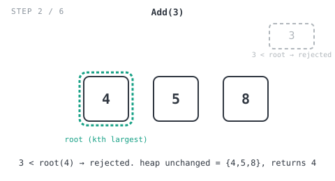
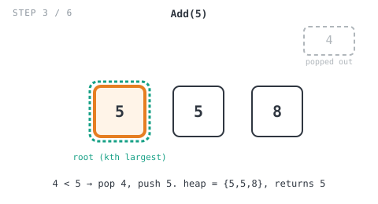
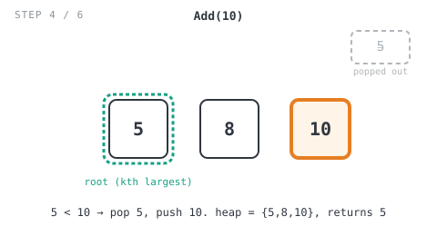
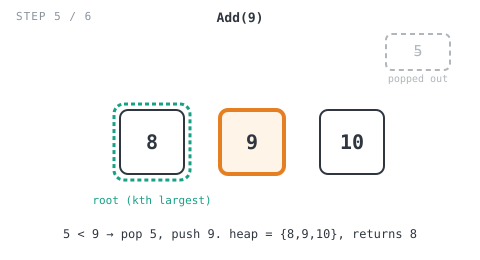
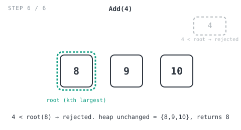

# 365 Days of LeetCode Challenge — Day 20/365

## Kth Largest Element in a Stream

[LeetCode 703 — Kth Largest Element in a Stream](https://leetcode.com/problems/kth-largest-element-in-a-stream/) · Difficulty: Easy

Picture an admissions office watching test scores come in one at a time, needing to
know after every single one what the kth highest score is so far. That's the whole
problem: build a class that watches a stream of numbers and reports the kth largest
value after every insertion.

```
KthLargest(int k, int[] nums)  // initialize with k and a starting stream of scores
int add(int val)                // add a new score, return the kth largest so far
```

### Example

```
Input:
["KthLargest", "add", "add", "add", "add", "add"]
[[3, [4, 5, 8, 2]], [3], [5], [10], [9], [4]]

Output: [null, 4, 5, 5, 8, 8]

Explanation:
KthLargest kthLargest = new KthLargest(3, [4, 5, 8, 2]);
kthLargest.add(3);  // return 4
kthLargest.add(5);  // return 5
kthLargest.add(10); // return 5
kthLargest.add(9);  // return 8
kthLargest.add(4);  // return 8
```

## The intuition

The obvious approach is to keep every score you've seen, re-sort the whole collection
on every `add` call, and read off the kth element. It works, but it's wasteful: up to
`10^4` calls to `add`, each one re-sorting from scratch, adds up fast.

Here's what actually matters: we never need the full sorted order of everything we've
seen. We only ever have to answer one question, what's the kth largest value right now,
and that means we only ever need to track the top k scores. Everything below that
cutoff is dead weight for every future query, because a score outside the top k can't
become the kth largest while k values above it still exist.

Now the trick: among those top k scores, the kth largest is exactly the smallest one,
the weakest link still holding a spot in the group. So the problem shrinks down to
maintaining a bounded set of k values where you can read and swap out the minimum
quickly. A min-heap does exactly that, and honestly this is one of my favorite easy
problems for that reason: the naive fix is obvious, but the efficient one only shows up
once you notice you're solving a much smaller problem than the one you were handed.

Here's the strategy:
- Keep a min-heap that holds at most `k` elements: the k largest scores seen so far.
- When a new value shows up and the heap isn't full yet (fewer than `k` elements), it's
  automatically part of the top-k, so just push it in.
- If the heap is already full, compare the new value against the root (the smallest of
  the current top-k). If it beats the root, the root gets evicted and the new value
  takes its place. If not, it doesn't crack the top-k and the heap is left alone.
- After every `add`, the root is the kth largest value seen across the whole stream.
  The heap holds exactly the top-k values, and the smallest of those sits in the kth
  position once you sort everything in descending order.

The constructor does the same thing, just seeded with a batch instead of one value at a
time: fill the heap with the first `k` elements of `nums` with no checks, then run
everything else through the same eviction test.

Time is `O(log k)` per `add` call (a bounded heap push/pop), and `O(n log k)` for the
constructor over an initial array of length `n`. Space is `O(k)`: the heap never grows
past size `k` no matter how long the stream runs.

## The solution, walked through

The implementation lives in `min.go`. It's built on Go's `container/heap` interface,
wrapped around a plain `minHeap []int`.

### The `minHeap` type

```go
type minHeap []int

func (mHeap *minHeap) Len() int { return len(*mHeap) }
func (mHeap *minHeap) Less(i, j int) bool { return (*mHeap)[i] < (*mHeap)[j] }
func (mHeap *minHeap) Swap(i, j int) { (*mHeap)[i], (*mHeap)[j] = (*mHeap)[j], (*mHeap)[i] }

func (h *minHeap) Push(val any) { *h = append(*h, val.(int)) }
func (h *minHeap) Pop() any {
	old := *h
	n := old.Len()
	x := old[n-1]
	*h = old[:n-1]
	return x
}
```

That one line, `Less(i, j int) bool { return (*mHeap)[i] < (*mHeap)[j] }`, is what makes
this a min-heap instead of a max-heap. Flip the `<` to `>` and you've built the wrong
data structure entirely. The smallest value always sorts to the front, so `(*obj)[0]` is
always the current minimum. `Push` and `Pop` follow the standard `container/heap`
contract: `Push` appends to the end and `heap.Push` sifts it up to restore the
invariant, and `Pop` just removes whatever `heap.Pop` has already swapped to the end of
the slice after doing the sift-down.

### `Constructor(k int, nums []int) KthLargest`

```go
func Constructor(k int, nums []int) KthLargest {
	obj := &minHeap{}
	heap.Init(obj)

	limit := k
	if len(nums) < k {
		limit = len(nums)
	}

	for i := 0; i < limit; i++ {
		heap.Push(obj, nums[i])
	}
	for i := limit; i < len(nums); i++ {
		if (*obj)[0] < nums[i] {
			_ = heap.Pop(obj)
			heap.Push(obj, nums[i])
		}
	}
	return KthLargest{
		k: k,
		h: obj,
	}
}
```

`limit` caps the initial fill at `k`, or fewer, since the constraints allow
`len(nums) < k` (easy to miss on a first read). The first loop pushes those first
`limit` elements with no comparison at all, since the heap isn't full yet. The second
loop runs every remaining element in `nums` through the same eviction test `Add` uses:
if it beats the heap's current minimum, the minimum gets popped and the new value takes
its place. Otherwise, nothing happens.

Tracing it against the example, `Constructor(3, [4, 5, 8, 2])`: `limit = 3`, so `4`,
`5`, `8` get pushed with no checks, filling the heap to `{4, 5, 8}` with root `4`. Then
`i = 3`, `nums[3] = 2`. Is `root(4) < 2`? No, so `2` gets rejected and the heap stays
`{4, 5, 8}`.



### `Add(val int) int`

```go
func (this *KthLargest) Add(val int) int {
	if this.h.Len() < this.k {
		heap.Push(this.h, val)
		return (*this.h)[0]
	}
	if (*this.h)[0] < val {
		_ = heap.Pop(this.h)
		heap.Push(this.h, val)
	}
	return (*this.h)[0]
}
```

There are two cases. If the heap isn't at capacity yet (`this.h.Len() < this.k`), fewer
than `k` values have been seen overall, so anything new is automatically in the top-k,
push it in directly. If the heap is already full, compare `val` against the root, the
current weakest member of the top-k. Beat it, and the root gets popped and `val` takes
its place. Don't beat it, and the heap stays untouched.

Either way, the function returns `(*this.h)[0]`, the root, which by construction is
always the kth largest value seen so far.

Since the heap is already full for the rest of the example (`Len() == k == 3`), every
remaining call takes the comparison branch:

**`Add(3)`**: root is `4`. Is `4 < 3`? No, rejected. Heap stays `{4, 5, 8}`, returns
`4`.



**`Add(5)`**: root is `4`. Is `4 < 5`? Yes, pop `4`, push `5`. Heap becomes
`{5, 5, 8}` with root `5`, returns `5`.



**`Add(10)`**: root is `5`. Is `5 < 10`? Yes, pop that `5`, push `10`. Heap becomes
`{5, 8, 10}` with root `5` (the *other* `5` already in the heap), returns `5`.



**`Add(9)`**: root is `5`. Is `5 < 9`? Yes, pop `5`, push `9`. Heap becomes
`{8, 9, 10}` with root `8`, returns `8`.



**`Add(4)`**: root is `8`. Is `8 < 4`? No, rejected. Heap stays `{8, 9, 10}`, returns
`8`.



Final sequence of returns: `[4, 5, 5, 8, 8]`, matching the expected output.

### Complexity

Time is `O(n log k)` for the constructor and `O(log k)` per `Add` call. Space is
`O(k)`: the heap never holds more than `k` elements no matter how long the stream runs.

---

*Part of the 365 Days of LeetCode Challenge. Follow along for daily problem
breakdowns.*

#DSA #LeetCode #100DaysOfCode #Heap #DataStructures #Golang #CodingInterview #Programming

---

*Solution and code by Archit Agarwal. Write-up drafted with AI assistance from the code and problem statement.*
