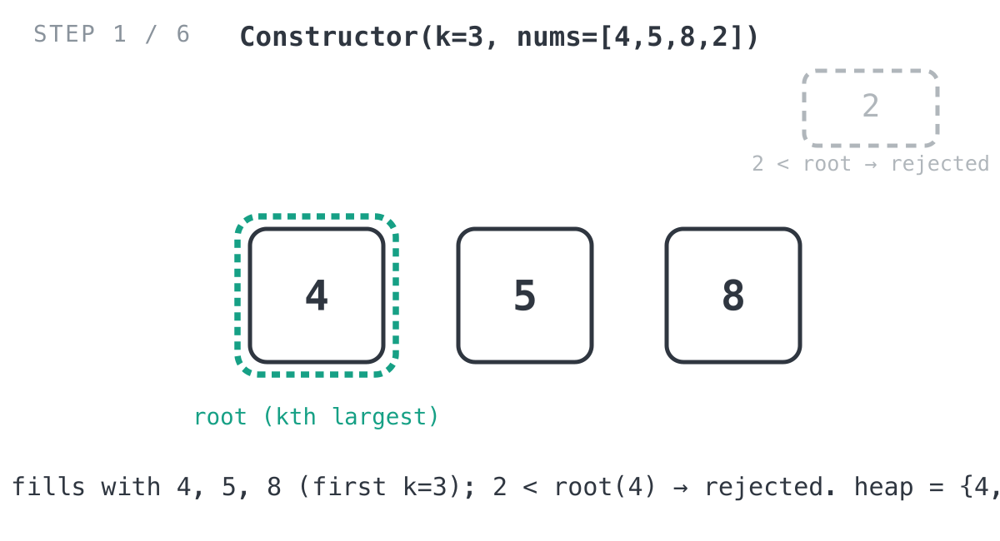
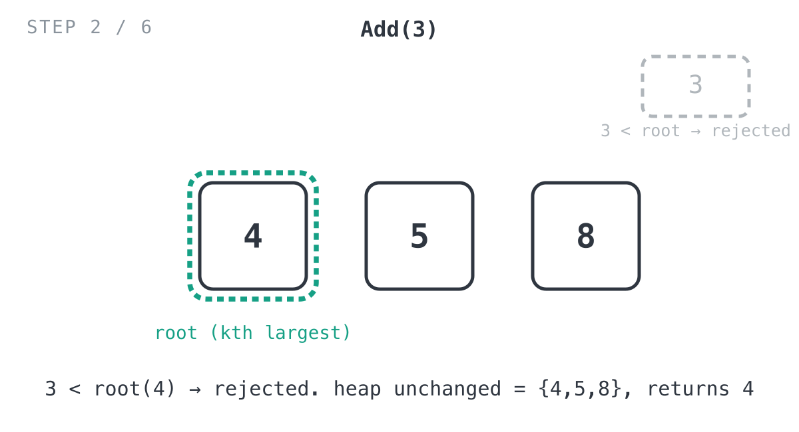
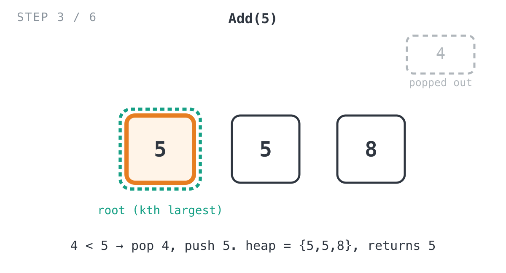
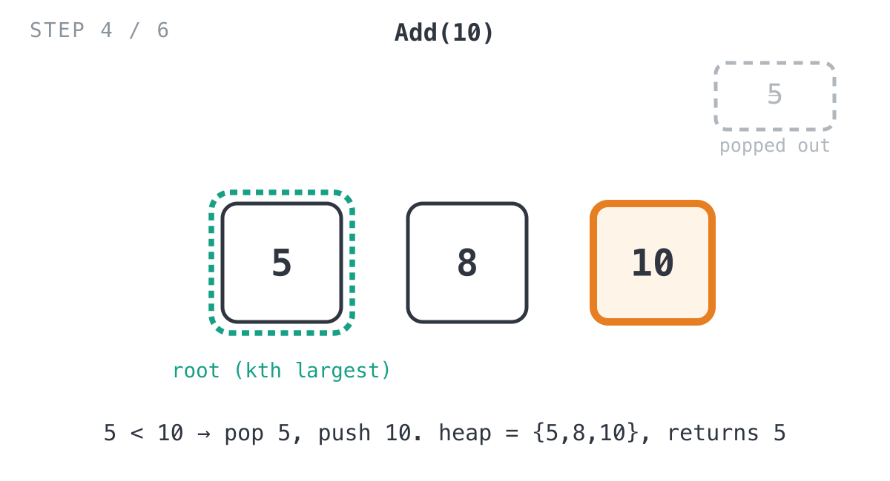
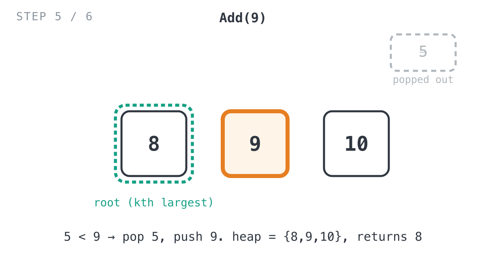
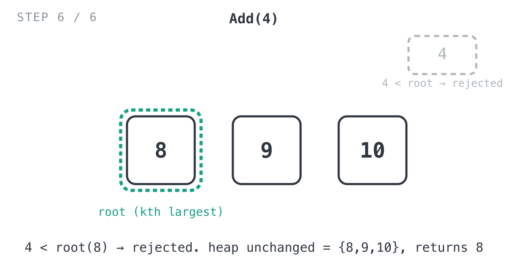

## Solution

The implementation lives in `min.go` and is built around Go's `container/heap`
interface applied to a plain `minHeap []int`. We'll trace it against the exact example
from the problem statement:

```
KthLargest(3, [4, 5, 8, 2])
add(3) -> 4
add(5) -> 5
add(10) -> 5
add(9) -> 8
add(4) -> 8
```

### The `minHeap` type

```go
type minHeap []int

func (mHeap *minHeap) Len() int { return len(*mHeap) }
func (mHeap *minHeap) Less(i, j int) bool { return (*mHeap)[i] < (*mHeap)[j] }
func (mHeap *minHeap) Swap(i, j int) { (*mHeap)[i], (*mHeap)[j] = (*mHeap)[j], (*mHeap)[i] }

func (h *minHeap) Push(val any) { *h = append(*h, val.(int)) }
func (h *minHeap) Pop() any {
	old := *h
	n := old.Len()
	x := old[n-1]
	*h = old[:n-1]
	return x
}
```

`Less(i, j int) bool { return (*mHeap)[i] < (*mHeap)[j] }` is what makes this a
**min-heap** rather than the more familiar max-heap: the smallest element always sorts
to the front, so `(*obj)[0]` is always the current minimum. `Push` and `Pop` follow the
standard `container/heap` contract — `Push` appends to the end and `heap.Push` restores
the heap invariant by sifting up; `Pop` returns whatever `heap.Pop` has already swapped
to the end of the slice (it does the sift-down first, then calls this to actually remove
the element).

### `Constructor(k int, nums []int) KthLargest`

```go
func Constructor(k int, nums []int) KthLargest {
	obj := &minHeap{}
	heap.Init(obj)

	limit := k
	if len(nums) < k {
		limit = len(nums)
	}

	for i := 0; i < limit; i++ {
		heap.Push(obj, nums[i])
	}
	for i := limit; i < len(nums); i++ {
		if (*obj)[0] < nums[i] {
			_ = heap.Pop(obj)
			heap.Push(obj, nums[i])
		}
	}
	return KthLargest{
		k: k,
		h: obj,
	}
}
```

`obj` starts as an empty `*minHeap`. `limit` caps the initial fill at `k` (or fewer, if
`nums` is shorter than `k` — the constraints allow `len(nums) < k`). The first loop
unconditionally pushes those first `limit` elements — they're automatically part of the
top-k since the heap isn't full yet. The second loop runs every *remaining* element in
`nums` through the same test `Add` uses: if it beats the current minimum of the top-k
(`(*obj)[0]`), the minimum is popped out and the new value takes its place; otherwise it
doesn't crack the top-k and nothing happens.

For `Constructor(3, [4, 5, 8, 2])`: `limit = 3`, so `4`, `5`, `8` are pushed
unconditionally, filling the heap to `{4, 5, 8}` with root `4`. Then `i = 3`, `nums[3] =
2`: is `root(4) < 2`? No — `2` is rejected and the heap stays `{4, 5, 8}`.



### `Add(val int) int`

```go
func (this *KthLargest) Add(val int) int {
	if this.h.Len() < this.k {
		heap.Push(this.h, val)
		return (*this.h)[0]
	}
	if (*this.h)[0] < val {
		_ = heap.Pop(this.h)
		heap.Push(this.h, val)
	}
	return (*this.h)[0]
}
```

Two cases:
- **Heap not yet full** (`this.h.Len() < this.k`): the stream has seen fewer than `k`
  values overall, so anything new is automatically part of the top-k — push it in, no
  comparison needed.
- **Heap already at capacity `k`**: compare `val` against the root, the current
  smallest of the top-k. If `val` beats it, pop the root out and push `val` in — the
  weakest member of the top-k gets replaced by the stronger newcomer. If `val` doesn't
  beat the root, the heap is left untouched.

Either way, the function returns `(*this.h)[0]` — the heap's root, which is always the
kth largest value seen so far by construction, since the heap holds exactly the top-k
elements and the smallest of those is the kth position when sorted descending.

Continuing the trace, the heap is already full (`Len() == k == 3`) for every remaining
call, so each one takes the comparison branch:

**`Add(3)`**: root is `4`. Is `4 < 3`? No — `3` is rejected, heap stays `{4, 5, 8}`,
returns `4`.



**`Add(5)`**: root is `4`. Is `4 < 5`? Yes — pop `4`, push `5`. Heap becomes
`{5, 5, 8}` with root `5`, returns `5`.



**`Add(10)`**: root is `5`. Is `5 < 10`? Yes — pop that `5`, push `10`. Heap becomes
`{5, 8, 10}` with root `5` (the *other* `5` that was already in the heap), returns `5`.



**`Add(9)`**: root is `5`. Is `5 < 9`? Yes — pop `5`, push `9`. Heap becomes
`{8, 9, 10}` with root `8`, returns `8`.



**`Add(4)`**: root is `8`. Is `8 < 4`? No — `4` is rejected, heap stays `{8, 9, 10}`,
returns `8`.



Final sequence of returns: `[4, 5, 5, 8, 8]` — exactly matching the problem statement's
expected output.

### Complexity

- **Time:** `O(n log k)` for the constructor (each of the `n` initial elements does at
  most one `O(log k)` heap push/pop), and `O(log k)` per `Add` call.
- **Space:** `O(k)` — the heap never holds more than `k` elements, no matter how long
  the stream runs.
