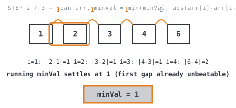
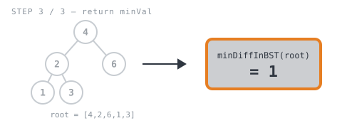

**365 Days of LeetCode Challenge — Day 21/365**
**Minimum Distance Between BST Nodes** (Easy)
🔗 https://leetcode.com/problems/minimum-distance-between-bst-nodes/

**Intuition:** an in-order traversal of a BST visits values in strictly sorted order, so
the minimum difference between *any* two nodes can only occur between two values that
end up adjacent once sorted. Traverse once to get a sorted list (no separate sort
needed), then scan for the smallest adjacent gap.


**Full solution:**
```go
func minDiffInBST(root *TreeNode) int {
	// No pair of nodes to compare in an empty tree or a single-node tree
	// (constraints guarantee n >= 2, so this mainly guards root == nil).
	if root == nil || (root.Left == nil && root.Right == nil) {
		return 0
	}
	// In-order traversal of a BST visits every value in strictly increasing
	// order, so the minimum difference between ANY two nodes can only occur
	// between two values that end up adjacent here.
	arr := inOrder(root)
	minVal := math.MaxInt
	// Only adjacent pairs in the sorted list need checking.
	for i := 1; i < len(arr); i++ {
		minVal = min(minVal, abs(arr[i]-arr[i-1]))
	}
	return minVal
}

func abs(a int) int {
	if a < 0 {
		return -1 * a
	}
	return a
}

// inOrder returns this subtree's values in sorted order (left, node, right).
func inOrder(root *TreeNode) []int {
	if root == nil {
		return []int{}
	}
	// Concatenate: left subtree values, then this node's value, then right
	// subtree values — the classic in-order recipe.
	return append(inOrder(root.Left), append([]int{root.Val}, inOrder(root.Right)...)...)
}
```

**Walkthrough** on `root = [4,2,6,1,3]` (expected `1`):

`arr := inOrder(root)` flattens the BST into sorted order `[1, 2, 3, 4, 6]`:

![Step 1: in-order traversal collects [1, 2, 3, 4, 6] from the tree](images/walkthrough-1.svg)

The loop scans adjacent gaps `(1,2)=1`, `(2,3)=1`, `(3,4)=1`, `(4,6)=2`, keeping the
smallest:



`minVal` is returned:



O(n) traversal (with nested `append`s that can degrade toward O(n²) on a skewed tree) +
O(n) scan. O(n) space for the array, O(h) for the recursion stack (tree height).
