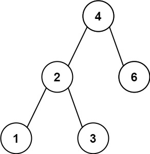
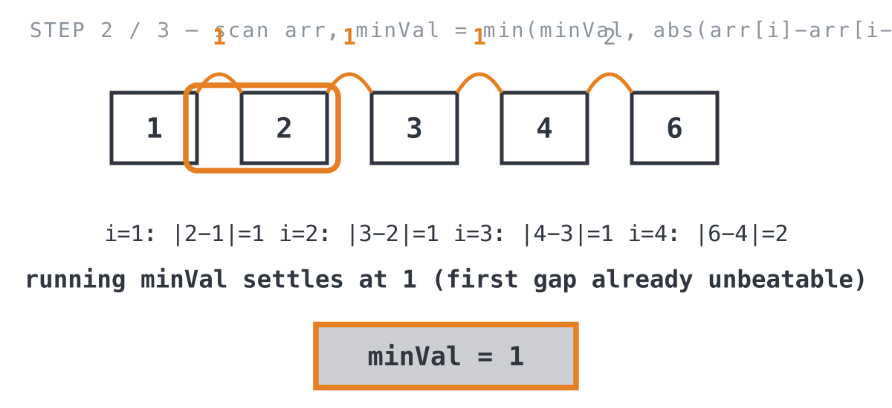
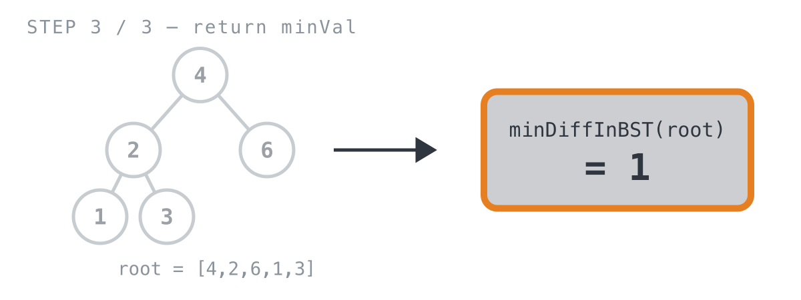

# Minimum Distance Between BST Nodes

*365 Days of LeetCode Challenge — Day 31/365*

🔗 [LeetCode #783](https://leetcode.com/problems/minimum-distance-between-bst-nodes/) · Difficulty: Easy

This is Day 30's problem again. LeetCode carries it under two numbers — 530 and 783 — with the
same constraints and the same answer.

Rather than skip it, it's worth doing deliberately, because a repeat is the cheapest possible
test of whether you learned the property or memorised the solution.

### The problem

You're given the root of a Binary Search Tree (BST). Return the minimum difference
between the values of any two different nodes in the tree.

### The intuition

The whole trick lives in what makes a tree a BST in the first place: walk it in-order
(left, node, right) and the values come out in strictly sorted order. Once you notice
that, the problem stops looking like an O(n²) check-every-pair mess and turns into
something almost boring.

Here's why. Once the values are sorted, the smallest gap between any two of them can
only show up between two neighbors in that sorted order. If you skip over a value in
between, that skipped value splits the gap into two smaller pieces. So there's no reason
to check anything but neighbors.

Two steps, then:
1. Collect every node's value with an in-order traversal, which hands back an
   already-sorted list for free.
2. Walk that sorted list once, tracking the smallest gap between consecutive entries.

I like this one because the hard part isn't the code, it's noticing that "any two nodes"
quietly collapses into "any two neighbors" the moment you trust the tree to already be
telling you the order.

### The solution



We'll trace it on `root = [4,2,6,1,3]` (expected `1`).

```go
func minDiffInBST(root *TreeNode) int {
	// No pair of nodes to compare in an empty tree or a single-node tree
	// (constraints guarantee n >= 2, so this mainly guards root == nil).
	if root == nil || (root.Left == nil && root.Right == nil) {
		return 0
	}
	// In-order traversal of a BST visits every value in strictly increasing
	// order, so the minimum difference between ANY two nodes can only occur
	// between two values that end up adjacent here.
	arr := inOrder(root)
	minVal := math.MaxInt
	// Only adjacent pairs in the sorted list need checking.
	for i := 1; i < len(arr); i++ {
		minVal = min(minVal, abs(arr[i]-arr[i-1]))
	}
	return minVal
}

func abs(a int) int {
	if a < 0 {
		return -1 * a
	}
	return a
}

// inOrder returns this subtree's values in sorted order (left, node, right).
func inOrder(root *TreeNode) []int {
	if root == nil {
		return []int{}
	}
	// Concatenate: left subtree values, then this node's value, then right
	// subtree values — the classic in-order recipe.
	return append(inOrder(root.Left), append([]int{root.Val}, inOrder(root.Right)...)...)
}
```

First, flatten the tree into a sorted list. `arr := inOrder(root)` walks left, node,
right, so on `[4,2,6,1,3]` it comes back as `[1, 2, 3, 4, 6]`. Already sorted, for free,
because that's just what in-order traversal does to a BST.

![Step 1: in-order traversal collects [1, 2, 3, 4, 6] from the tree](https://raw.githubusercontent.com/architagr/leetcode_solutions/main/easy_problems/701_800/minimum_distance_between_bst_nodes/images/walkthrough-1.png)

Then scan for the smallest neighboring gap. `minVal` starts at `math.MaxInt` so the
first comparison always wins. The loop walks the sorted array one adjacent pair at a
time: `(1,2)`, `(2,3)`, `(3,4)`, `(4,6)`. It takes the absolute difference of each pair
and keeps the smallest. Since the answer can only live between adjacent values once
everything is sorted, one linear pass covers it.



Last, return the answer. Once the loop finishes, `minVal` is holding the smallest gap
found across the whole sequence.



One thing worth flagging: the traversal visits each of the `n` nodes once, but `inOrder`
rebuilds and copies a slice at every recursive call through nested `append`s, so the
copying work can creep toward O(n²) on a heavily skewed tree instead of staying linear.
A version that appends into one shared accumulator slice would dodge that. The scan
afterward is a clean O(n). Space is O(n) for the collected values plus O(h) for the
recursion stack, where `h` is the tree's height.

---

If the second attempt came out of the BST's in-order property rather than out of recall, the first
one stuck. If it came out of recall, that's useful to know too — the property is the part that
transfers to problems that aren't identical twins.

Full code and the step-by-step walkthrough:
[minimum_distance_between_bst_nodes](https://github.com/architagr/leetcode_solutions/blob/main/easy_problems/701_800/minimum_distance_between_bst_nodes/SOLUTION.md)

---

*Solution and code by Archit Agarwal. Write-up drafted with AI assistance from the code and problem statement.*
