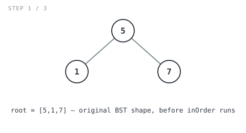
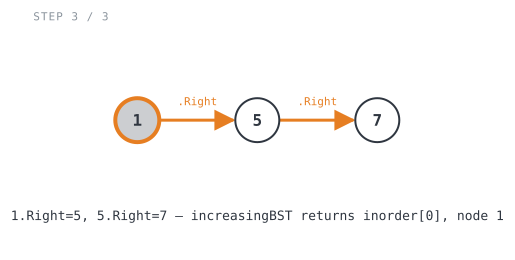

**365 Days of LeetCode Challenge — Day 23/365**
**Increasing Order Search Tree** (Easy)
🔗 https://leetcode.com/problems/increasing-order-search-tree/

**Intuition:** the target shape (no left child, one right child on every node) is just
a sorted linked list built out of `TreeNode`s. An in-order traversal of a BST already
visits nodes in ascending order, so the problem splits into two easy steps: collect
nodes in-order, then relink them with `.Right`. Old child pointers get cleared the
moment each node is collected, otherwise stale links from the original tree can
survive into the final vine.


**Full solution:**
```go
func increasingBST(root *TreeNode) *TreeNode {
	// In-order traversal of a BST visits nodes in ascending value order,
	// so this is already the exact node order the final vine needs.
	inorder := inOrder(root)
	// Rewire consecutive nodes with .Right only, turning the sorted list
	// order into the "no left child, one right child" chain the problem wants.
	for i := 1; i < len(inorder); i++ {
		inorder[i-1].Right = inorder[i]
	}
	// The smallest node (first in ascending order) becomes the new root.
	return inorder[0]
}

func inOrder(root *TreeNode) []*TreeNode {
	if root == nil {
		return []*TreeNode{}
	}
	res := make([]*TreeNode, 0)
	// Recurse on the original left/right children before root is touched,
	// so each call still sees the tree's original shape to descend into.
	left := inOrder(root.Left)
	right := inOrder(root.Right)

	// Detach root from its old children now that both subtrees have already
	// been walked and collected. This leaves every node fully unlinked when
	// it's handed back, so increasingBST's relinking pass starts clean with
	// no stale pointers left over from the original tree shape.
	root.Left = nil
	root.Right = nil
	// Standard in-order assembly: everything from the left subtree, then
	// root itself, then everything from the right subtree.
	res = append(left, root)
	res = append(res, right...)
	return res
}
```

**Walkthrough** on `root = [5,1,7]` (expected `[1,null,5,null,7]`):




`inOrder(5)` recurses left and right first. `inOrder(1)` has both children nil and
returns `[1]`. `inOrder(7)` works the same way and returns `[7]`. Back at `5`:
`5.Left = nil` and `5.Right = nil` detach it from its old children, and
`res = [1, 5, 7]`.

![Step 2: inOrder returns [1, 5, 7], all three nodes already detached from old children](images/walkthrough-2.svg)

Relinking loop: `i=1` sets `1.Right = 5`, `i=2` sets `5.Right = 7`. `increasingBST`
returns `inorder[0]`, node `1`, now the root of `1 → 5 → 7`, exactly what's expected.



Scales the same way for the 9-node example: `inOrder` collects `[1..9]` already
detached, and the relinking loop chains them `1 → 2 → ... → 9`.

O(n) time (traversal plus relinking), O(n) space for the collected list plus O(h)
recursion stack (h = tree height). No new nodes get allocated, the existing ones are
just reused. The part I'd call out is that detaching step in `inOrder`: it looks like
dead weight until you realize the relinking loop would otherwise be fighting leftover
pointers from the old tree shape.
