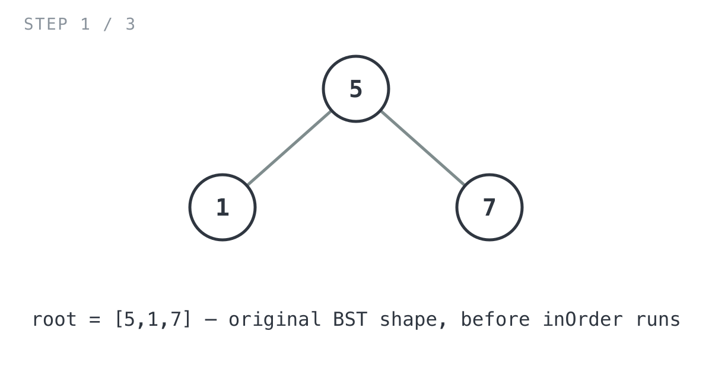
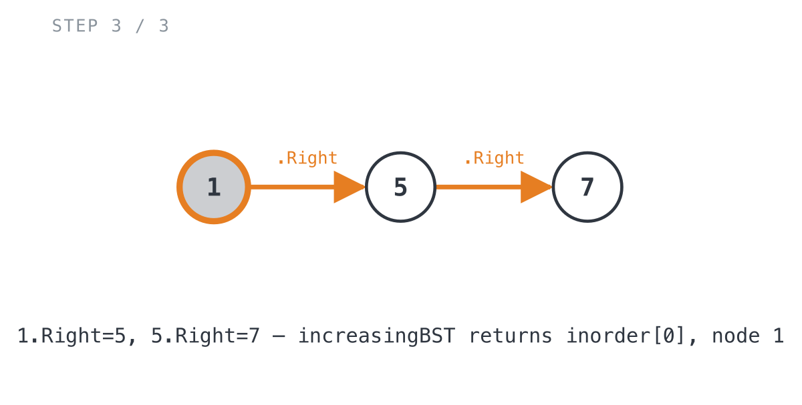

## 365 Days of LeetCode Challenge — Day 23/365

# Increasing Order Search Tree

🔗 https://leetcode.com/problems/increasing-order-search-tree/ · Difficulty: Easy

### The problem

Given the root of a binary search tree, rearrange the tree in-order so that the
leftmost node becomes the new root, and every node has no left child and only one
right child.


### The intuition

Look at the shape the problem actually wants: no left child, exactly one right child
on every node. That's a sorted singly linked list, just built out of `TreeNode`s
instead of a `ListNode`. So the real question underneath the question is: give me the
nodes of this BST in ascending order, then chain them together with `.Right`.

"Nodes of a BST in ascending order" is exactly what an in-order traversal produces, by
definition, since left subtree < node < right subtree. That's the part that made this
problem click for me. Once you see the target shape as a linked list wearing a tree
costume, the urge to do one fused recursive rewire goes away, and the problem splits
into two boring, independent pieces.

1. Walk the tree in-order and collect every node, not its value, into a flat list. We
   need the actual node objects, since we're going to reuse and relink them.
2. Walk that flat list left to right and point each node's `.Right` at the next one,
   turning the list order into the vine-shaped tree the problem wants.

The part that actually needs care: a node comes out of step 1 still carrying its old
`Left` and `Right` pointers from the original tree. Leave those alone and stray links
from the old shape can survive into the final structure once step 2 starts writing
`.Right`. So each node gets its old children cleared the moment it's collected, before
it ever lands in the list. That way step 2 only ever wires up nodes that start out
completely disconnected.

Complexity:
- Time: O(n). Every node is visited once during the traversal and once during
  relinking.
- Space: O(n) for the list of collected nodes, plus O(h) for the recursion stack of the
  in-order traversal (h = tree height, O(log n) balanced, O(n) skewed). No new
  `TreeNode`s get allocated; the existing nodes are reused and relinked in place.

### The solution

The implementation is `increasingBST(root *TreeNode) *TreeNode` plus its helper
`inOrder(root *TreeNode) []*TreeNode`.

`increasingBST` itself is short. It just calls `inOrder` and then rewires the result:

```go
func increasingBST(root *TreeNode) *TreeNode {
	// In-order traversal of a BST visits nodes in ascending value order,
	// so this is already the exact node order the final vine needs.
	inorder := inOrder(root)
	// Rewire consecutive nodes with .Right only, turning the sorted list
	// order into the "no left child, one right child" chain the problem wants.
	for i := 1; i < len(inorder); i++ {
		inorder[i-1].Right = inorder[i]
	}
	// The smallest node (first in ascending order) becomes the new root.
	return inorder[0]
}
```

`inorder := inOrder(root)` walks the BST in-order and hands back a flat
`[]*TreeNode` of every node, already in ascending value order. The loop right after it
walks that slice and points each node's `.Right` at the next one. Then
`return inorder[0]` hands back the smallest node, now the head of the chain. Three
lines of actual logic, wrapped around one helper call.

The real work, and the part worth tracing carefully, happens inside `inOrder`:

```go
func inOrder(root *TreeNode) []*TreeNode {
	if root == nil {
		return []*TreeNode{}
	}
	res := make([]*TreeNode, 0)
	left := inOrder(root.Left)
	right := inOrder(root.Right)

	root.Left = nil
	root.Right = nil
	res = append(left, root)
	res = append(res, right...)
	return res
}
```

An empty subtree contributes no nodes, so `root == nil` returns an empty slice. The
two recursive calls, `left := inOrder(root.Left)` and `right := inOrder(root.Right)`,
run before `root`'s own children get touched, so each call still sees the original
left and right children it needs to walk into. Only once both subtrees have already
been collected does the function clear `root.Left` and `root.Right`. This is the
detail I'd point out to anyone reading the code cold: it looks like it should happen
earlier, but it can't, because the recursive calls above still need those pointers to
know where to descend. Clearing them here means the node handed back is fully
unlinked, nothing left over from the original shape to interfere with the relinking
pass in `increasingBST`. Then `res = append(left, root)` puts `root` right after
everything from its left subtree, and `res = append(res, right...)` tacks on
everything from the right subtree after that. Standard left, node, right order, just
built as a slice instead of printed or summed.

Let's trace `inOrder` on the smaller example from the statement, `root = [5,1,7]`, a
3-node BST with `5` at the top and children `1` and `7`. Small enough to draw every
node explicitly.




`inOrder(5)` recurses left and right before touching `5` itself. `inOrder(1)` has both
children nil, so `left=[]` and `right=[]`; clearing `1.Left` and `1.Right` is a no-op
since they're already nil, and `res = append([], 1) = [1]`. `inOrder(7)` works out the
same way and returns `[7]`.

Back in `inOrder(5)`: `left=[1]`, `right=[7]`. Now `5.Left = nil` and `5.Right = nil`
detach `5` from its old children. `res = append([1], 5) = [1, 5]`, then
`res = append([1,5], 7...) = [1, 5, 7]`.

![Step 2: inOrder returns [1, 5, 7], all three nodes already detached from old children](images/walkthrough-2.png)

Back in `increasingBST`, `inorder = [1, 5, 7]`, and the relinking loop runs twice:
`i=1` sets `inorder[0].Right = inorder[1]`, meaning `1.Right = 5`. `i=2` sets
`inorder[1].Right = inorder[2]`, meaning `5.Right = 7`. `increasingBST` returns
`inorder[0]`, node `1`, now the root of a chain `1 → 5 → 7`, linked purely through
`.Right`, matching the expected output `[1,null,5,null,7]`.



The same two-phase approach scales directly to the bigger example above
(`root = [5,3,6,2,4,null,8,1,null,null,null,7,9]`): `inOrder` collects all nine nodes
as `[1,2,3,4,5,6,7,8,9]`, already detached from their old children along the way, and
the relinking loop chains them `1 → 2 → 3 → 4 → 5 → 6 → 7 → 8 → 9`, matching the
expected output exactly.

Complexity: O(n) time, every node visited once by `inOrder` and once by the relinking
loop. O(n) space for the `inorder` slice, plus O(h) for the recursion stack (h = tree
height).

Full code: `easy_problems/801_900/increasing_order_search_tree/` in the repo.

#DSA #LeetCode #100DaysOfCode #BinarySearchTree #InOrderTraversal #Golang #CodingInterview #Algorithms

---

*Solution and code by Archit Agarwal. Write-up drafted with AI assistance from the code and problem statement.*
