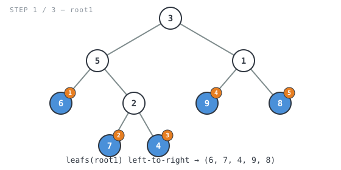
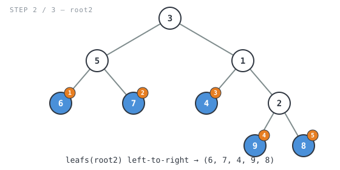
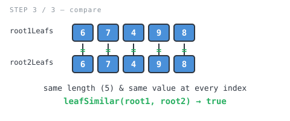

**365 Days of LeetCode Challenge — Day 22/365**
**Leaf-Similar Trees** (Easy)
🔗 https://leetcode.com/problems/leaf-similar-trees/

**Intuition:** Stop comparing tree shapes — extract each tree's leaves left-to-right
into a slice (left subtree fully explored before right, so order comes for free),
then it's just a list-equality check: same length, same value at every index.


**Full solution:**
```go
func leafSimilar(root1 *TreeNode, root2 *TreeNode) bool {
	// Extract each tree's leaf sequence independently; from here on we only
	// ever compare two int slices, not the trees themselves.
	root1Leafs := leafs(root1)
	root2Leafs := leafs(root2)
	// Cheap early exit: different leaf counts can never be leaf-similar.
	if len(root1Leafs) != len(root2Leafs) {
		return false
	}
	for i := 0; i < len(root1Leafs); i++ {
		if root1Leafs[i] != root2Leafs[i] {
			return false
		}
	}
	return true
}

// leafs returns node's leaves in left-to-right order.
func leafs(node *TreeNode) []int {
	if node == nil {
		return []int{}
	}
	// A childless node is a leaf; contribute just its own value.
	if node.Left == nil && node.Right == nil {
		return []int{node.Val}
	}
	// Left subtree's leaves always come before the right subtree's, so the
	// concatenation below naturally preserves left-to-right order.
	return append(leafs(node.Left), leafs(node.Right)...)
}
```

**Walkthrough** on Example 1 — `root1 = [3,5,1,6,2,9,8,null,null,7,4]`,
`root2 = [3,5,1,6,7,4,2,null,null,null,null,null,null,9,8]` (expected `true`):


- `leafs(root1)` → `6, 7, 4` (left subtree), then `9, 8` (right subtree)



- `leafs(root2)` (different shape) → same order: `6, 7, 4, 9, 8`



- Same length, same values at every index → `true`



O(n + m) time, O(n + m) space (plus O(h1 + h2) recursion stack).
