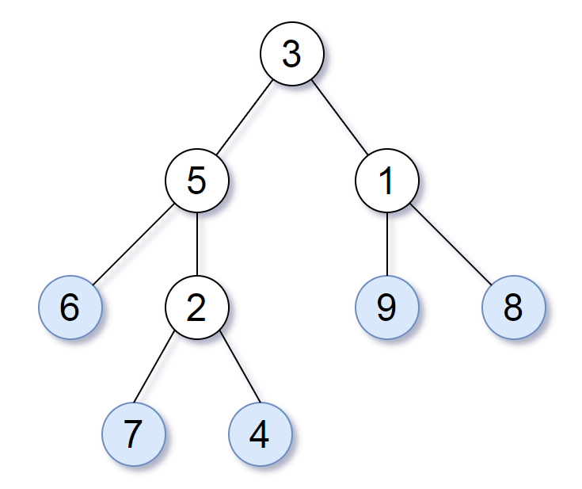
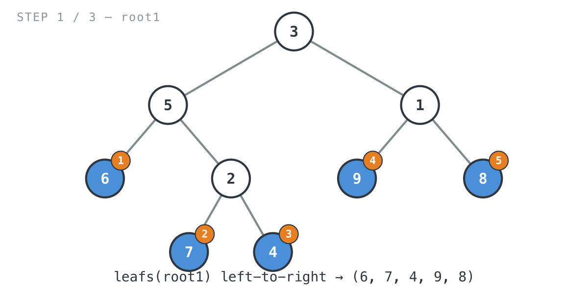
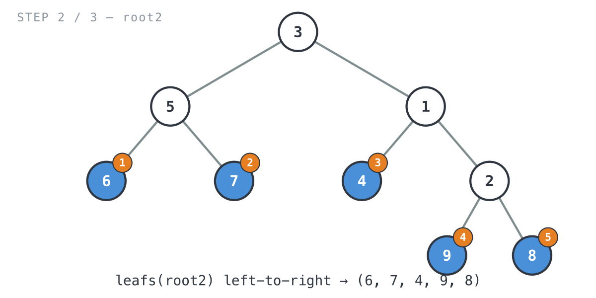
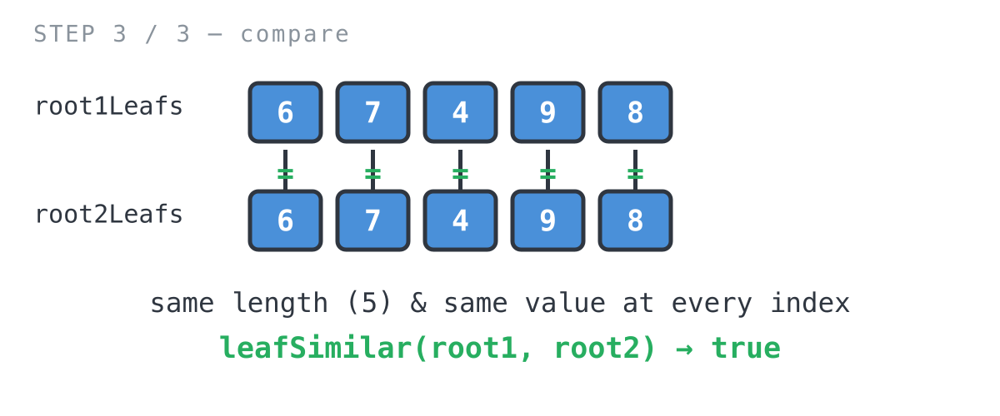

## 365 Days of LeetCode Challenge — Day 46/365

# Leaf-Similar Trees

🔗 https://leetcode.com/problems/leaf-similar-trees/ · Difficulty: Easy

### The problem

Line up all the leaves of a binary tree from left to right and read off their
values, and that's the tree's **leaf value sequence**. Two trees are *leaf-similar*
if their leaf value sequences match, even when the trees themselves look nothing
alike.



For the tree above, the leaf value sequence is `(6, 7, 4, 9, 8)`.

### The intuition

What I like about this one is how much it lets you ignore. "Leaf-similar" sounds
like it should involve comparing shapes somehow, but shape never enters into it.
Read the leaves left to right off each tree and check whether the two lists match.
That's the whole problem, once you see it.

Getting the leaves out in left-to-right order costs nothing extra either. A plain
depth-first walk that visits the left subtree before the right one already produces
that order for free: recurse left, recurse right, and whenever you land on a node
with no children, that's a leaf, so record it. Because the left side always
finishes before the right side starts, the leaves come out in order without any
sorting or index bookkeeping.

Once both sequences sit in slices, comparing them for leaf-similarity is just list
equality: same length, and the same value at every position.

### The solution

```go
func leafSimilar(root1 *TreeNode, root2 *TreeNode) bool {
	// Extract each tree's leaf sequence independently; from here on we only
	// ever compare two int slices, not the trees themselves.
	root1Leafs := leafs(root1)
	root2Leafs := leafs(root2)
	// Cheap early exit: different leaf counts can never be leaf-similar.
	if len(root1Leafs) != len(root2Leafs) {
		return false
	}
	for i := 0; i < len(root1Leafs); i++ {
		if root1Leafs[i] != root2Leafs[i] {
			return false
		}
	}
	return true
}

// leafs returns node's leaves in left-to-right order.
func leafs(node *TreeNode) []int {
	if node == nil {
		return []int{}
	}
	// A childless node is a leaf; contribute just its own value.
	if node.Left == nil && node.Right == nil {
		return []int{node.Val}
	}
	// Left subtree's leaves always come before the right subtree's, so the
	// concatenation below naturally preserves left-to-right order.
	return append(leafs(node.Left), leafs(node.Right)...)
}
```

Walking it through Example 1 — `root1 = [3,5,1,6,2,9,8,null,null,7,4]`,
`root2 = [3,5,1,6,7,4,2,null,null,null,null,null,null,9,8]` (expected `true`):


- `leafs(root1)` collects `6`, `7`, `4` from the left subtree, then `9`, `8` from the
  right subtree.



- `leafs(root2)` has a completely different shape, but it comes back with the same
  values in the same order: `6`, `7`, `4`, `9`, `8`.



- Same length, same value at every index, so `leafSimilar` returns `true`.



**Complexity:** O(n + m) time, since every node of both trees gets visited exactly
once. O(n + m) space for the two leaf slices, plus O(h1 + h2) for the recursion
stacks (each tree's height).

Full code and the step-by-step walkthrough:
[leaf_similar_trees](https://github.com/architagr/leetcode_solutions/blob/main/easy_problems/801_900/leaf_similar_trees/SOLUTION.md)

#DSA #LeetCode #BinaryTree #DFS #Golang #100DaysOfCode #CodingInterview

---

*Solution and code by Archit Agarwal. Write-up drafted with AI assistance from the code and problem statement.*
