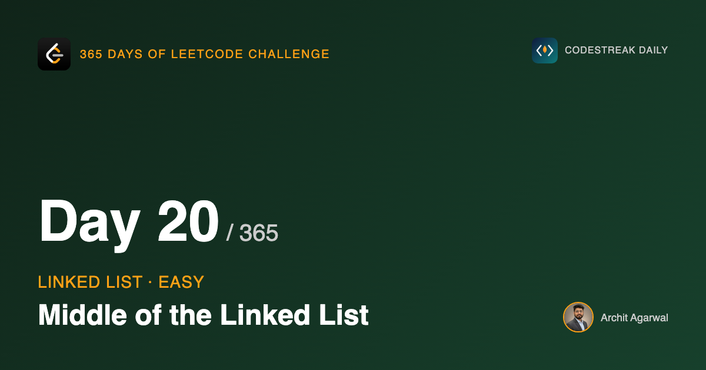

## 365 Days of LeetCode Challenge — Day 20/365

**[876. Middle of the Linked List](https://leetcode.com/problems/middle-of-the-linked-list/)** (Easy)

Return the middle node of a singly linked list. If the length is even, return the second of the two middles.

## The obvious answer first

Walk the list counting nodes, then walk again to position `count/2`. Two passes, O(n) time, O(1) space, and there is nothing wrong with it. It is a fine answer in an interview.

But it has to know the length before it can start, and a singly linked list is precisely the structure that will not tell you its length without a walk.

## The one-pass version

Run two pointers from the head. Move one a single node per step and the other two nodes per step. When the fast one reaches the end, the slow one has covered exactly half the ground, because it moved at half the speed for the same number of steps.

That is not a clever property of linked lists. It is arithmetic. What makes it worth knowing is that it finds the middle without the length ever existing as a number anywhere in the program.

```go
func middleNode(head *ListNode) *ListNode {
	middle, end := head, head

	for end != nil && end.Next != nil {
		middle = middle.Next
		end = end.Next.Next
	}
	return middle
}
```

Both pointers start on the same node. That matters: from a shared starting line, after k iterations `end` has covered 2k nodes and `middle` has covered k.

## Watching it run

The list is `[1,2,3,4,5]`.


One iteration in: `middle` on 2, `end` on 3.


Two iterations: `middle` on 3, `end` on 5.


`end.Next` is `nil`, the loop stops, and `middle` is on node 3. Returning that node returns the rest of the list with it, which is why the expected output is `[3,4,5]` rather than just `3`.

## Both loop conditions are load-bearing

```go
for end != nil && end.Next != nil {
```

`end != nil` handles even lengths, where the fast pointer steps onto `nil` exactly.

`end.Next != nil` handles odd lengths, where it lands on the final node and `end.Next.Next` would read through nothing.

Drop either one and you get a nil dereference on half of all possible inputs. That is a nasty class of bug, because the first example you test is fifty-fifty to pass.

The order matters too. Go short-circuits `&&`, so `end != nil` has to be written first, or the second test panics on exactly the input the first exists to protect against.

## The even case is free

The problem asks for the second middle when there are two. Nothing in this function implements that rule.

Trace `[1,2,3,4,5,6]`: `end` visits 1, 3, 5 then `nil`, and `middle` visits 1, 2, 3, 4 and stops on 4. The second middle, with no special case written for it.

Worth knowing the other form, because when this walk shows up inside a harder problem it usually wants the *first* middle so it can cut the list there:

```go
for end.Next != nil && end.Next.Next != nil {
```

That version stops one node earlier. It is the one that appears on day 26.

## Complexity

- **Time: O(n)**. One pass, the loop running about n/2 times.
- **Space: O(1)**. Two pointers.

Full code and the step-by-step walkthrough:
[middle_of_the_linked_list](https://github.com/architagr/leetcode_solutions/blob/main/easy_problems/801_900/middle_of_the_linked_list/SOLUTION.md)

#DSA #LeetCode #Golang #LinkedList #TwoPointers #CodingInterview #Algorithms

---

*Solution and code by Archit Agarwal. Write-up drafted with AI assistance from the code and problem statement.*
