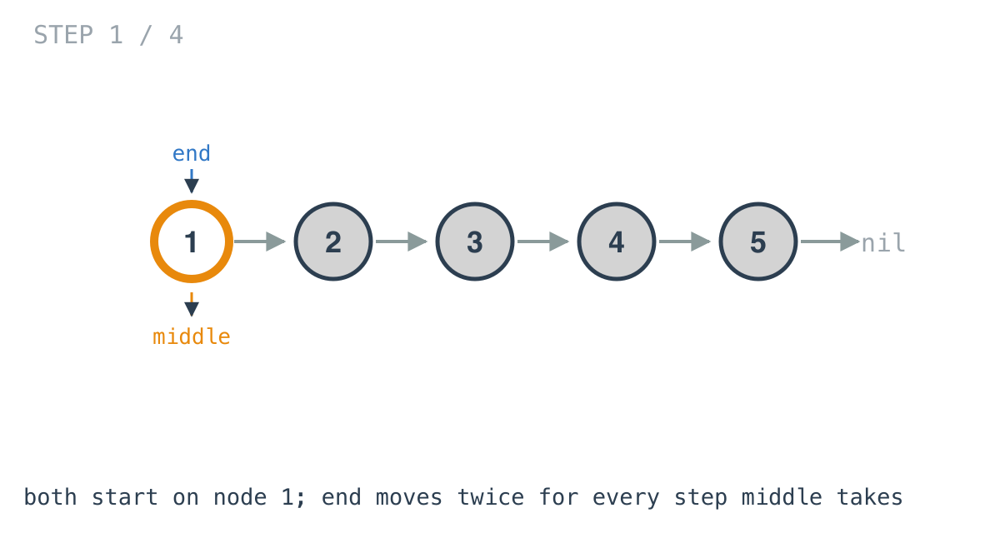
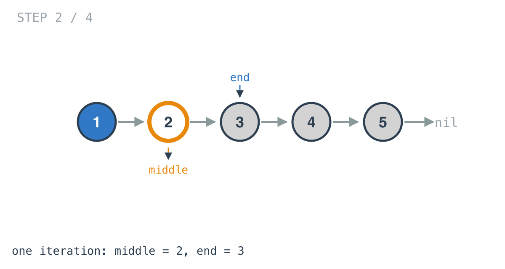
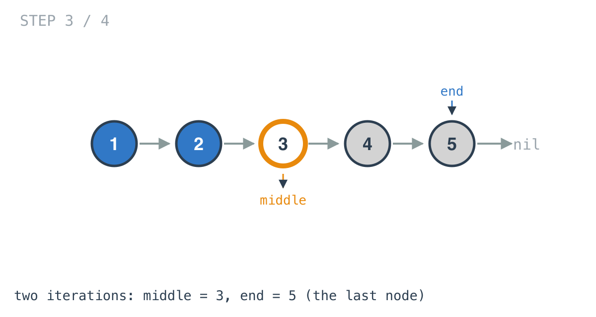
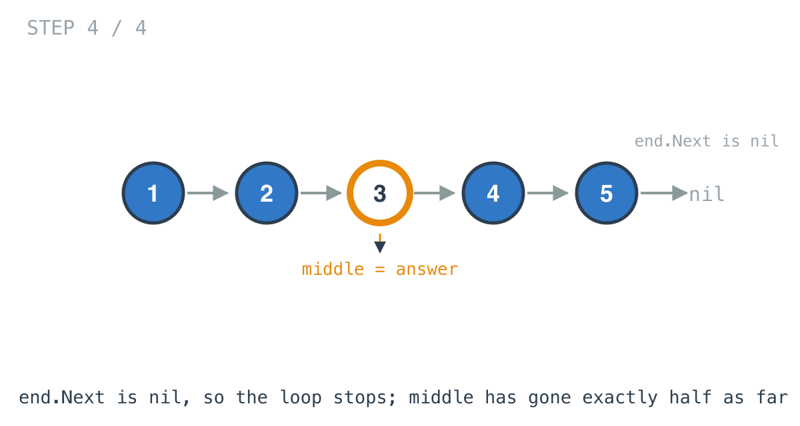

# Middle of the Linked List — solution walkthrough

The whole function, from `main.go`:

```go
func middleNode(head *ListNode) *ListNode {
	middle, end := head, head

	for end != nil && end.Next != nil {
		middle = middle.Next
		end = end.Next.Next
	}
	return middle
}
```

Five lines. The names say what they are: `middle` is the answer being converged on, `end` is the pointer racing ahead to find the end of the list.

## Both pointers start at the head

Not at `head` and `head.Next`. Starting them together is what makes the halving exact: from the same starting line, after k iterations `end` has covered 2k nodes and `middle` has covered k.

## The walk

The example list is `[1,2,3,4,5]`.



Nothing has moved. Both pointers are on node 1.



One iteration. `middle` is on 2, `end` is on 3.



Two iterations. `middle` is on 3, `end` is on 5, the last node.



`end.Next` is `nil`, so the condition fails and the loop stops. `middle` is on node 3, which is the middle of a five-node list. It is returned as-is, and because a node carries the rest of the list with it, returning node 3 returns `[3,4,5]` exactly as the examples show.

## The loop condition is doing two jobs

```go
for end != nil && end.Next != nil {
```

`end != nil` is the even-length guard. With `[1,2,3,4]`, `end` visits 1 then 3 then steps to `nil`. Without this test, the `end.Next` in the second condition dereferences a nil pointer.

`end.Next != nil` is the odd-length guard. With `[1,2,3,4,5]`, `end` lands on node 5 and `end.Next.Next` would be reading through `nil`.

Go evaluates `&&` left to right and short-circuits, so the order matters: `end != nil` has to come first, or the second test panics on exactly the input the first one exists to catch.

## Even-length lists, and the second middle

The problem says to return the second middle when there are two. That behaviour is not implemented anywhere in this function; it is a consequence of the loop condition.

Trace `[1,2,3,4,5,6]`. `end` goes 1, 3, 5, then `nil`. `middle` goes 1, 2, 3, 4 and stops. Node 4 is the second of the two middle nodes.

The variant that returns the *first* middle is the same walk with the condition shifted one node earlier:

```go
for end.Next != nil && end.Next.Next != nil {
```

That is the form to reach for when this walk shows up inside a bigger problem, because splitting a list usually wants the last node of the first half rather than the first node of the second.

## Complexity

- **Time: O(n).** `end` touches roughly half the nodes, `middle` roughly a quarter of the steps, and the loop runs about n/2 times. One pass.
- **Space: O(1).** Two pointers, no allocation.

## Test

`main_test.go` runs both worked examples: the odd case `[1,2,3,4,5]` expecting `[3,4,5]`, and the even case `[1,2,3,4,5,6]` expecting `[4,5,6]`. The even case is the one that would catch a loop condition that returned the first middle instead of the second.
