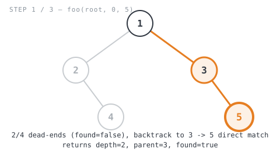
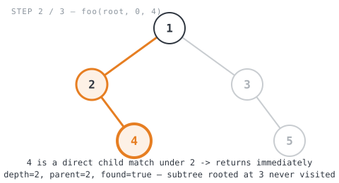
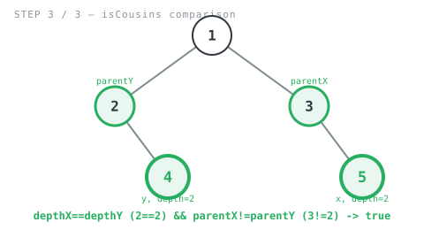

**365 Days of LeetCode Challenge — Day 25/365**
**Cousins in Binary Tree** (Easy)
🔗 https://leetcode.com/problems/cousins-in-binary-tree/

**Intuition:** Cousins = same depth + different parent, so compute both facts for `x`
and both for `y`, then compare. No parent pointers on a plain tree, but since values are
unique, a node's own `Val` can stand in for its parent's identity — a helper checks each
child *before* descending into it and hands back that child's value as `parent` the
moment it matches.


**Full solution:**
```go
func isCousins(root *TreeNode, x int, y int) bool {
	depthX, parentX, _ := foo(root, 0, x)
	depthY, parentY, _ := foo(root, 0, y)
	return depthX == depthY && parentX != parentY
}

func foo(node *TreeNode, currentDepth, searchVal int) (depth int, parent int, found bool) {
	depth = currentDepth
	parent = 0
	found = false
	if node == nil {
		return currentDepth, 0, false
	}
	if node.Val == searchVal {
		return currentDepth, 0, true
	}
	if node.Left != nil {
		if node.Left.Val == searchVal {
			return currentDepth + 1, node.Val, true
		}
		depth, parent, found = foo(node.Left, currentDepth+1, searchVal)
		if found {
			return
		}
	}
	if node.Right != nil {
		if node.Right.Val == searchVal {
			return currentDepth + 1, node.Val, true
		}
		depth, parent, found = foo(node.Right, currentDepth+1, searchVal)
	}
	return
}
```

**Walkthrough** on `[1,2,3,null,4,null,5]`, `x=5, y=4` (expected `true`):
```
        1
       / \
      2   3
       \   \
        4   5
```

- Search `x=5`: `foo(1,0,5)` → left into `2` → `2` has no left child, right child `4`
  doesn't match → recurse into `4`, a dead end (`found=false`), bubbles back up. Root's
  left branch failed, so it tries `node.Right` (`3`) → `3.Right` is `5`, a **direct
  child match** → returns `(depth=2, parent=3, found=true)`.



- Search `y=4`: `foo(1,0,4)` → left into `2` → `2.Right` is `4`, a **direct child
  match** on the first recursive call → returns `(depth=2, parent=2, found=true)`
  immediately, so `if found { return }` fires and `3`'s whole subtree is skipped.



- Compare: `depthX==depthY` → `2==2` ✓. `parentX!=parentY` → `3!=2` ✓. → `true`.



O(n) time (two O(n) tree walks), O(h) space per call (recursion stack, h = tree height).
