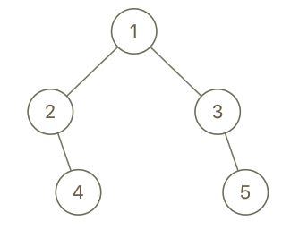
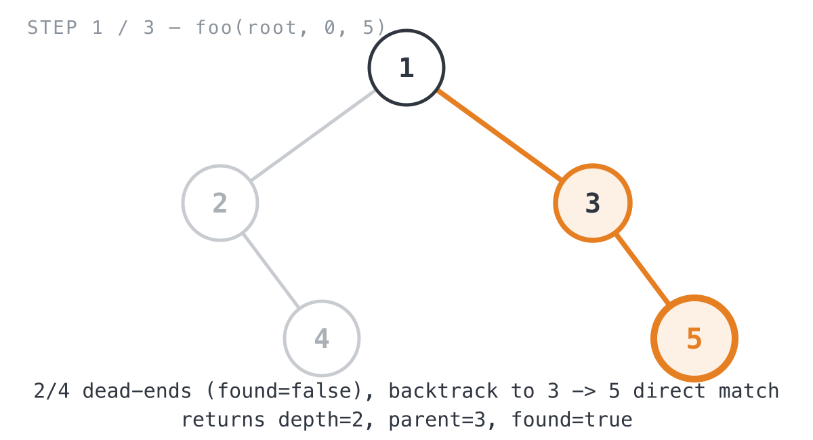
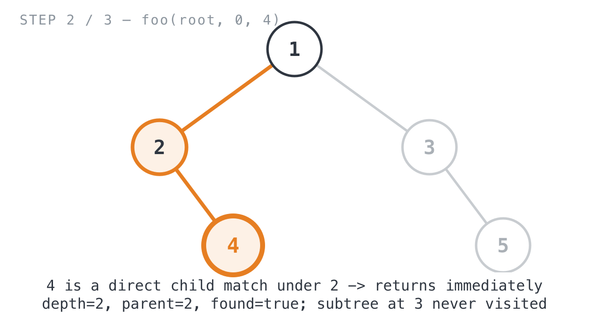
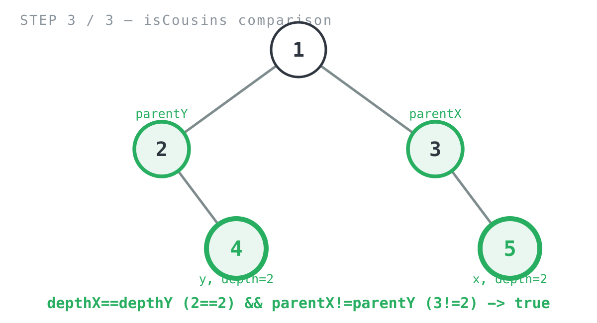

## 365 Days of LeetCode Challenge — Day 18/365

# Cousins in Binary Tree

🔗 https://leetcode.com/problems/cousins-in-binary-tree/ · Difficulty: Easy

### The problem

Given the root of a binary tree with unique values and two target values `x` and `y`,
return `true` if the nodes holding those values are **cousins**: same depth, different
parents. Otherwise, `false`. The root sits at depth `0`.

### The intuition

Cousins comes down to two separate facts that both have to be true: same depth,
different parents. Once I saw that, the plan wrote itself: work out both facts for `x`,
work out both facts for `y`, then compare them.

Depth is the easy half, just count levels on the way down. Parent is where it gets
interesting. A plain binary tree gives you no parent pointers, and building a whole
`map[*TreeNode]*TreeNode` just to answer one yes-or-no question felt like using a
hammer on a thumbtack. The way out is the problem's guarantee that every value is
unique: a node's own `Val` can stand in for its identity, so instead of handing back a
pointer to the parent, a helper can hand back the *parent's value* and compare those
directly.

So the helper checks each child's value before it ever recurses into that child.
That's the one spot in the whole walk where you're looking at a potential match from
the parent's own vantage point, so you can grab the child's value as `parent` right
there. Call it once for `x`, once for `y`, check same depth and different parent, done.

### The solution



```go
func isCousins(root *TreeNode, x int, y int) bool {
	depthX, parentX, _ := foo(root, 0, x)
	depthY, parentY, _ := foo(root, 0, y)
	return depthX == depthY && parentX != parentY
}

func foo(node *TreeNode, currentDepth, searchVal int) (depth int, parent int, found bool) {
	depth = currentDepth
	parent = 0
	found = false
	if node == nil {
		return currentDepth, 0, false
	}
	if node.Val == searchVal {
		return currentDepth, 0, true
	}
	if node.Left != nil {
		if node.Left.Val == searchVal {
			return currentDepth + 1, node.Val, true
		}
		depth, parent, found = foo(node.Left, currentDepth+1, searchVal)
		if found {
			return
		}
	}
	if node.Right != nil {
		if node.Right.Val == searchVal {
			return currentDepth + 1, node.Val, true
		}
		depth, parent, found = foo(node.Right, currentDepth+1, searchVal)
	}
	return
}
```

`isCousins` just calls `foo` twice — once per target — and discards the `found` flag
since the problem guarantees both values exist in the tree. `foo` itself starts with
"not found" defaults (`depth = currentDepth`, `parent = 0`, `found = false`), then walks
off (`node == nil`) or matches (`node.Val == searchVal`) as base cases. The interesting
part is that before recursing into either child, it checks that child directly —
`node.Left.Val == searchVal` — and if so returns `(currentDepth + 1, node.Val, true)`
immediately. That's the only place `parent` becomes non-zero for a non-root match,
because it's the one point in the recursion where the target is visible *from its
parent's own call*. If the left subtree doesn't produce a match, `foo` recurses into it,
and `if found { return }` prunes the right subtree once a hit's already been found on
the left — the right-side block has no equivalent guard since it's the last thing the
function does anyway.

Tracing it on `root = [1,2,3,null,4,null,5]`, `x = 5`, `y = 4` — LeetCode's example,
which returns `true`:

Searching for `x = 5` first: `foo(1, 0, 5)` checks node `1` (no match), then descends
left into `2`. Node `2` has no left child, and its right child `4` doesn't match `5`
either, so it recurses one more level into `4`, which is a childless dead end —
`found = false` bubbles all the way back up to the root call. Since the left branch came
back empty, the root call moves on to its right child, `3`. `3` doesn't match `5`
directly, but `3.Right` *is* `5` — a direct child match — so that call returns
`(depth=2, parent=3, found=true)` immediately, no further recursion needed.



Searching for `y = 4`: `foo(1, 0, 4)` again checks node `1`, descends left into `2`, and
this time `2.Right` *is* `4` — a direct hit on the very first recursive call, no
backtracking required. That returns `(depth=2, parent=2, found=true)`, and because
`found` is `true`, the root call's `if found { return }` fires right away — node `3`'s
entire subtree is never even visited.



Back in `isCousins`: `depthX == depthY` → `2 == 2` → `true`. `parentX != parentY` → `3
!= 2` → `true`. Both hold, so the function returns `true` — `5` and `4` sit at the same
depth under different parents, exactly the definition of cousins.



**Complexity:**
- Time: O(n) — `foo` runs twice, and each call visits at most every node once (fewer,
  when a match is found early enough to prune the sibling subtree).
- Space: O(h) for the recursion stack per call, where h is the tree's height — O(log n)
  balanced, O(n) worst case for a skewed tree.

Full code and the step-by-step walkthrough:
[cousins_in_binary_tree](https://github.com/architagr/leetcode_solutions/blob/main/easy_problems/901_1000/cousins_in_binary_tree/SOLUTION.md)

#DSA #LeetCode #100DaysOfCode #CodingInterview #BinaryTree #DFS #Golang

---

*Solution and code by Archit Agarwal. Write-up drafted with AI assistance from the code and problem statement.*
