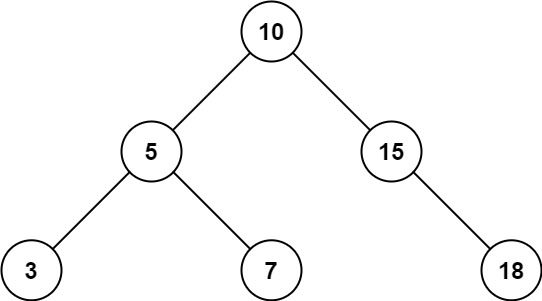
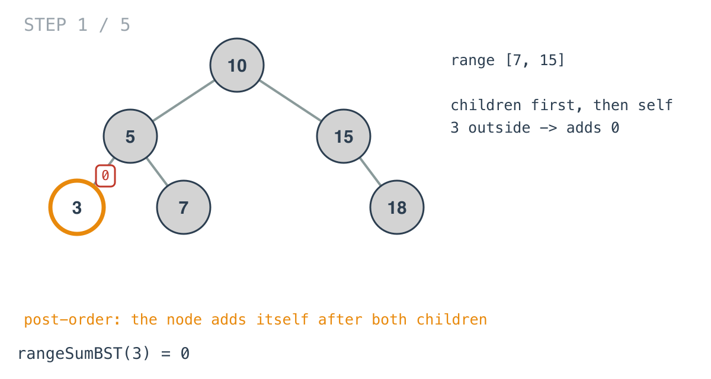
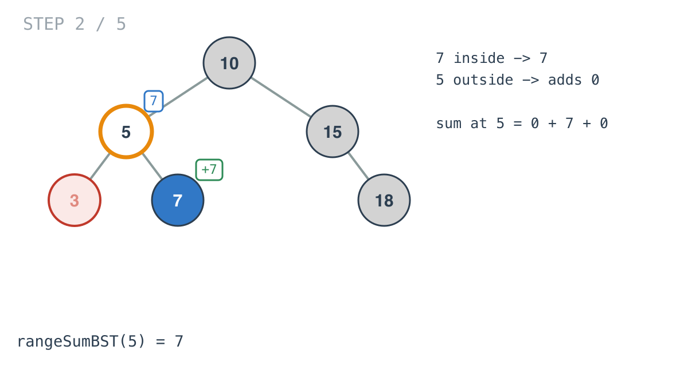
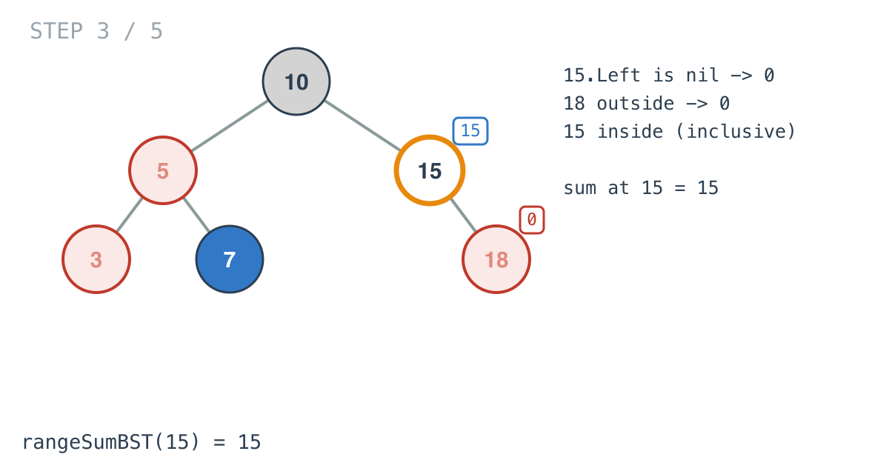
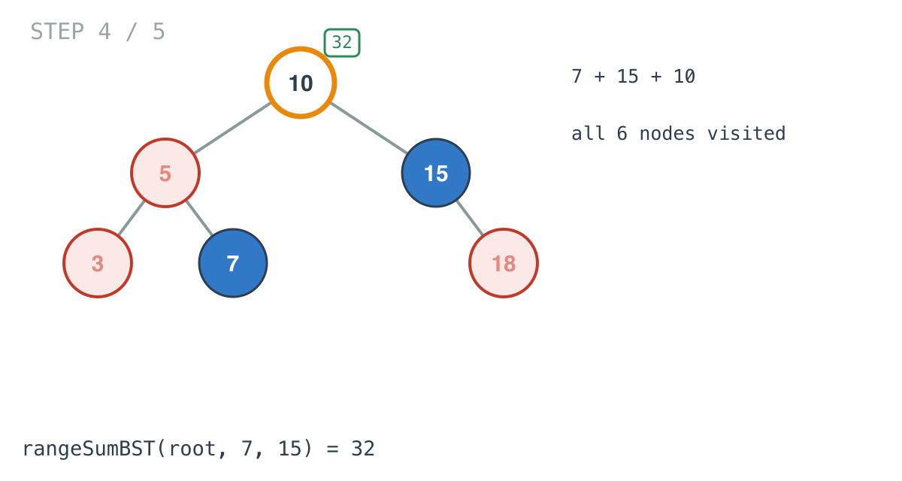
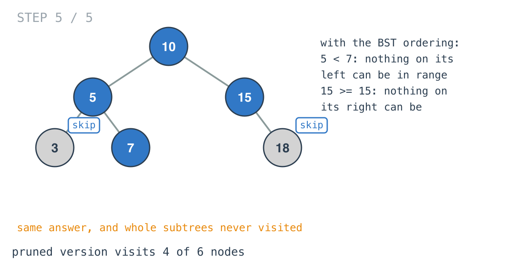

## Solution walkthrough

`rangeSumBST(root, low, high)` in `main.go` returns the sum of in-range values in the
subtree at `root`. It recurses into both children, then adds its own value if it
qualifies.



We'll trace Example 1: `[10,5,15,3,7,null,18]`, range `[7, 15]`, expected `32`.

1. **Nil contributes nothing.** `if root == nil { return 0 }`.

2. **Children first.** `sum += rangeSumBST(root.Left, low, high)` then the same for
   `root.Right`, then the node's own check. That's post-order, and here the order doesn't
   matter since addition doesn't care. The recursion reaches `3` first, which is outside
   the range and has no children, so it returns 0.

   

3. **Add yourself if you're in range.** `if root.Val >= low && root.Val <= high`. Both
   ends are inclusive. `7` qualifies; `5` doesn't, so the call at `5` returns only what
   its children found, `7`.

   

4. **The right side.** At `15` the left child is nil and `18` is out of range, but `15`
   itself equals `high` and counts. The call returns 15.

   

5. **The root adds it all up.** `7 + 15 + 10 = 32`. Every node in the tree was visited.

   

6. **What the BST ordering could skip.** Nothing here depends on the tree being a BST. With
   the ordering: at `5`, which is below `low`, every node on its left is smaller still,
   so `3` never needed a visit. At `15`, which is at `high`, every node on its right is
   bigger, so `18` didn't either. Guarding the two recursive calls captures that:

```go
func rangeSumBST(root *TreeNode, low int, high int) int {
	if root == nil {
		return 0
	}
	sum := 0
	if root.Val > low { // only then can the left subtree reach low
		sum += rangeSumBST(root.Left, low, high)
	}
	if root.Val < high { // only then can the right subtree reach high
		sum += rangeSumBST(root.Right, low, high)
	}
	if root.Val >= low && root.Val <= high {
		sum += root.Val
	}
	return sum
}
```

   Same answer, 4 visits instead of 6 here, and 4 instead of 10 on Example 2.

   

**Complexity:** O(n) time as written, one visit per node. O(h) space for the recursion
stack.
