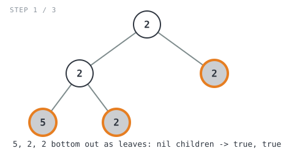
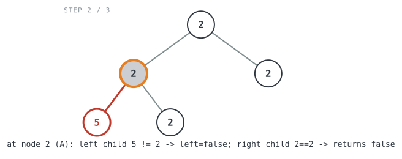
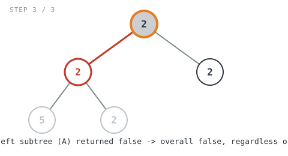

## 365 Days of LeetCode Challenge — Day 24/365

# Univalued Binary Tree

🔗 https://leetcode.com/problems/univalued-binary-tree/ · Difficulty: Easy

### The problem

A binary tree is **uni-valued** if every node in the tree has the same value. Given
the `root` of a binary tree, return `true` if the tree is uni-valued, or `false`
otherwise.


### The intuition

A tree is uni-valued exactly when *every* parent-child edge connects two nodes with
the same value — if that holds everywhere, all values in the tree must be equal to the
root's value by transitivity, and if it fails anywhere, the tree isn't uni-valued.

So instead of collecting every value into a set and checking they're all equal, it's
enough to walk the tree and compare each node to its own parent as we go. A node
doesn't need to know the root's value directly — it just needs to know its parent's
value, which is available to the parent at the moment it looks at its child.

That gives a simple recursion: a subtree rooted at `node` is uni-valued if both its
children (when present) share `node`'s value, *and* the subtrees hanging off those
children are themselves uni-valued. An empty subtree is trivially uni-valued — there's
nothing to disagree with — so `nil` is the base case that returns `true`.

### The solution


```go
func isUnivalTree(root *TreeNode) bool {
	// An empty subtree has nothing that could disagree with its parent's
	// value, so it's trivially uni-valued.
	if root == nil {
		return true
	}
	// Assume each side is fine unless a present child proves otherwise.
	// A side with no child simply stays true.
	left, right := true, true
	if root.Left != nil {
		// A child can only be compared to its parent's value from the
		// parent's own call, since the child has no way to know which
		// node called it. Also recurse so the left child's own subtree
		// is checked for internal uni-valuedness.
		left = isUnivalTree(root.Left) && root.Left.Val == root.Val
	}
	if root.Right != nil {
		// Mirror of the left-child check above.
		right = isUnivalTree(root.Right) && root.Right.Val == root.Val
	}
	// The whole subtree is uni-valued only if both sides checked out.
	return left && right
}
```

Walking it through `root = [2,2,2,5,2]` (expected `false`):

```
        2
       / \
      2   2
     / \
    5   2
```

- `isUnivalTree(2)` (root) recurses left into node `A = 2`, and right into node
  `B = 2` (a leaf).
  - `isUnivalTree(A=2)` recurses left into leaf `C = 5`, and right into leaf `D = 2`.
    - `isUnivalTree(C=5)`: no children → returns `true` (this call has no idea `5`
      doesn't match its parent — that's not its job).
    - `isUnivalTree(D=2)`: no children → returns `true`, same reasoning.
    - `isUnivalTree(B=2)`: no children → returns `true`.



- Back in `isUnivalTree(A=2)`: `left = isUnivalTree(C) && C.Val == A.Val` →
  `true && (5 == 2)` → `left = false`. `right = isUnivalTree(D) && D.Val == A.Val` →
  `true && (2 == 2)` → `right = true`. Returns `left && right = false`.



- Back at the root: `left = isUnivalTree(A) && A.Val == root.Val` →
  `false && (2 == 2)` — the left-hand side of `&&` is already `false`, so `left = false`
  regardless of what the value comparison would have said. `right = isUnivalTree(B) &&
  B.Val == root.Val` → `true && (2 == 2)` → `right = true`. Returns
  `left && right = false`. ✓



The mismatch (`5` under a `2`) is detected two levels down, at node `A`, and then just
propagates upward as `false` through every ancestor's `left`/`right` combination —
nothing further up needs to re-check values it already knows are wrong.

**Complexity:** O(n) time — every node is visited exactly once. O(h) space for the
recursion stack, where h is the tree's height (O(log n) for a balanced tree, O(n) for
a completely skewed one).

Full code: `easy_problems/901_1000/univalued_binary_tree/` in the repo.
