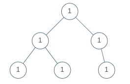
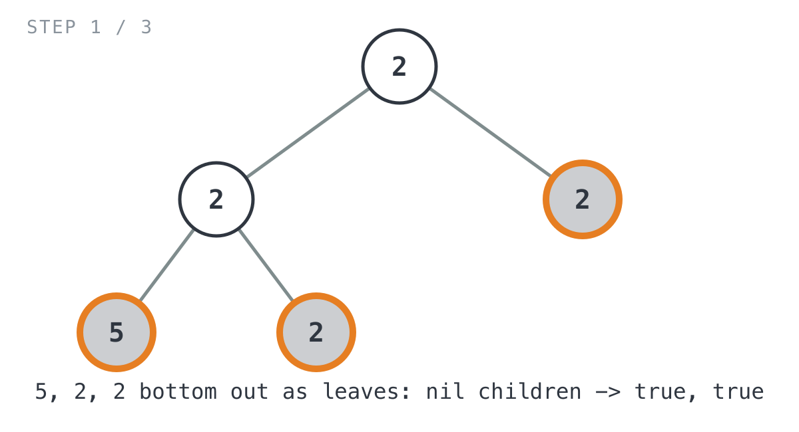
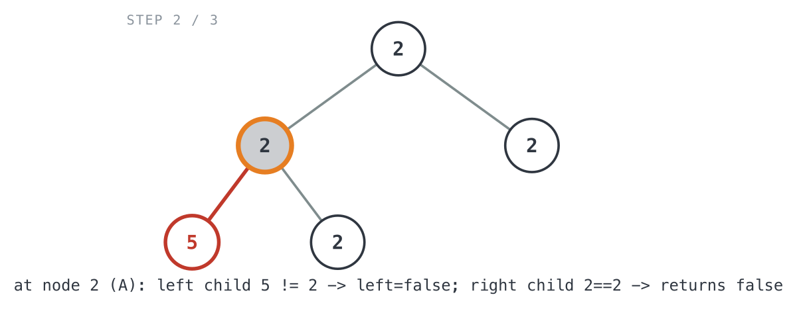
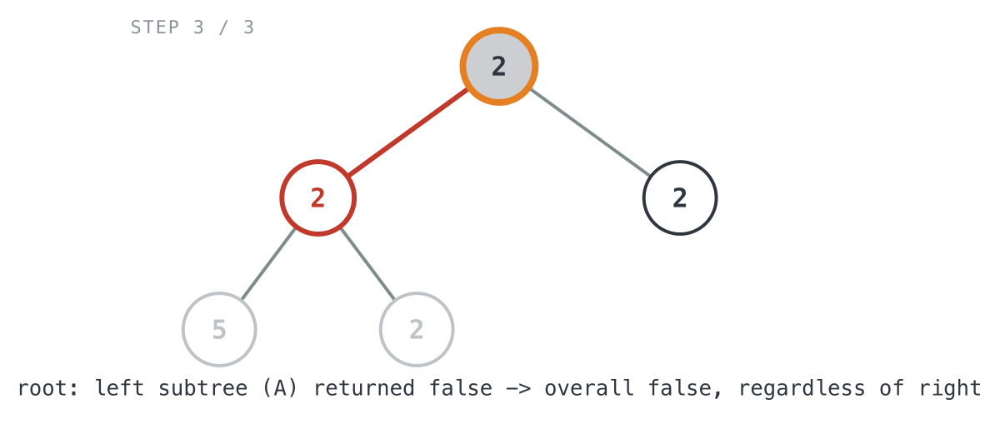

# Univalued Binary Tree

*365 Days of LeetCode Challenge — Day 17/365*

🔗 [LeetCode #965](https://leetcode.com/problems/univalued-binary-tree/) · Difficulty: Easy

The instinct is to grab the root's value, then walk the tree checking every node against it —
threading that value down through every call, or closing over it.

You don't need to. A node only has to agree with its parent. If that holds on every edge, then by
transitivity every value in the tree equals the root's, and if it fails anywhere the answer is
already no. The root's value never has to travel.

### The problem

A binary tree is **uni-valued** if every node in the tree has the same value. Given
the `root` of a binary tree, return `true` if the tree is uni-valued, or `false`
otherwise.



### The intuition

A tree is uni-valued exactly when every parent-child edge connects two nodes with the
same value. If that holds at every edge, all the values in the tree equal the root's
value by transitivity. If it fails at even one edge, the tree isn't uni-valued. That's
the whole problem, really.

My first instinct was to throw every value into a set and check the set has size one.
That works, but it's more machinery than the problem needs. You don't have to know the
root's value at all, you only need to know your parent's value, and your parent
already has that the moment it looks at you.

So the recursion is simple: a subtree rooted at `node` is uni-valued if each existing
child shares `node`'s value, and that child's own subtree is uni-valued too. An empty
subtree can't disagree with anything, so `nil` returns `true` and that's the base
case.

### The solution


```go
func isUnivalTree(root *TreeNode) bool {
	// An empty subtree has nothing that could disagree with its parent's
	// value, so it's trivially uni-valued.
	if root == nil {
		return true
	}
	// Assume each side is fine unless a present child proves otherwise.
	// A side with no child simply stays true.
	left, right := true, true
	if root.Left != nil {
		// A child can only be compared to its parent's value from the
		// parent's own call, since the child has no way to know which
		// node called it. Also recurse so the left child's own subtree
		// is checked for internal uni-valuedness.
		left = isUnivalTree(root.Left) && root.Left.Val == root.Val
	}
	if root.Right != nil {
		// Mirror of the left-child check above.
		right = isUnivalTree(root.Right) && root.Right.Val == root.Val
	}
	// The whole subtree is uni-valued only if both sides checked out.
	return left && right
}
```

Walking it through `root = [2,2,2,5,2]` (expected `false`):

`isUnivalTree(2)` on the root recurses left into node `A = 2` and right into node
`B = 2` (a leaf). `isUnivalTree(A=2)` in turn recurses left into leaf `C = 5` and right
into leaf `D = 2`. `C`, `D`, and `B` have no children, so all three just return `true`.
Worth noticing: `isUnivalTree(C=5)` has no idea `5` doesn't match its parent's value.
Checking against the parent isn't its job. It's the parent's.



Back in `isUnivalTree(A=2)`: `left = isUnivalTree(C) && C.Val == A.Val` works out to
`true && (5 == 2)`, so `left = false`. `right = isUnivalTree(D) && D.Val == A.Val` is
`true && (2 == 2)`, so `right = true`. The call returns `left && right = false`.



Back at the root: `left = isUnivalTree(A) && A.Val == root.Val` is
`false && (2 == 2)`. The `&&` already sees `false` on the left, so it short-circuits,
and `left = false` no matter what the value comparison would have said.
`right = isUnivalTree(B) && B.Val == root.Val` is `true && (2 == 2)`, so
`right = true`. The root returns `left && right = false`, matching what the problem
expects.



What I like about this trace: the mismatch (`5` sitting under a `2`) gets caught two
levels down, at node `A`, and then just rides upward as `false` through every
ancestor's `left`/`right` check. Nobody further up has to re-examine values it already
knows are wrong.

**Complexity:** O(n) time, since every node gets visited exactly once. Space is O(h)
for the recursion stack, where h is the tree's height, so O(log n) if the tree's
balanced and O(n) if it's basically a linked list.

---

Local conditions that compose into a global one are worth spotting: they usually mean less state
threaded through the recursion, and a base case that writes itself. An empty subtree is trivially
uni-valued — there's nothing in it to disagree.

Full code and the step-by-step walkthrough:
[univalued_binary_tree](https://github.com/architagr/leetcode_solutions/blob/main/easy_problems/901_1000/univalued_binary_tree/SOLUTION.md)

---

*Solution and code by Archit Agarwal. Write-up drafted with AI assistance from the code and problem statement.*
