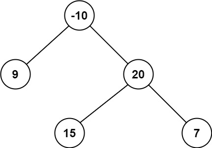
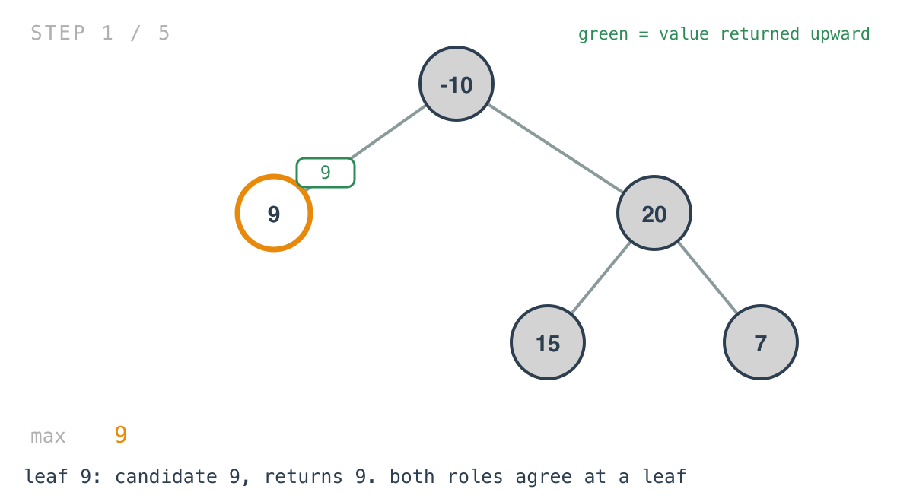
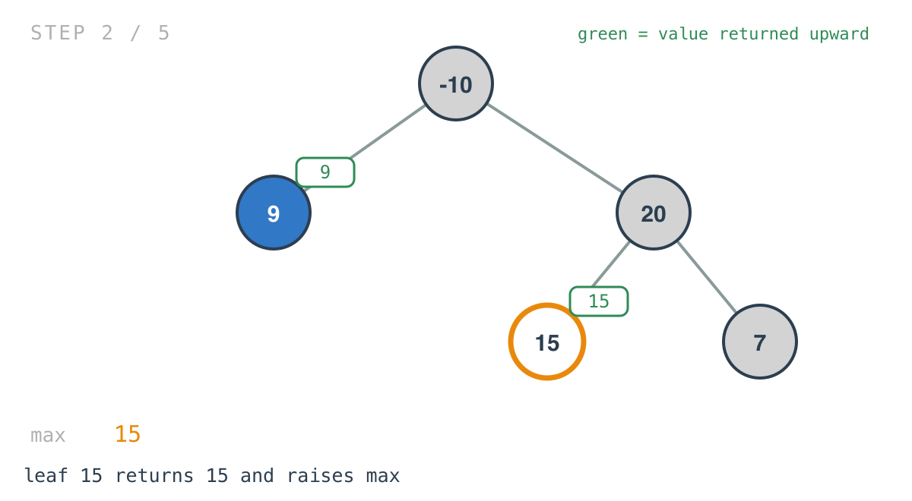
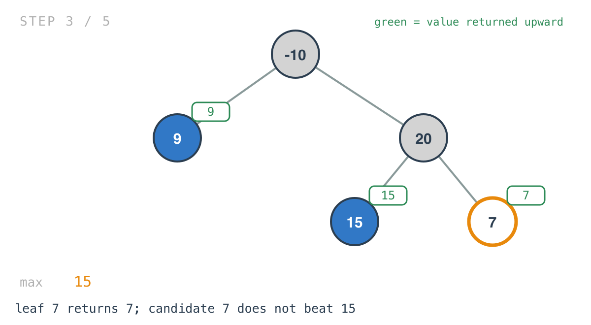
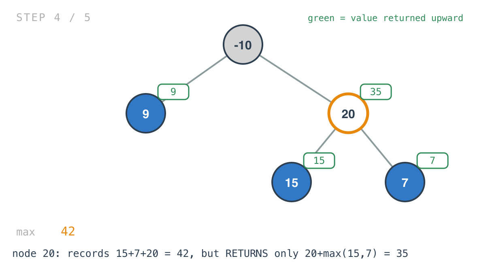
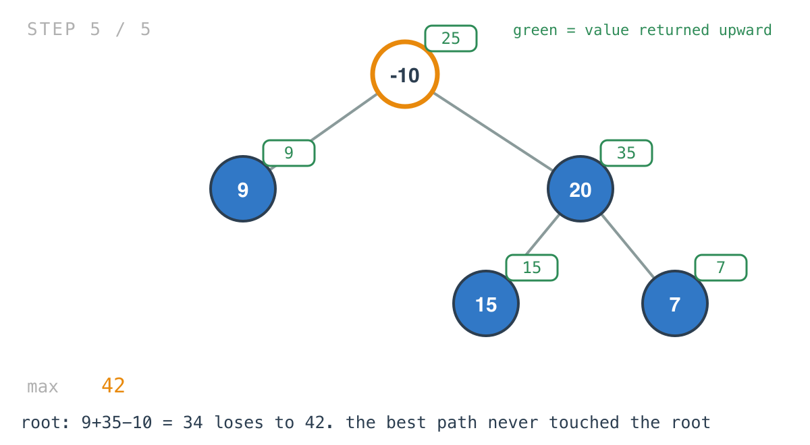

## 365 Days of LeetCode Challenge — Day 18/365

# Binary Tree Maximum Path Sum

🔗 https://leetcode.com/problems/binary-tree-maximum-path-sum/ · Difficulty: Hard

### The problem

A path is a sequence of nodes connected by edges, each node used at most once, and it
doesn't have to pass through the root. Return the maximum sum of any non-empty path.



### The intuition

The first hard of the challenge, and what makes it hard isn't the traversal. It's that
each node has to compute two different things, and confusing them is the whole trap.

Read the definition of a path carefully and one consequence follows. At the topmost node
of a path, the path may come up one side and go down the other. Anywhere else along the
path, it can only continue in one direction — a path that branched would contain a node
with three neighbours, which isn't a path.

So every node plays two roles:

As the top of a path, both children can contribute: `left + right + val`, which is a
candidate for the answer.

As a link in some ancestor's path, only one child can contribute, because the ancestor will
attach above: `max(left, right) + val`, which is what the node reports upward.

Those two values differ, and only one of them can be the return value. The other has to go
somewhere else — which is why `max` is threaded through as a pointer and the answer is
recorded as a side effect at every node, while the return value carries something
different.

The other half of the problem is negatives. Node values can be negative, so a subtree isn't
automatically worth attaching. Every use of a child's value is guarded against taking
nothing at all: `maxValue(left+root.Val, root.Val)` means "extend into the left child, or
don't."

### Builds on

- [Day 13: Diameter of Binary Tree](https://github.com/architagr/leetcode_solutions/blob/main/easy_problems/501_600/diameter_of_binary_tree/) — the identical shape. There, each node returned a height upward while recording left + right as a candidate answer. Swap "height" for "path sum" and you have this problem

### The solution

```go
func maxPathSum(root *TreeNode) int {
	max := -2000
	recurssivePathSum(root, &max)
	return max
}

func recurssivePathSum(root *TreeNode, max *int) int {
	if root == nil {
		return 0
	}
	left := recurssivePathSum(root.Left, max)
	right := recurssivePathSum(root.Right, max)

	// candidate: root.Val + max(0, left) + max(0, right)
	(*max) = maxValue(*max, /* nested comparisons, see the repo */ 0)

	return maxValue(maxValue(left, right)+root.Val, root.Val)
}
```

Tracing `[-10,9,20,null,null,15,7]`: root `-10` with children `9` and `20`; `20` has
children `15` and `7`. Expected `42`, the path `15 -> 20 -> 7`, which never touches the
root.

At a leaf the two roles coincide, which is why leaves are a bad place to notice the
distinction.







Node `20` is where they part company: it records `15 + 7 + 20 = 42` as a candidate, but
returns only `20 + max(15, 7) = 35`. Returning 42 would be the classic bug — the parent
attaches to it and builds a "path" that forks at `20`.



The root's own candidate is `9 + 35 - 10 = 34`, which doesn't beat 42. The best path never
passes through the root, which is exactly the case a root-anchored solution gets wrong.



Two implementation notes.

`max` seeds at `-2000`, below anything reachable, because values are at least `-1000` and
a path is non-empty. A `0` seed would be wrong on an all-negative tree, where the answer is
the least negative single node.

And the nested `maxValue` calls look worse than the idea. The code builds the candidate by
comparing `root.Val` against `right+val`, `left+val` and `left+right+val`. Written
directly, the candidate is `val + max(0, left) + max(0, right)` and the return is
`val + max(0, left, right)`. Those agree with the implementation on every input — the short
form is what you'd write from scratch, and the long form is what makes the code look harder
than the problem.

O(n) time, one visit per node with constant work. Space is O(h) for the recursion stack.

Full code and the step-by-step walkthrough:
[binary_tree_maximum_path_sum](https://github.com/architagr/leetcode_solutions/blob/main/hard_problems/101_200/binary_tree_maximum_path_sum/SOLUTION.md)

#DSA #LeetCode #100DaysOfCode #CodingInterview #BinaryTree #Recursion #Golang

---

*Solution and code by Archit Agarwal. Write-up drafted with AI assistance from the code and problem statement.*
