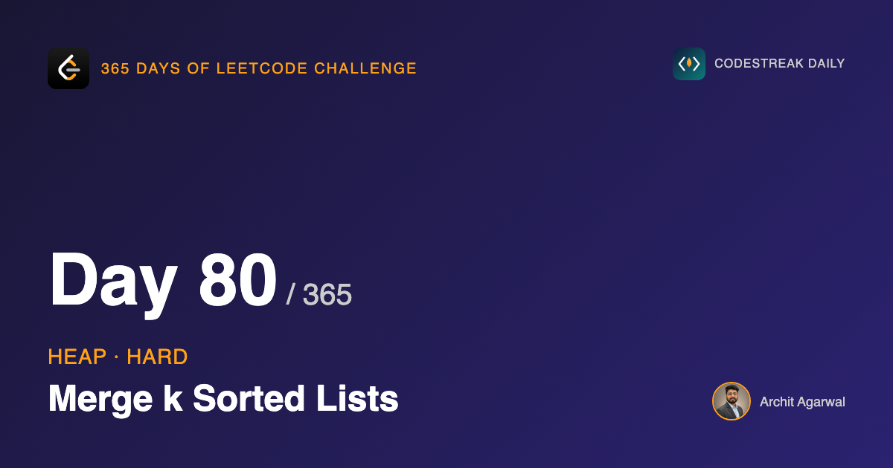
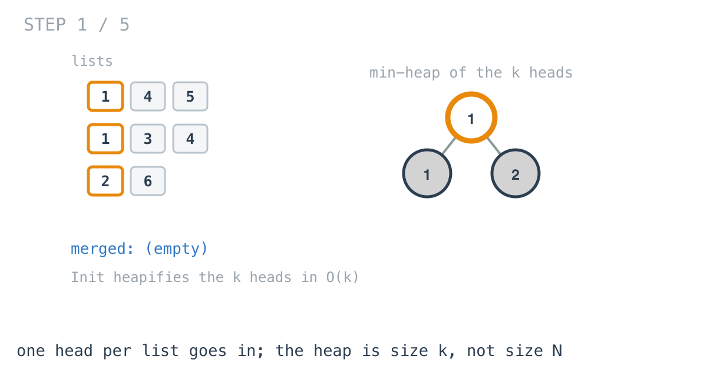
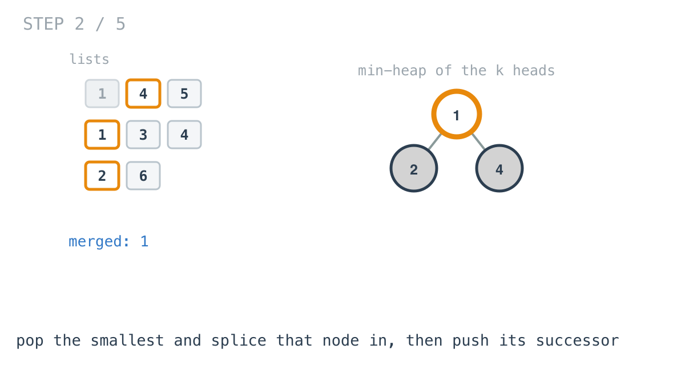
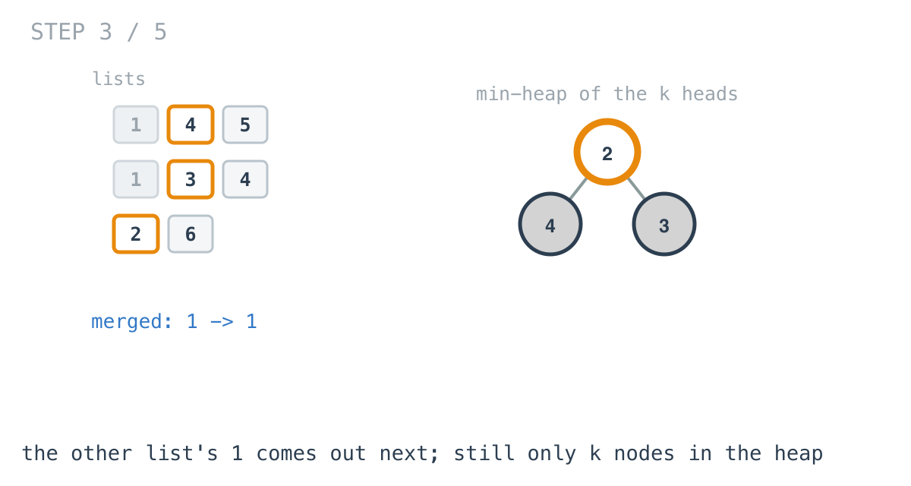
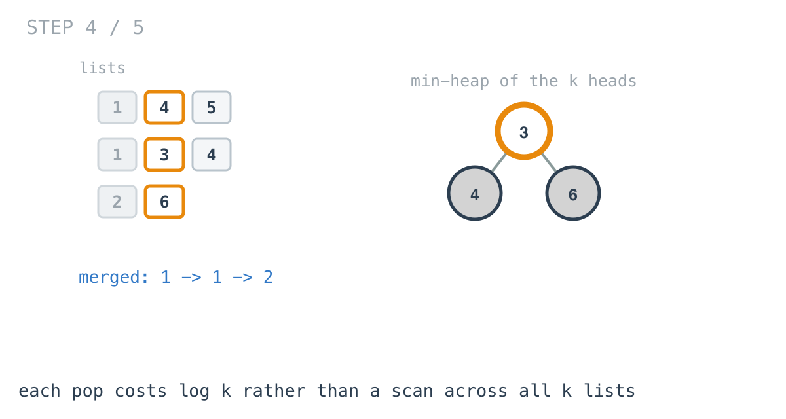
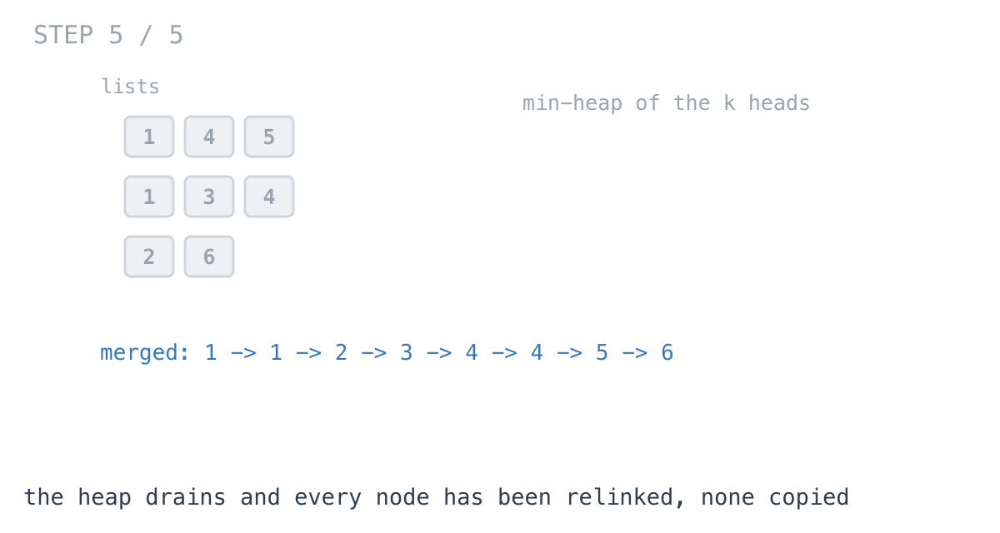

*365 Days of LeetCode Challenge — Day 80/365*

**[23. Merge k Sorted Lists](https://leetcode.com/problems/merge-k-sorted-lists/)** (Hard)

You are given an array of `k` linked lists, each sorted ascending. Merge them into one sorted list.

This is the problem the last two months have been pointing at.

When I laid out the reading order for this series, day 80 was chosen deliberately: it is the one problem that needs the linked list arc from day 22 and the heap arc from this week, and needs both at the same time. Fifty-eight days apart, converging on one Hard.

## Day 22, with one thing changed

Day 22 was Merge Two Sorted Lists. The algorithm was: look at the head of each list, take the smaller, advance that list, repeat.

The comparison was an `if`. With exactly two candidates, that is all a comparison needs to be.

Now make it `k` lists. Everything else about the approach still holds — the smallest unplaced element is still the head of one of the lists, because each list is sorted and nothing behind a head is smaller than it. That reasoning does not change at all.

What changes is the act of finding which head.

"Take the smallest of k things" is not a comparison any more. It is a repeated query for the minimum of a collection, where the collection changes after every answer.

That is the definition of what a heap is for. So this problem is **day 22's merge with the `if` replaced by a heap** — and the dummy head, the splicing, and the loop shape all come across untouched.

## What goes into the heap

```go
h := &nodeHeap{}
for _, l := range lists {
	if l != nil {
		*h = append(*h, l)
	}
}
heap.Init(h)
```



One node per list. Not every node — just the current head of each.

This is the observation everything else rests on, and it is worth stating carefully.

A list's second element cannot possibly be the next smallest overall while its first element is still unplaced. The list is sorted, so its own head is smaller than it. It is not a candidate, and it does not become one until the instant its predecessor is placed.

So there is never any reason to hold more than `k` nodes. The heap's size is the number of *lists*, not the number of *elements*.

That is the entire difference between O(N log k) and O(N log N). Push everything into a heap and you have written a heapsort over all N nodes; push only the heads and you have written a k-way merge.

## Two details in that setup

**Empty lists must be filtered out.** A `nil` cannot go into the heap — `Less` dereferences `h[i].Val` during the very first sift, and it would panic immediately.

This is not defensive programming against an imagined input. The problem's own examples include `lists = []` and `lists = [[]]`, and the constraints allow individual lists of length zero.

**`Init` rather than k pushes.** The heads are appended directly and heapified once, which is O(k) by Floyd's method. Pushing them one at a time through `heap.Push` would be O(k log k).

Day 76 pointed this distinction out and did not take advantage of it. Here it is taken.

## The loop

```go
for h.Len() > 0 {
	node := heap.Pop(h).(*ListNode)
	tail.Next = node
	tail = node
	if node.Next != nil {
		heap.Push(h, node.Next)
	}
}
```



Pop the smallest head. Splice it onto the result. Then push its successor — which, at that exact moment, has become a candidate for the first time.





One node leaves the heap per iteration and at most one enters, so the size stays at k and drifts down only as lists are exhausted.

## Why not scan the k heads each round

The straightforward alternative: look at all `k` heads, take the minimum, advance that list. No heap at all.

It is correct, and it is O(k) per placed node, so O(N·k) over the whole merge.

The waste in it is precise, and worth stating precisely. Between one round and the next, exactly **one** head changed — the head of the list that was just advanced. Every other list is exactly as it was. The scan re-examines all k of them anyway, rediscovering facts it established a moment earlier.

A heap retains the ordering between rounds and pays O(log k) to absorb the single change. That is the same argument as the monotonic stack on day 59: the difference between re-reading and consuming.

## The dummy head, again

```go
dummy := &ListNode{}
tail := dummy
```

Directly from day 22. Without it, the loop needs a branch on every iteration to decide whether it is setting the list's head or extending its tail, and that branch is the same comparison written twice.

## Splicing, and the cycle it can create

```go
tail.Next = node
tail = node
```

The nodes already exist. Building new ones and copying values into them costs O(N) memory to construct something that rewriting pointers produces for free.

This is day 22's rule, and it is the same correction 206 and 21 received earlier in this series. By now it should feel automatic: in a linked list problem, moving pointers is the answer and copying values is the tell that you have not seen it yet.

But splicing carries a consequence that copying does not:

```go
tail.Next = nil
```

Every node spliced into the result arrives with its `Next` still pointing wherever it pointed in its original list.

In practice, the final node popped is the overall maximum, which must be the tail of its own list — anything after it would be larger and would have been pushed and popped later. So its `Next` is already `nil` and the cut changes nothing.

I keep it anyway, and the test file walks the merged result with a step cap so that a cycle **fails the test** instead of hanging it. A merge that reuses its input nodes is precisely the shape of code where an unterminated list quietly becomes an infinite one, and an infinite list does not announce itself — it just stops the test suite forever.



## Complexity

- **Time: O(N log k)** for N nodes total. Each node is pushed exactly once and popped exactly once, and every heap operation runs on at most k entries. Plus O(k) for the initial heapify.
- **Space: O(k)** for the heap. Nothing is allocated per node — the returned list is made of the nodes that were passed in.

For comparison: scanning the heads is O(N·k), and concatenating everything into a slice and sorting is O(N log N). With k up to 10⁴ and N up to 10⁴, the gap between those is the reason this is filed as Hard.

## Builds on

- [Day 22: Merge Two Sorted Lists](https://github.com/architagr/leetcode_solutions/blob/main/easy_problems/1_100/merge_two_sorted_lists/) — the dummy head and the splice-don't-copy rule, both used here unchanged
- [Day 75: Kth Largest Element in a Stream](https://github.com/architagr/leetcode_solutions/blob/main/easy_problems/701_800/kth_largest_element_in_a_stream/) — a heap held at a fixed size while values stream through it

Full code and the step-by-step walkthrough:
[merge_k_sorted_lists](https://github.com/architagr/leetcode_solutions/blob/main/hard_problems/1_100/merge_k_sorted_lists/SOLUTION.md)

---

*Solution and code by Archit Agarwal. Write-up drafted with AI assistance from the code and problem statement.*
