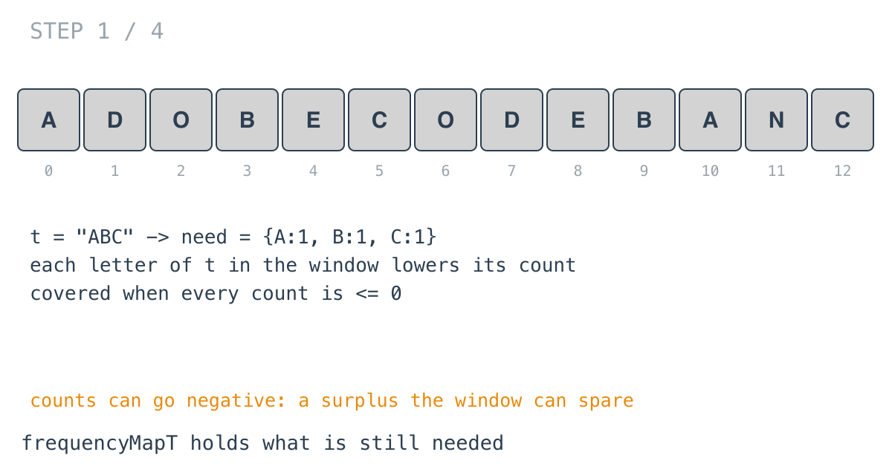
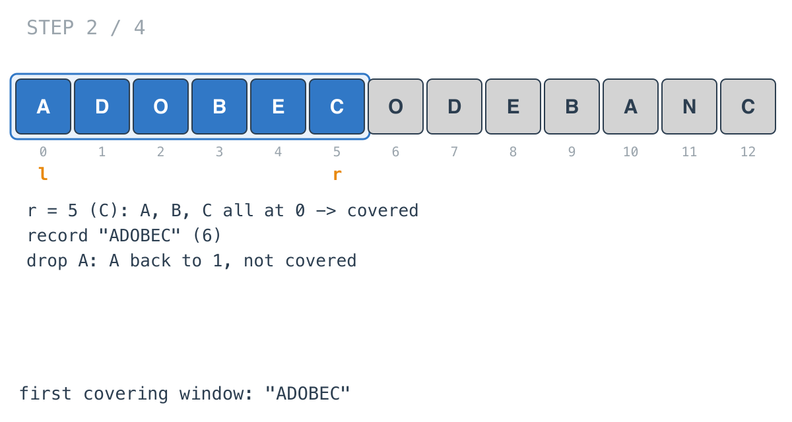
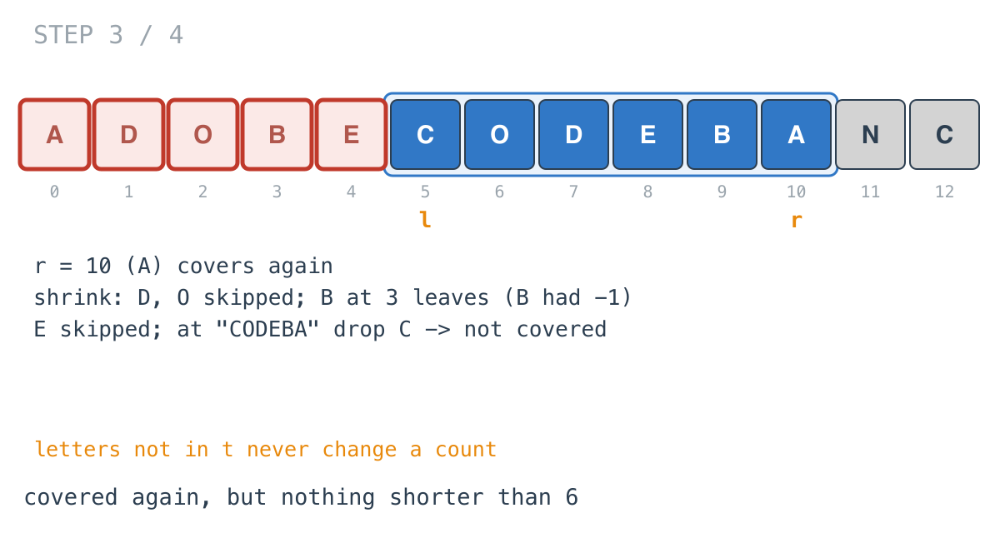
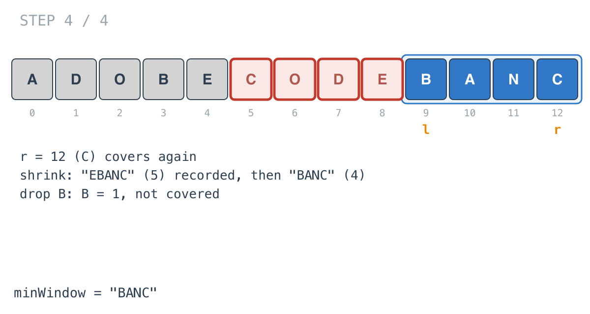

## Solution walkthrough

`minWindow(s, t string) string` in `main.go` keeps a map of the characters still needed,
grows the window until nothing is needed, then shrinks it from the left for as long as
nothing is needed, remembering the shortest window.

We'll trace Example 1: `s = "ADOBECODEBANC"`, `t = "ABC"`, expected `"BANC"`.

1. **What's needed.** `frequencyMapT` starts as the counts of `t`: `{A:1, B:1, C:1}`. A
   character of `t` entering the window decrements its entry; leaving increments it. The
   window covers `t` when `found` sees every entry at 0 or below.

   

2. **Grow until covered.** Characters not in `t` are skipped with `continue`. By `r = 5`,
   `A`, `B` and `C` are all at 0: the window `"ADOBEC"` covers `t`.

3. **Shrink while covered.**

   ```go
   for ; found(frequencyMapT) && l <= r; l++ {
       if len(result) == 0 || r-l+1 < len(result) {
           result = s[l : r+1]
       }
       if _, ok := frequencyMapT[s[l]]; !ok {
           continue
       }
       frequencyMapT[s[l]]++
   }
   ```

   `"ADOBEC"` is recorded. Dropping `A` puts it back to 1, and the loop stops.

   

4. **Surplus lets the window shrink further.** The `B` at 9 takes `B` to -1: the window
   has a spare. At `r = 10` an `A` makes it covered again. The shrink steps over `D` and
   `O` (the `continue` still runs `l++`), drops the first `B` (back to 0, still covered),
   steps over `E`, and stops after dropping `C`. None of these windows is shorter than 6.

   

5. **The answer.** At `r = 12` the final `C` covers `t` again. Shrinking records `"EBANC"`
   (5) and then `"BANC"` (4); dropping `B` ends it. The result is `"BANC"`.

   

If `t` is never covered, `result` stays `""`, which is the required answer for Example 3.

**Complexity:** O(52·|s|) time, O(1) space.
