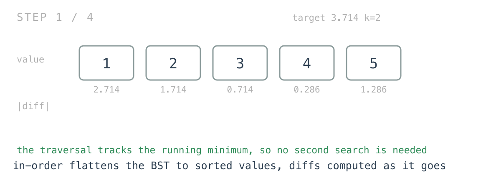
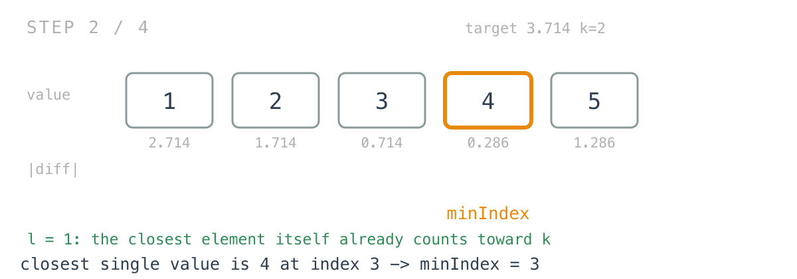
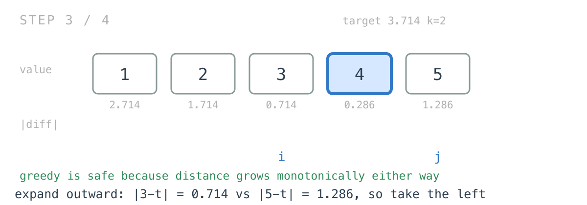
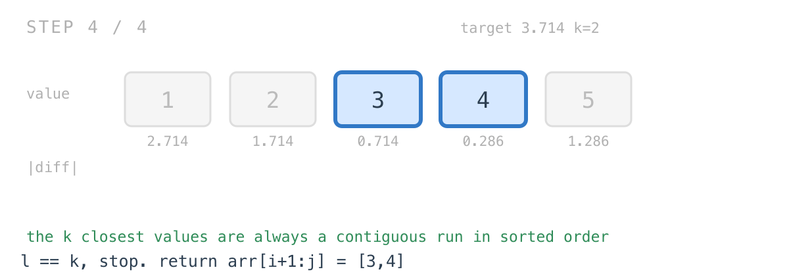

## Solution walkthrough

The implementation is `closestKValues(root *TreeNode, target float64, k int) []int` over
`inOrderTraversal` and an `absDiff` helper, in `main.go`.


We'll trace `root = [4,2,5,1,3]`, `target = 3.714286`, `k = 2`. The in-order sequence is
`[1,2,3,4,5]` and the expected answer is `[4,3]`, in any order.

1. **One traversal does two jobs.** `inOrderTraversal` flattens the tree into `arr` and, on
   the way, tracks the smallest absolute difference seen and the index where it occurred:

   ```go
   diff := absDiff(root.Val, target)
   if min > diff {
       min = diff
       minIndex = len(*arr)
   }
   (*arr) = append((*arr), root.Val)
   ```

   `minIndex` is captured as `len(*arr)` *before* the append, which is precisely the index
   this value is about to occupy. No separate search for the closest element is needed.

   

   Here the diffs are `2.714, 1.714, 0.714, 0.286, 1.286`, so `minIndex` ends up `3`, the
   index of value `4`.

   

2. **The counter starts at 1.** `l := 0; l++` is a roundabout way of writing `l := 1`, and
   the `1` is right: the closest element itself is already part of the answer, so only
   `k-1` more are needed.

3. **Expand outward, taking the nearer neighbour each time.**

   ```go
   i, j := minIndex-1, minIndex+1
   for i >= 0 && j < len(inOrderArr) && l < k {
       if absDiff(inOrderArr[i], target) < absDiff(inOrderArr[j], target) {
           i--
       } else {
           j++
       }
       l++
   }
   ```

   `i` walks left and `j` walks right. At each step whichever side is closer to the target
   is consumed. Here `|3 - t| = 0.714` beats `|5 - t| = 1.286`, so `i` moves left.

   

   Greedy is safe because distance from the target increases monotonically as you move away
   in either direction — this is the merge step of a merge sort, run outward from a centre.

4. **The two trailing loops handle running out of array.**

   ```go
   for ; i >= 0 && l < k; l++ { i-- }
   for ; j < len(inOrderArr) && l < k; l++ { j++ }
   ```

   If one side is exhausted before `k` values are collected, the other supplies the rest.
   Only one of these can ever execute, since the main loop stops when either pointer runs
   out.

5. **The answer is the window between the pointers.** `return inOrderArr[i+1 : j]`. Both
   pointers sit one step outside the collected range — `i` has moved past the last value it
   took and `j` stops one beyond — so `i+1` and `j` are exactly the inclusive-exclusive
   bounds. Here `i` is `1` and `j` is `4`, giving `arr[2:4]` = `[3,4]`.

   

6. **A note on the package-level state.** `min` and `minIndex` are package variables rather
   than parameters or struct fields. It works because `closestKValues` resets both at the
   top of every call, but it makes the function non-reentrant — two goroutines calling it
   concurrently would corrupt each other's search. Threading them through as pointers, the
   way `arr` already is, would remove that.

**Complexity:** O(n) for the traversal plus O(k) for the expansion. Space is O(n) for the
flattened slice plus O(h) for the recursion stack. The known better answer is O(k + h):
run two stack-based BST iterators outward from the target — yesterday's follow-up applied
twice, one going backwards and one forwards — and merge `k` values off them.
