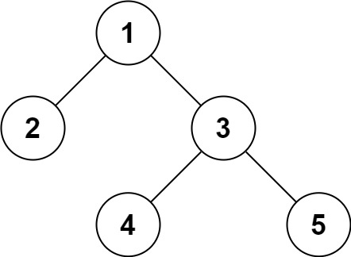
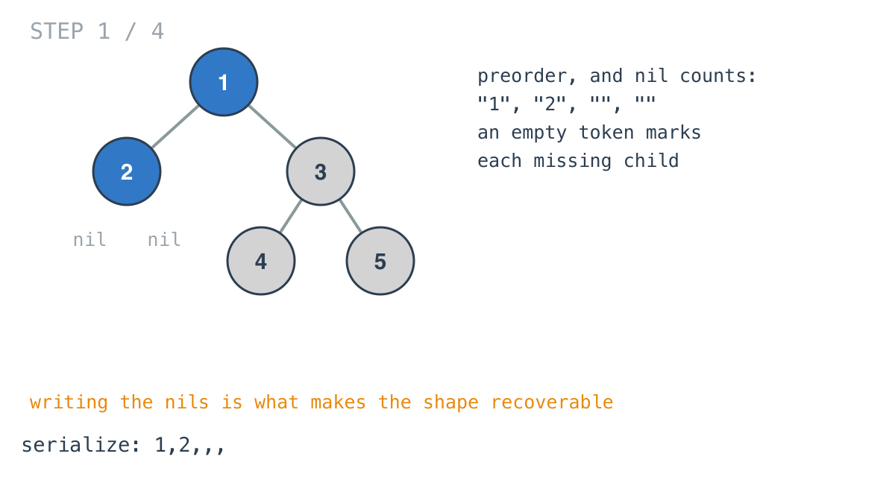
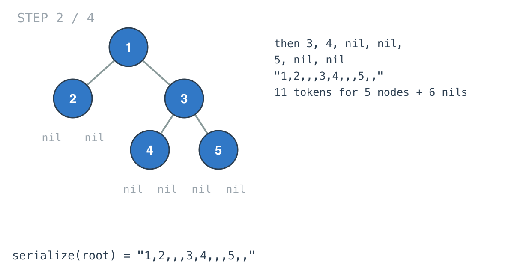
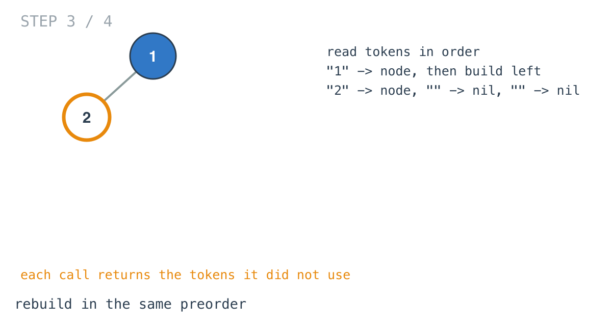
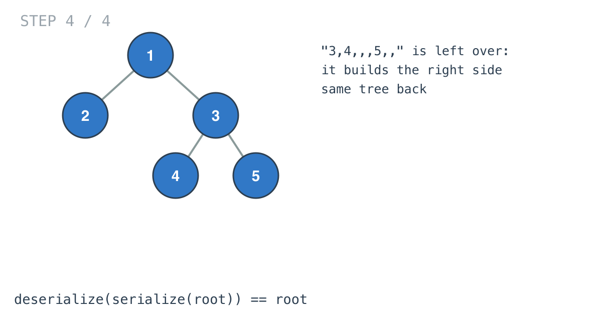

## Solution walkthrough

`Codec` in `main.go` has `serialize`, a preorder walk that writes an empty token for every missing
child, and `deserialize`, which reads the tokens back in the same order.



We'll trace Example 1: `[1,2,3,null,null,4,5]`.

1. **Write nils too.** `serialize`'s `dfs` appends `strconv.Itoa(root.Val)` for a node and `""`
   for a nil, visiting node, left, right. Node 1, node 2, and 2's two missing children give
   `"1", "2", "", ""`.

   

2. **The whole string.** Then 3, 4 with two nils, 5 with two nils. Joined with commas:
   `"1,2,,,3,4,,,5,,"`. Five nodes and six nils; a tree of `n` nodes always has `n + 1` empty child
   slots.

   

3. **Read in the same order.**

   ```go
   dfs = func(ss []string) ([]string, *TreeNode) {
       if ss[0] == "" {
           return ss[1:], nil
       }
       v, _ := strconv.Atoi(ss[0])
       root := &TreeNode{Val: v}
       ss, root.Left = dfs(ss[1:])
       ss, root.Right = dfs(ss)
       return ss, root
   }
   ```

   Token "1" makes the root, and the left subtree is built from the tokens after it: "2", then two
   empties. Each call returns the tokens it didn't use.

   

4. **The rest builds the right side.** The left subtree hands back `"3,4,,,5,,"`, which becomes
   3 with children 4 and 5. Serialising the result gives the identical string.

   

The empty tree serialises to `""`; splitting that gives one empty token, which deserialises to nil.

**Complexity:** O(n) time each way, O(n) space.
