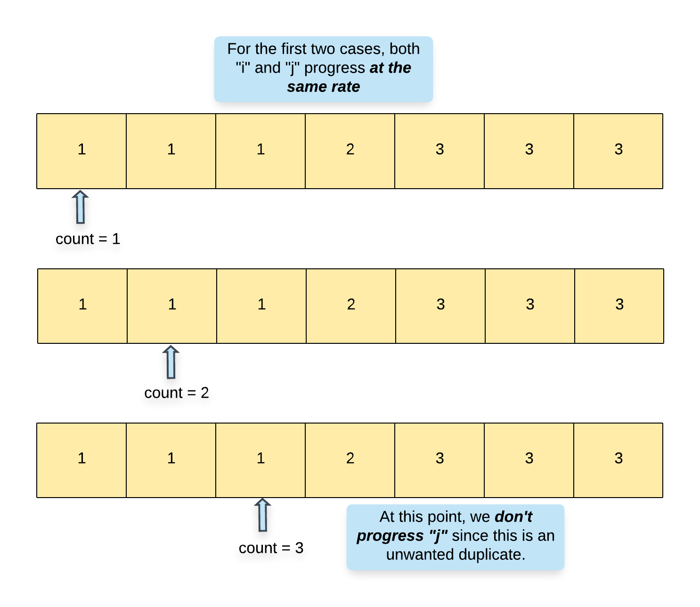
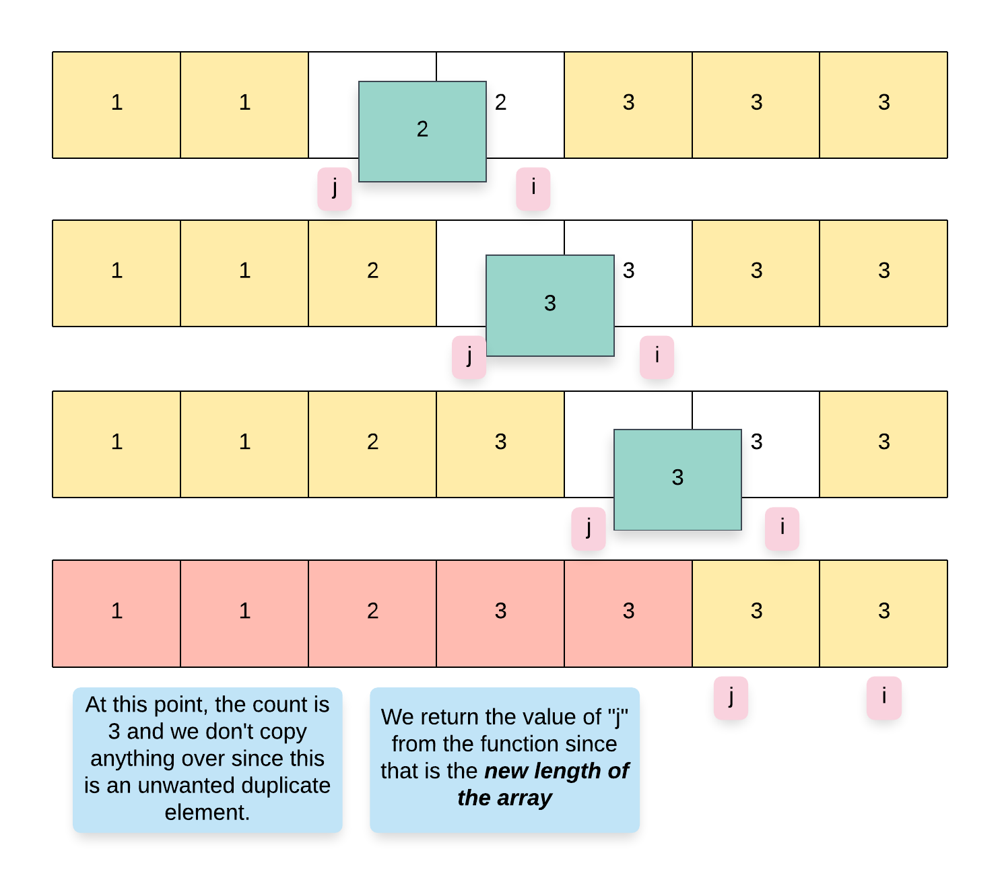

# Intuition

The second approach is really inspired by the fact that the problem statement asks us to return the _new length of the array_ from the function. If all we had to do was remove elements, the function would not really ask us to return the updated length. However, in our scenario, this is really an indication that we don't need to actually remove elements from the array. Instead, we can do something better and simply overwrite the duplicate elements that are unwanted.

> We won't be able to achieve this using a single pointer. We will be using a two-pointer approach where one pointer iterates over the original set of elements and another one that keeps track of the next "empty" location in the array or the next location that can be overwritten in the array.

## Algorithm

1. We define two pointers, `i` and `j` for our algorithm. The pointer `i` iterates of the array processing one element at a time and `j` keeps track of the next location in the array where we can overwrite an element.

1. We also keep a variable `count` which keeps track of the count of a particular element in the array. Note that the minimum count would always be 1.

1. We start with index `1` and process one element at a time in the array.

1. If we find that the current element is the same as the previous element i.e. `nums[i] == nums[i - 1]`, then we increment the `count`. If the value of `count > 2`, then we have encountered an unwanted duplicate element. In this case, we simply move forward i.e. we increment `i` but not `j`.

1. However, if the count is `<= 2`, then we can move the element from index `i` to index `j`.

1. If we encounter that the current element is not the same as the previous element i.e. `nums[i] != nums[i - 1]`, then it means we have a new element at hand and so accordingly, we update `count = 1` and also move this element to index `j`.

1. It goes without saying that whenever we copy a new element to `nums[j]`, we have to update the value of `j` as well since `j` always points to the location where the next element can be copied to in the array.

## Complexity Analysis

- **Time Complexity:** `O(N)` since we process each element exactly once.
- **Space Complexity:** `O(1)`.
