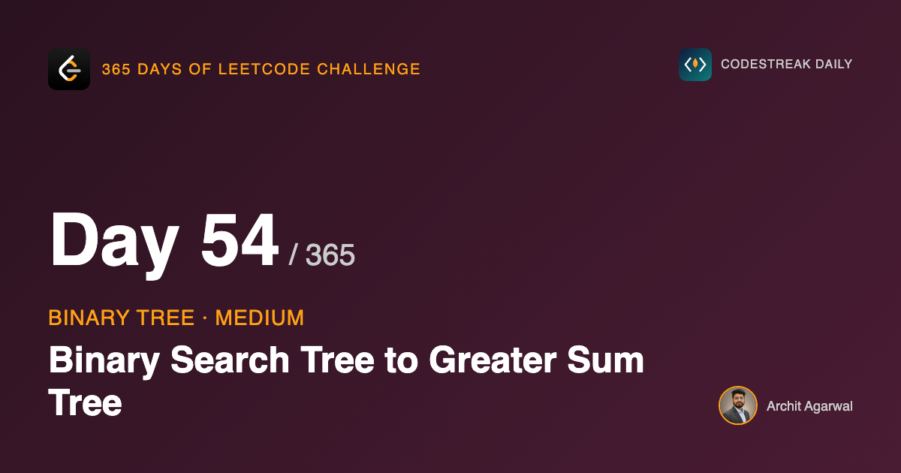
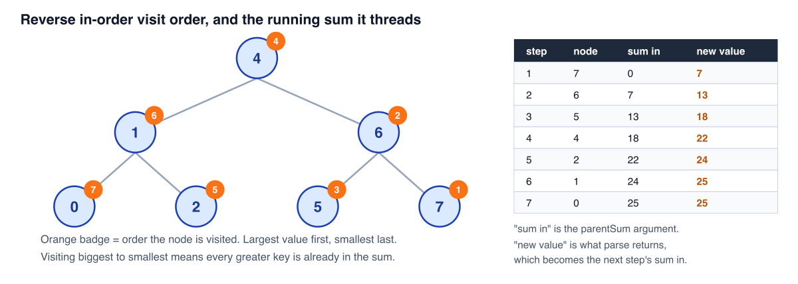
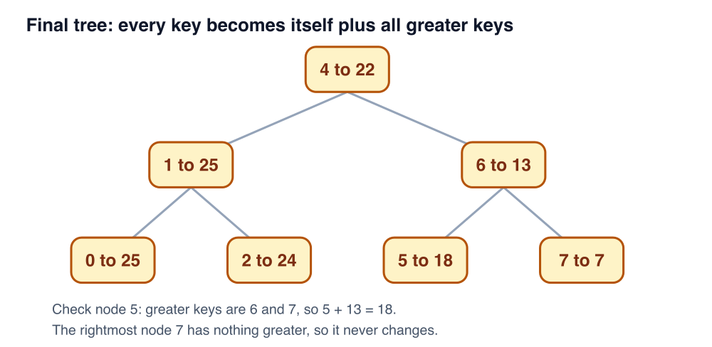

# 365 Days of LeetCode Challenge — Day 54/365

## Binary Search Tree to Greater Sum Tree

[LeetCode #1038](https://leetcode.com/problems/binary-search-tree-to-greater-sum-tree/) · Medium



Given the root of a BST, convert it so that every key becomes the original key plus the sum of all keys greater than it.


## The trap in the problem statement

"Add the sum of all keys greater than this one" describes a search. For each node, go find the bigger nodes, add them up, write the result back. That reading gives you O(n^2), and on a tree of 100 nodes it would even pass.

It's worth resisting anyway, because the BST is already telling you what "greater" means and you don't have to search for anything.

## Walking the tree backwards

In-order traversal of a BST yields keys in ascending order. Flip it, right subtree before left, and you get descending order.

Now the problem changes shape. If I visit nodes from largest to smallest, then by the time I reach any node, I have already visited exactly the set of nodes greater than it. Nothing needs looking up. I only need to have been adding as I went.

The algorithm is then: traverse right, root, left, carry a running total, and at each node add that total to the node's value.

## Threading the sum through the recursion

Most implementations keep the running total in a pointer or a closure variable that every call mutates. This one passes it as an argument and gets it back as a return value:

```go
func bstToGst(root *TreeNode) *TreeNode {
	parse(root, 0)
	return root
}

func parse(node *TreeNode, parentSum int) int {
	if node == nil {
		return parentSum + 0
	}
	// Traverse right subtree first to process larger values
	right := parse(node.Right, parentSum)
	// Add the accumulated sum of all greater nodes
	node.Val += right
	// Traverse left subtree with updated sum
	return parse(node.Left, node.Val)
}
```

The contract: given the sum of everything already processed, handle this subtree and return the sum of everything processed once it's done. The `nil` case returns `parentSum` unchanged, so empty branches let the total flow straight past.

Three lines, and the order is the algorithm:

**`parse(node.Right, parentSum)` runs first.** Everything in the right subtree is greater than this node, so it has to be folded in before this node is touched. The incoming sum goes down untouched, because those nodes' totals shouldn't include this node yet.

**`node.Val += right` converts the node.** At that moment `right` is the sum of every key greater than it, so the addition is the problem statement, verbatim.

**`parse(node.Left, node.Val)` recurses left.** This is my favourite bit. After the previous line, `node.Val` *is* the running sum, because it now equals this key plus everything above it. So there's no separate accumulator to maintain. The tree ends up holding the state the traversal needs.

Get that ordering wrong and every value drifts by one subtree's worth. The output still looks like a plausible tree, which makes it a nasty bug to catch by eye.

## Following it through

Take the BST `[4,1,6,0,2,5,7]`:



The badges show the order `parse` reaches each node: 7, 6, 5, 4, 2, 1, 0. Strictly descending.

- **7**, the rightmost node, gets `parentSum` 0 and stays 7.
- **6** receives 7 from its right child, becomes 13.
- **5** is 6's left child, receives 13, becomes 18. That 18 unwinds back to the root.
- **4**, the root, receives 18 and becomes 22. Checks out: 5 + 6 + 7 = 18.
- **2** receives 22, becomes 24.
- **1** receives 24, becomes 25.
- **0** receives 25, becomes 25.

The result:



Spot-check node 5. The keys above it are 6 and 7, and 5 + 6 + 7 = 18. Node 7 never moves, because nothing in the tree is bigger.

## Cost

**Time O(n).** One visit per node, constant work each.

**Space O(h)** for the call stack. Balanced BST gives O(log n), a fully skewed one gives O(n). Nothing allocated beyond the recursion, and the conversion happens in place.

## Worth noting

This is the same problem as [538: Convert BST to Greater Tree](https://leetcode.com/problems/convert-bst-to-greater-tree/). Solve one and you've solved both.

The general lesson is the one that keeps coming up with BSTs: when a problem mentions ordering, the traversal order is usually the answer. Reversing in-order costs nothing and turns a search into a running total.

Full code and the step-by-step walkthrough:
[binary_search_tree_to_greater_sum_tree](https://github.com/architagr/leetcode_solutions/blob/main/medium_problems/1001_1100/binary_search_tree_to_greater_sum_tree/SOLUTION.md)

#DSA #LeetCode #BinarySearchTree #Recursion #Golang #CodingInterview #Algorithms

---

*Solution and code by Archit Agarwal. Write-up drafted with AI assistance from the
code and problem statement.*
