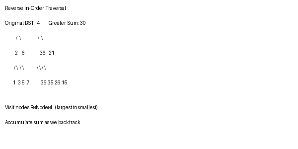

# 365 Days of LeetCode Challenge — Day 30/365

## Binary Search Tree to Greater Sum Tree

**LeetCode:** [#1038 - Binary Search Tree to Greater Sum Tree](https://leetcode.com/problems/binary-search-tree-to-greater-sum-tree/)  
**Solution:** [github.com/architagr/leetcode_solutions/blob/main/medium_problems/1001_1100/binary_search_tree_to_greater_sum_tree/](https://github.com/architagr/leetcode_solutions/blob/main/medium_problems/1001_1100/binary_search_tree_to_greater_sum_tree/)

---

## Related Easy Problems

- [Day 3: Binary Tree Paths](https://github.com/architagr/leetcode_solutions/blob/main/easy_problems/201_300/binary_tree_path/) — tree traversal
- [Day 11: Minimum Absolute Difference in BST](https://github.com/architagr/leetcode_solutions/blob/main/easy_problems/501_600/minimum_absolute_difference_in_bst/) — understanding BST properties

---

## Intuition

The key insight: traverse the BST in reverse in-order (right → node → left). This visits nodes from largest to smallest. Keep a running sum as we go. When we visit a node, add the running sum to it, then update the sum.

This works because in a BST, the right subtree has all values greater than the current node. By going right first, we process all greater values before the current node. We accumulate them in a sum that gets applied as we traverse back through smaller nodes.

---

## Solution Walkthrough

### Diagram



### Approach: Reverse In-Order Traversal with Running Sum

To convert each node, add the sum of all greater nodes to it. We achieve this using reverse in-order traversal (right-to-left), maintaining a running cumulative sum.

### Code

```go
func bstToGst(root *TreeNode) *TreeNode {
    parse(root, 0)
    return root
}

func parse(node *TreeNode, parentSum int) int {
    if node == nil {
        return parentSum + 0
    }
    // Visit right subtree first (larger values)
    right := parse(node.Right, parentSum)
    // Add accumulated sum to current node
    node.Val += right
    // Visit left subtree (smaller values)
    return parse(node.Left, node.Val)
}
```

**Traversal order:** Right → Node → Left (reverse in-order)

1. Recursively traverse to the rightmost node
2. On the way back, accumulate the current node's value into a running sum
3. Add that sum to each node we visit
4. Continue to the left subtree with the updated sum

### Complexity

- **Time:** O(n) — visit each node once
- **Space:** O(h) — recursion depth

---

#BinarySearchTree #BinaryTree #Recursion #TreeTraversal #LeetCode #DSA #Golang

---

*Solution and code by Archit Agarwal. Write-up drafted with AI assistance from the code and problem statement.*
