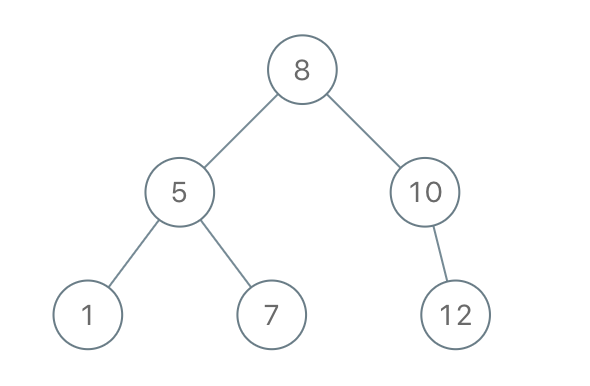
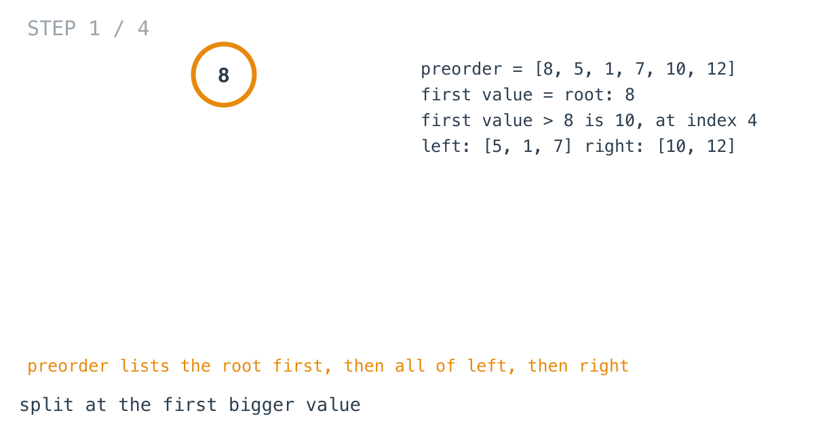
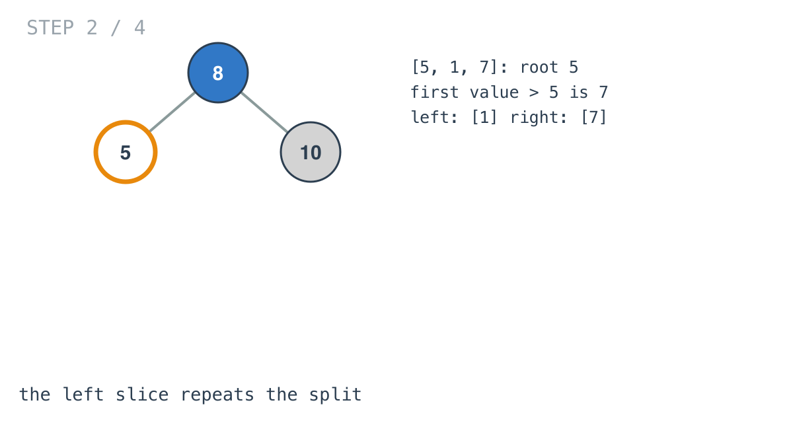
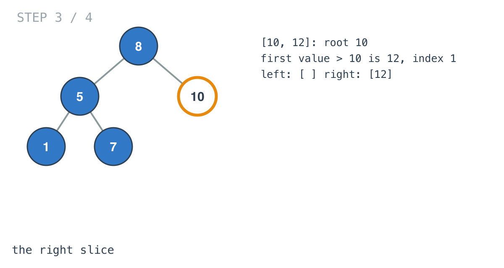
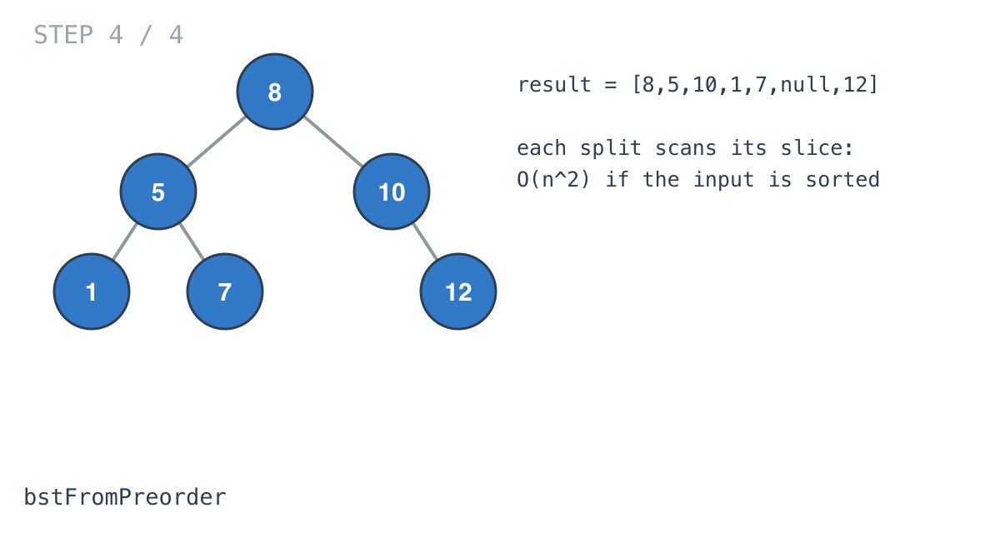

## Solution walkthrough

`bstFromPreorder(preorder []int) *TreeNode` in `main.go` takes the first value as the root
and splits the rest at the first larger value.



We'll trace Example 1: `[8,5,1,7,10,12]`, expected `[8,5,10,1,7,null,12]`.

1. **Root first.** Preorder starts with the root: 8. `findNextLargestIndex` scans for the
   first value greater than 8 and finds 10 at index 4.

   ```go
   return &TreeNode{
       Val:   preorder[0],
       Left:  bstFromPreorder(preorder[1:index]),
       Right: bstFromPreorder(preorder[index:]),
   }
   ```

   Left block `[5, 1, 7]`, right block `[10, 12]`.

   

2. **Recurse on the left block.** Root 5; the first value above 5 is 7. Left `[1]`, right
   `[7]`, each a single node.

   

3. **The right block.** Root 10; the first value above 10 is 12 at index 1. The left block
   `preorder[1:1]` is empty, so 10 has no left child. If nothing is bigger,
   `findNextLargestIndex` returns `len(arr)` and the right block is empty.

   

4. **Done.** The tree is `[8,5,10,1,7,null,12]`. Each split scanned its block once, which
   is fine here and quadratic on sorted input. See INTUITION.md for the linear version.

   

**Complexity:** O(n²) worst case, O(h) recursion.
