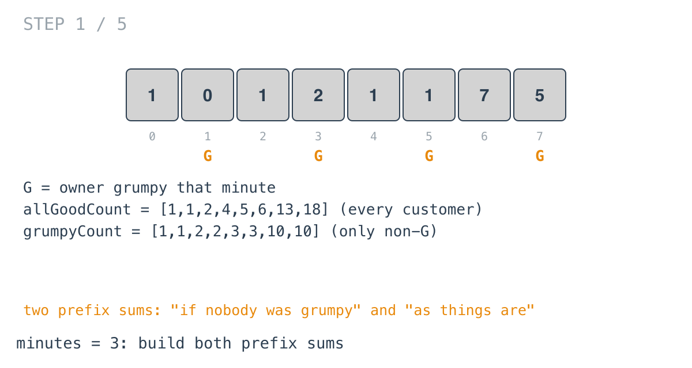
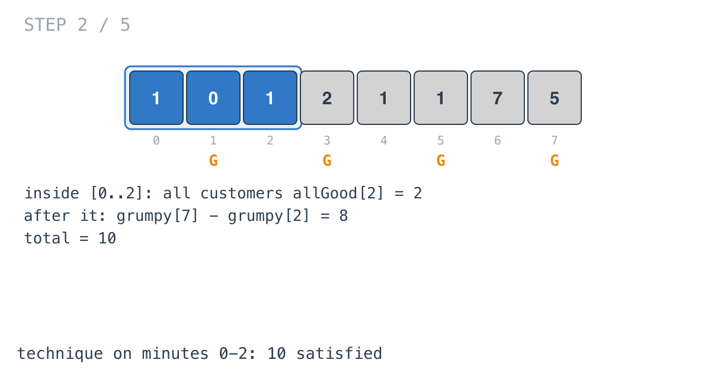
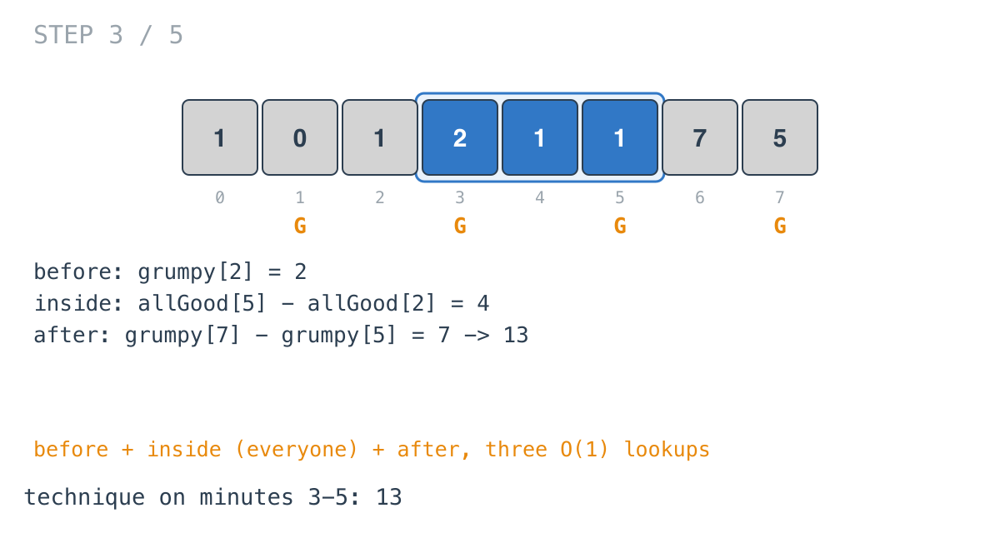
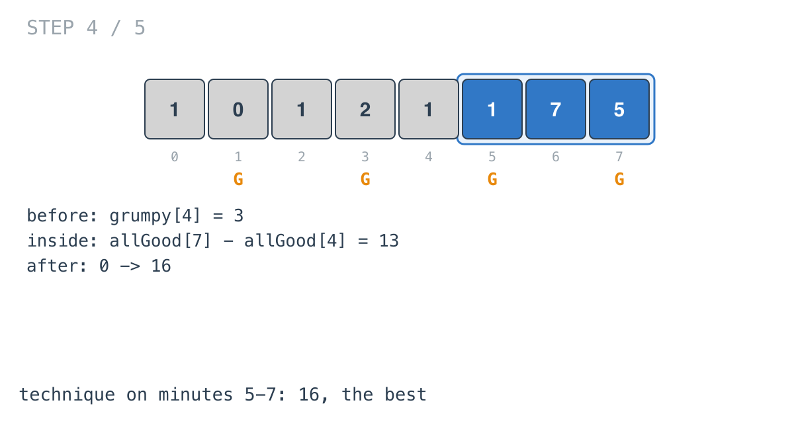
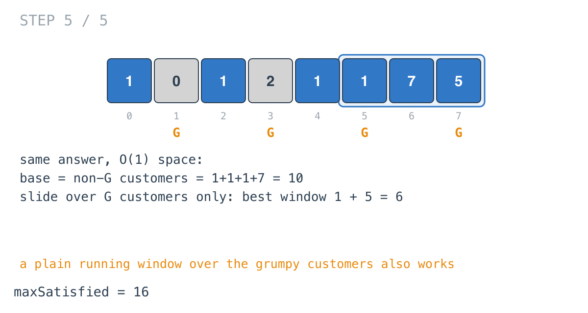

## Solution walkthrough

`maxSatisfied(customers, grumpy []int, minutes int) int` in `grumpy_bookstore_owner.go`
builds two prefix sums and scores every placement of the technique window with them.

We'll trace Example 1: `customers = [1,0,1,2,1,1,7,5]`,
`grumpy = [0,1,0,1,0,1,0,1]`, `minutes = 3`, expected `16`. `G` in the diagrams marks
grumpy minutes.

1. **Two prefix sums.** In one loop, `allGoodCount[i]` accumulates every customer, and
   `grumpyCount[i]` accumulates only customers in non-grumpy minutes (a grumpy minute adds
   `currCust = 0`). Here that's `[1,1,2,4,5,6,13,18]` and `[1,1,2,2,3,3,10,10]`.

   

2. **Covering the whole day.** `if minutes >= n { return allGoodCount[n-1] }`: every
   minute is in the window, so every customer is satisfied.

3. **The first window.** For the technique on minutes `0..2`:
   `allGoodCount[minutes-1] + grumpyCount[n-1] - grumpyCount[minutes-1]` is everyone
   inside (2) plus the usual satisfied after it (`10 - 2 = 8`): 10.

   

4. **Every later window in three lookups.** For the window ending at `i`:

   ```go
   grumpyCount[i-minutes]                       // satisfied before
   + allGoodCount[i] - allGoodCount[i-minutes]  // everyone inside
   + grumpyCount[n-1] - grumpyCount[i]          // satisfied after
   ```

   Window `3..5` scores `2 + 4 + 7 = 13`.

   

5. **The best window.** Window `5..7` scores `3 + 13 + 0 = 16`. The others in between
   score 12, 12 and 11. `max = 16`.

   

6. **The O(1)-space alternative.** Customers in non-grumpy minutes are satisfied
   regardless: `1 + 1 + 1 + 7 = 10`. The window only adds back grumpy-minute customers,
   so a plain sliding sum over `customers[i] * grumpy[i]` finds the best recovery (`1 + 5 =
   6` on minutes `5..7`). `10 + 6 = 16`, with no arrays.

   

**Complexity:** O(n) time, O(n) space for the prefix sums as written.
