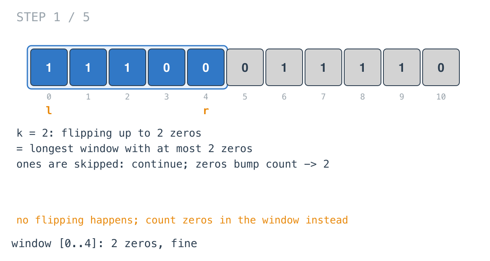
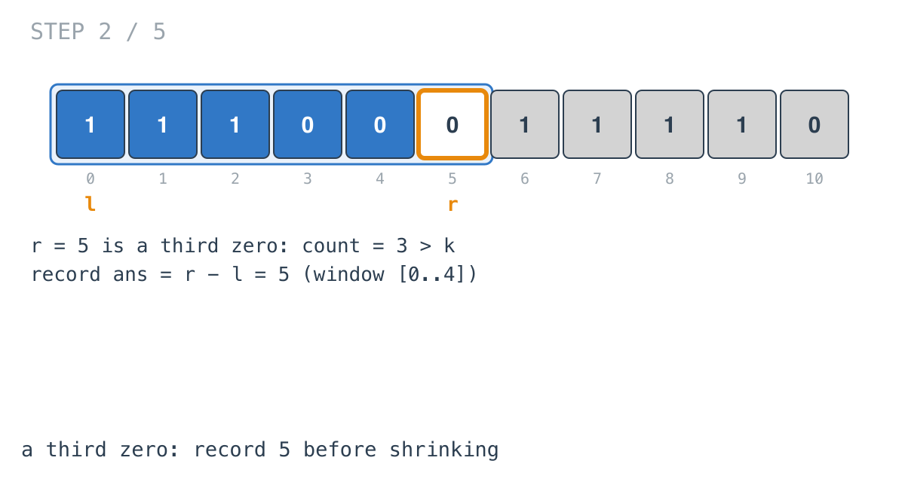
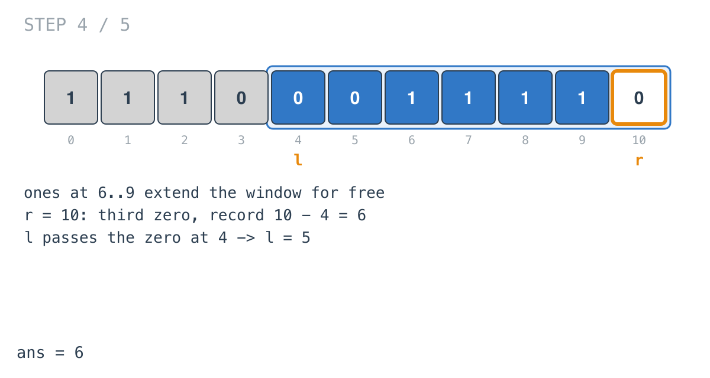
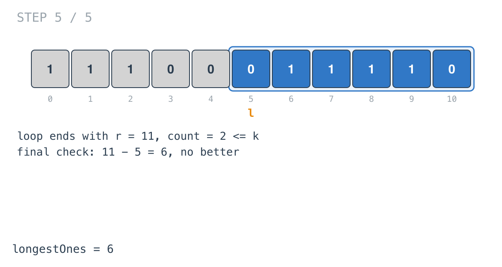

## Solution walkthrough

`longestOnes(nums []int, k int) int` in `main.go` finds the longest window containing at
most `k` zeros.

We'll trace Example 1: `nums = [1,1,1,0,0,0,1,1,1,1,0]`, `k = 2`, expected `6`.

1. **Ones are free.** `if nums[r] == 1 { continue }`. A one can't push the window over
   its limit, so nothing else needs checking. Zeros increment `count`. After index 4 the
   window `[0..4]` has two zeros, which is allowed.

   

2. **A violation: record, then shrink.** The zero at `r = 5` makes `count = 3`. Inside
   the shrink loop, the first line records `r - l = 5`, the length of `[0..4]`, which is
   the longest the window got before this zero arrived.

   

3. **Shrink until a zero leaves.**

   ```go
   for ; l <= r && l < len(nums) && count > k; l++ {
       ...
       if nums[l] == 0 {
           count--
       }
   }
   ```

   `l` passes the three ones at 0-2 without changing anything, then the zero at 3, which
   brings `count` back to 2. `l` ends at 4.

   ![Step 3: window [4..5]](images/walkthrough-3.png)

4. **Grow through the ones.** Indices 6-9 are ones and join for free. At `r = 10` a third
   zero arrives: record `10 - 4 = 6`. Then `l` passes the zero at 4 and stops at 5.

   

5. **The last window.** The loop ends with `r = 11`. The final
   `if count <= k && ans < r-l` checks the window that was never interrupted: `11 - 5 = 6`,
   not better. The answer is 6.

   

**Complexity:** O(n) time, O(1) space.
