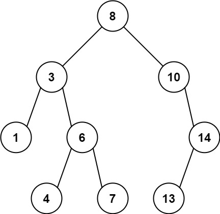
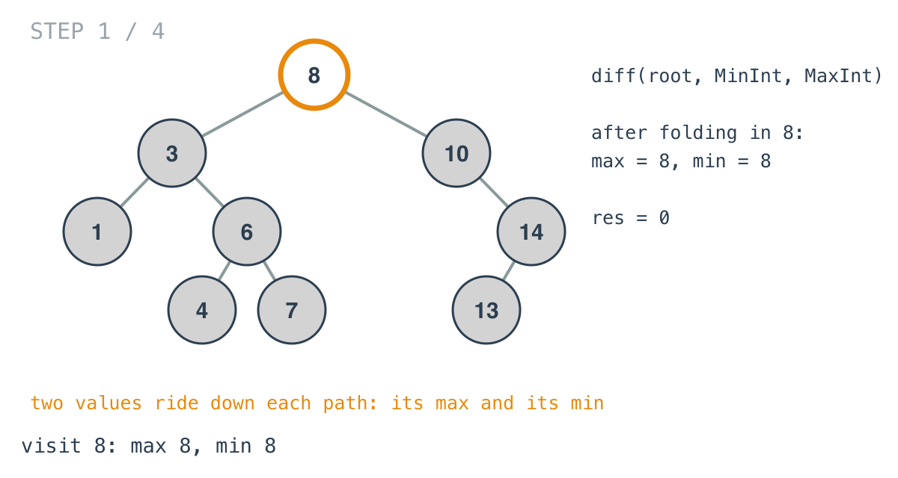
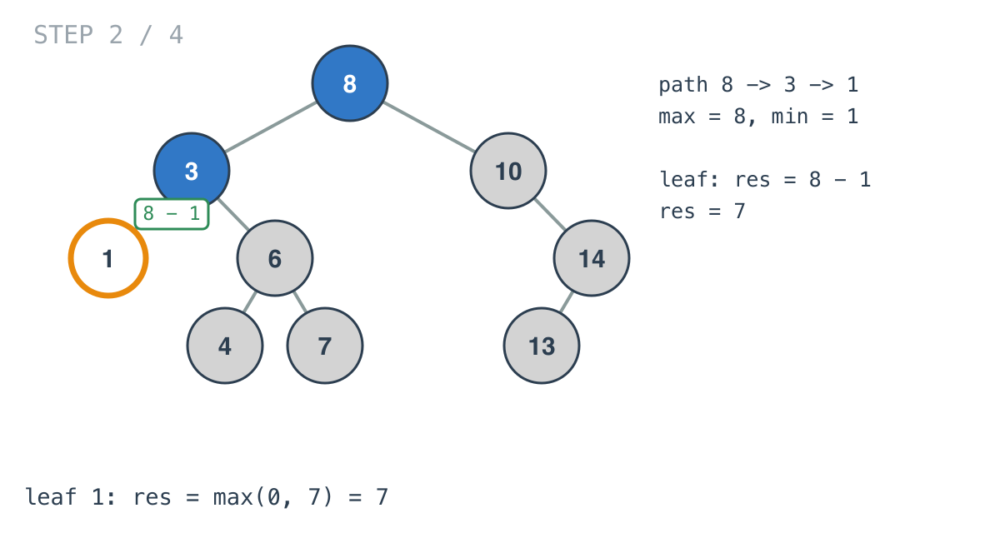
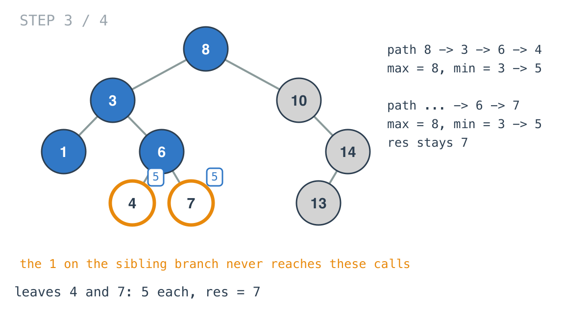
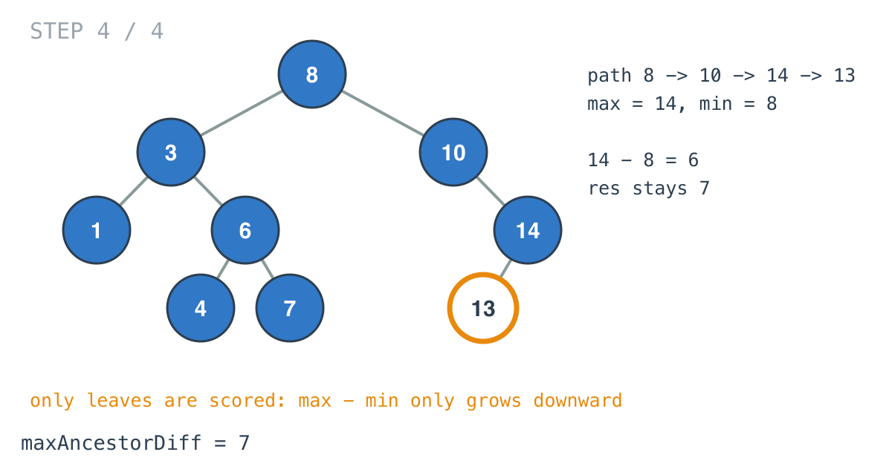

## Solution walkthrough

`maxAncestorDiff` in `main.go` resets the package-level `res`, calls
`diff(root, math.MinInt, math.MaxInt)`, and returns `res`. `diff` carries the path's max
and min down and scores each leaf.



We'll trace Example 1, `[8,3,10,1,6,null,14,null,null,4,7,13]`, expected `7`.

1. **Fold the node into the path's range.**

   ```go
   ancestorMax, ancestorMin = maxVal(node.Val, ancestorMax), minVal(node.Val, ancestorMin)
   ```

   At the root the seeds are the extreme ints, so both become 8.

   

2. **Score at leaves.**

   ```go
   if node.Left == nil && node.Right == nil {
       res = maxVal(res, ancestorMax-ancestorMin)
       return
   }
   ```

   Down the left edge, `3` lowers the min to 3 and `1` lowers it to 1. `1` is a leaf, so
   `res` becomes `8 - 1 = 7`.

   

3. **Each branch has its own range.** Back at `3`, the call into `6` receives max 8, min 3.
   The `1` was folded in only inside its own call, and parameters are per call, so it
   never reaches this branch. Leaves `4` and `7` both score `8 - 3 = 5`, which doesn't beat
   7.

   

4. **Only recurse into real children.** `if node.Left != nil { ... }`. Checking for nil
   before recursing is required here, not a style choice: the first line of `diff` reads
   `node.Val`, so calling it on nil would panic.

5. **The right side.** `10` and `14` raise the max to 14; the min stays 8. Leaf `13`
   scores `14 - 8 = 6`. The final `res` is 7.

   

6. **Why leaves are enough.** Walking down a path, the max never decreases and the min
   never increases, so `max - min` at a leaf is at least as big as at any node above it.
   Every ancestor/descendant pair lies on some root-to-leaf path, so checking every leaf
   covers every pair.

**Complexity:** O(n) time, one visit per node. O(h) space for the recursion stack. `res`
is package-level, so concurrent calls would share it.
