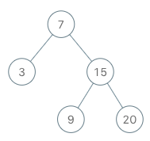
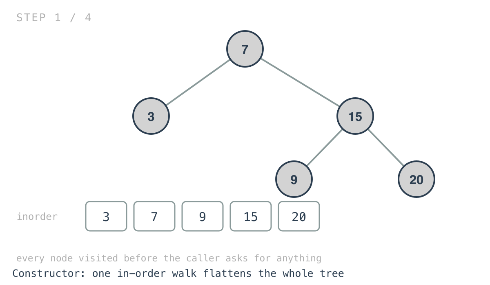
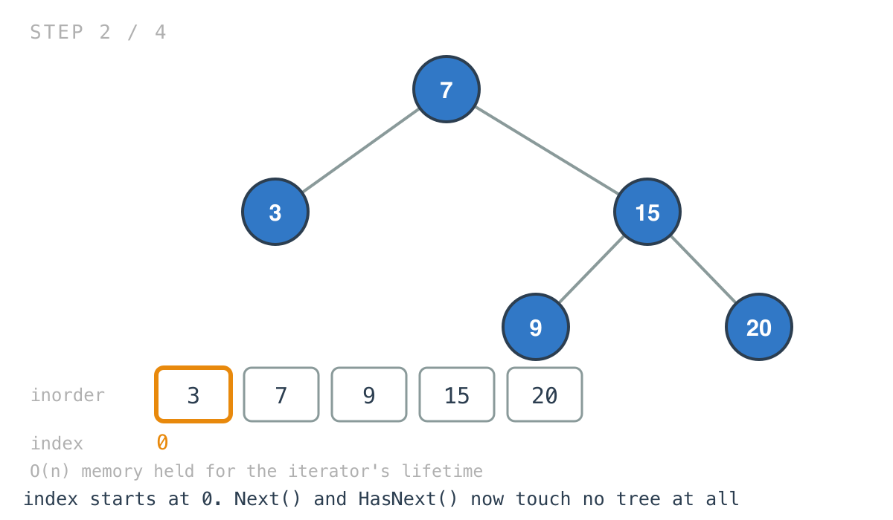
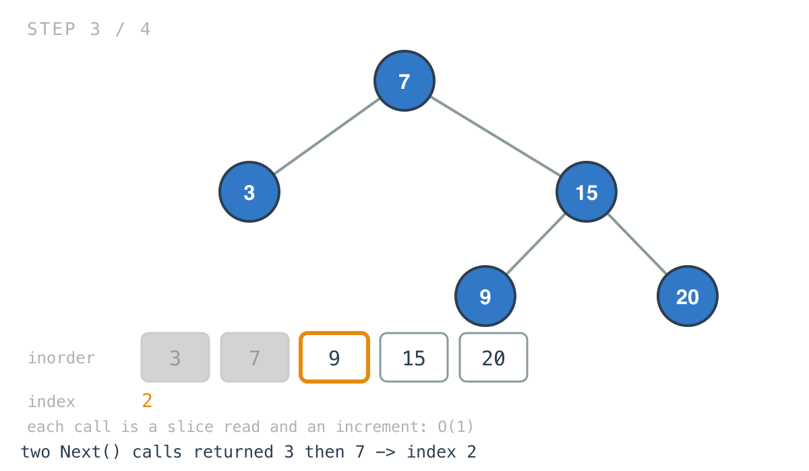
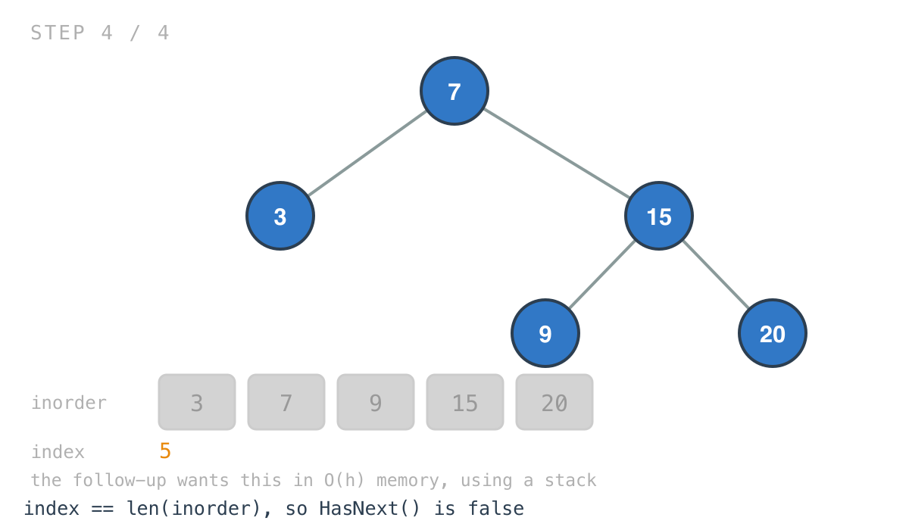

## 365 Days of LeetCode Challenge — Day 33/365

# Binary Search Tree Iterator

🔗 https://leetcode.com/problems/binary-search-tree-iterator/ · Difficulty: Medium

### The problem

Implement an iterator over the in-order traversal of a BST: a constructor taking the root,
`hasNext()`, and `next()` returning the next value in ascending order.



### The intuition

An iterator promises an ordering and hides when the work happens. That second half is the
only real decision in this problem, and the solution here takes the blunt end of it: do
everything up front.

The ordering is in-order, which for a BST is ascending — the property Days 29, 30 and 32
all leaned on. So the constructor walks the tree once, flattens it into a slice, and keeps
an index. After that `Next` is a slice read and an increment, and `HasNext` is a bounds
check. Both are O(1) with no traversal state to maintain at all.

What that buys is the simplest possible implementation of the two methods that get called
repeatedly. What it costs is O(n) memory held for the iterator's whole lifetime, and a
constructor that walks the entire tree before the caller has asked for a single value. If
the caller only ever wants the first three of a million nodes, this solution did all the
work anyway.

The problem's follow-up asks for exactly that improvement: O(h) memory and average O(1)
`next()`. The standard answer is a stack holding the path down the leftmost spine — push
left children on construction, and on each `next()` pop a node, then push the left spine of
its right child. That keeps only one root-to-node path in memory, and the amortised cost
works out because every node is pushed and popped exactly once across the whole iteration.

Neither is wrong. Precomputing is a fine answer when the tree is small or the caller will
consume most of it; the stack version is the one to reach for when either of those isn't
true.

### Builds on

- [Day 30: Minimum Absolute Difference in BST](https://github.com/architagr/leetcode_solutions/blob/main/easy_problems/501_600/minimum_absolute_difference_in_bst/) — in-order on a BST yields sorted values, which is exactly the sequence this iterator has to produce
- [Day 29: Find Mode in Binary Search Tree](https://github.com/architagr/leetcode_solutions/blob/main/easy_problems/501_600/find_mode_in_binary_search_tree/) — the same property again, with the same choice to collect first and compute afterwards

### The solution

```go
type BSTIterator struct {
	inorder []int
	root    *TreeNode
	index   int
}

func (this *BSTIterator) inOrder(node *TreeNode) {
	if node == nil {
		return
	}
	this.inOrder(node.Left)
	this.inorder = append(this.inorder, node.Val)
	this.inOrder(node.Right)
}

func (this *BSTIterator) Next() int {
	val := this.inorder[this.index]
	this.index++
	return val
}

func (this *BSTIterator) HasNext() bool {
	return this.index < len(this.inorder)
}
```

Tracing the example tree `[7,3,15,null,null,9,20]`, whose in-order sequence is
`[3,7,9,15,20]`.

There's no stack, no current node and no parent pointers on the struct. `root` is kept but
never read again after construction.





The problem describes a pointer initialized to a non-existent number smaller than any
element, with `next()` moving it and then returning. Same behaviour, expressed as an index
that's read and then advanced.





Two small implementation notes. `inOrder` is a method rather than a free function, so it
appends onto the struct field directly instead of threading a slice through as a parameter
and return value the way earlier days did. And `Next` has no bounds check, which is safe
only because the problem guarantees it's called when a value exists.

`Constructor` is O(n) time and O(n) space; `Next` and `HasNext` are O(1). Total memory held
is O(n), against O(h) for the follow-up's stack version.

Full code and the step-by-step walkthrough:
[binary_search_tree_iterator](https://github.com/architagr/leetcode_solutions/blob/main/medium_problems/101_200/binary_search_tree_iterator/SOLUTION.md)

#DSA #LeetCode #100DaysOfCode #CodingInterview #BinarySearchTree #DataStructures #Golang

---

*Solution and code by Archit Agarwal. Write-up drafted with AI assistance from the code and problem statement.*
