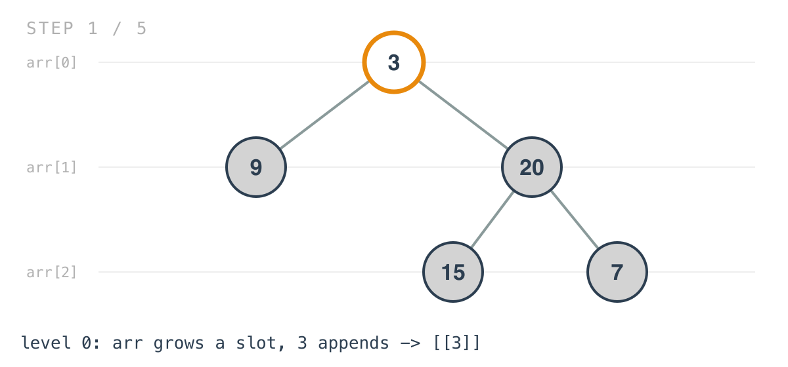
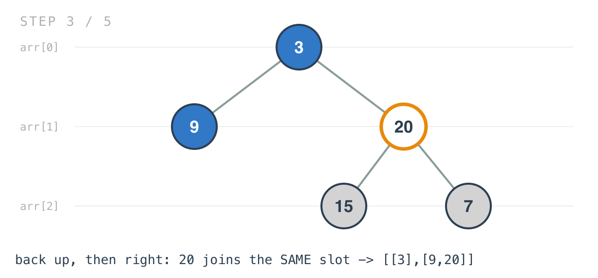
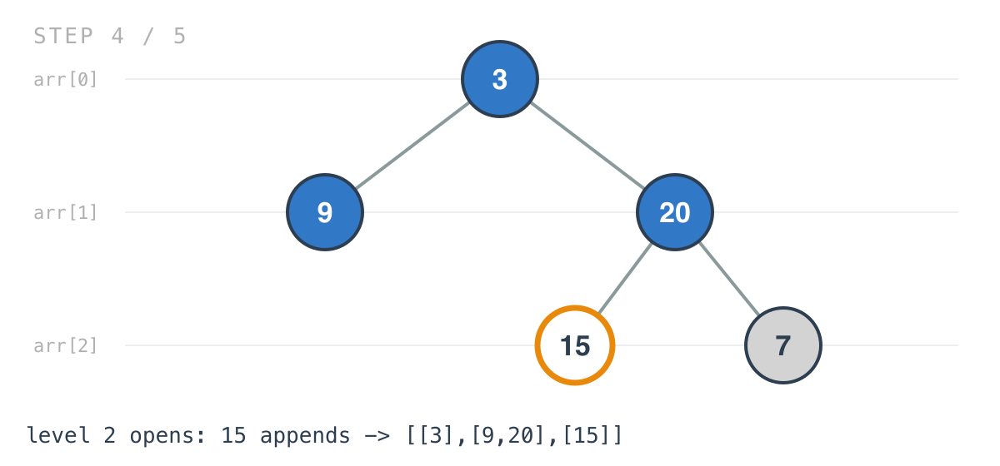

## 365 Days of LeetCode Challenge — Day 29/365

# Binary Tree Level Order Traversal

🔗 https://leetcode.com/problems/binary-tree-level-order-traversal/ · Difficulty: Medium

### The problem

Given the root of a binary tree, return its nodes' values grouped by level, each level
read left to right.


### The intuition

"Level order" is the textbook use for BFS: a queue, drain one level, move to the next.
This solution doesn't use one. It's a depth-first recursion that produces level-ordered
output anyway.

A DFS visits nodes branch by branch. It goes all the way down the left side before it
touches anything on the right, so the order it arrives at nodes has nothing to do with
levels. That sounds fatal for a problem whose entire output is grouped by level.

It isn't, because the grouping doesn't depend on arrival order. Each recursive call
carries its own depth as a parameter, and every node appends into `arr[level]` — the slot
for its own depth. Whichever node reaches depth 2 first, second or last, they all land in
`arr[2]`.

They land there in the right order, too, and that part is not an accident: the recursion
always descends into `Left` before `Right`, so at every depth simultaneously, the leftmost
node of a level is appended before anything to its right.

What you get for not writing BFS is a shorter function and no explicit queue. What you
give up is the level boundary as something the code knows about. BFS knows when a level
ends; this doesn't. For a problem that needed that — a zigzag, or stopping early at a
given depth — BFS would be the better shape.

### Builds on

- [Day 27: Average of Levels in Binary Tree](https://github.com/architagr/leetcode_solutions/blob/main/easy_problems/601_700/average_of_levels_in_binary_tree/) — the same idea, that a DFS can answer a per-level question by keying its accumulator on depth instead of on visit order

### The solution

```go
func LevelOrder(root *TreeNode) [][]int {
	arr := make([][]int, 0)
	return traversal(root, arr, 0)
}

func traversal(head *TreeNode, arr [][]int, level int) [][]int {
	if head == nil {
		return arr
	}
	if (len(arr) - 1) < level {
		a := make([]int, 0)
		arr = append(arr, a)
	}
	arr[level] = append(arr[level], head.Val)
	arr = traversal(head.Left, arr, level+1)
	arr = traversal(head.Right, arr, level+1)
	return arr
}
```

Tracing `[3,9,20,null,null,15,7]`: root `3` has children `9` and `20`, and `20` has
children `15` and `7`. Expected: `[[3],[9,20],[15,7]]`.

There's no separate queue or per-level buffer. The accumulator being threaded through the
traversal is the answer itself, one inner slice per level, and the root starts at level 0.



`len(arr) - 1` is the highest level index that currently exists, so the growth check fires
exactly once per level: the first node to reach a depth opens the slot, everything after
finds it already there.

![Step 2: the recursion goes left first, so 9 lands in arr[1]](images/walkthrough-2.png)

When the recursion comes back up and takes the right branch, `20` appends into `arr[1]` —
the same slot `9` used — and lands after it.



Deeper levels open the same way. `15` is the first node to reach depth 2.



Then `7` finds that slot present and appends after it.

![Step 5: 7 lands in arr[2] as well](images/walkthrough-5.png)

Both recursive calls capture the returned slice rather than relying on mutation, and that
matters: `append` can reallocate the outer slice when a new level opens, so a caller that
ignored the return value would lose every level after the reallocation.

O(n) time — every node visited once, constant work each. Space is O(h) for the recursion
stack plus O(n) for the output. Worth stating against BFS: this recursion's peak memory is
the tree's height, where a queue's would be the width of the widest level. On a skewed
tree this is worse; on a bushy one it's better.

Full code and the step-by-step walkthrough:
[binary_tree_level_order_traversal](https://github.com/architagr/leetcode_solutions/blob/main/medium_problems/101_200/binary_tree_level_order_traversal/SOLUTION.md)

#DSA #LeetCode #100DaysOfCode #CodingInterview #BinaryTree #DFS #Golang

---

*Solution and code by Archit Agarwal. Write-up drafted with AI assistance from the code and problem statement.*
