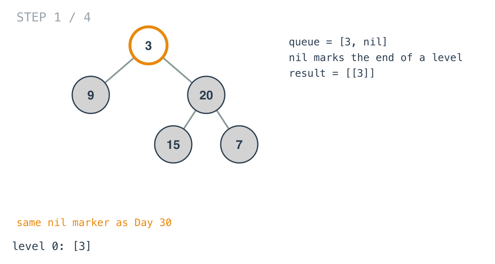
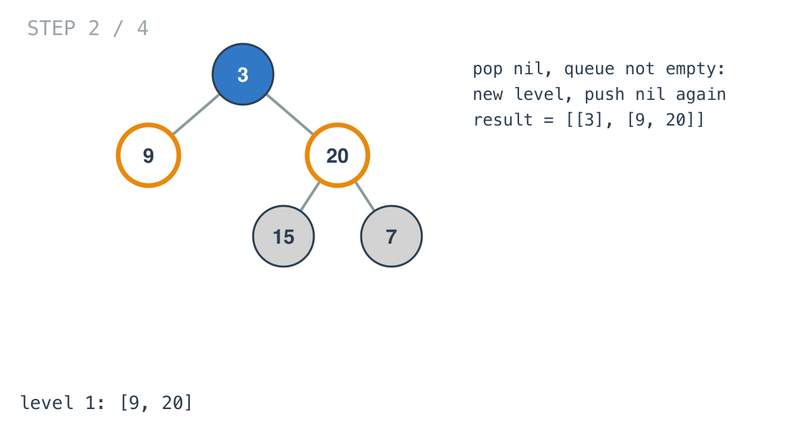
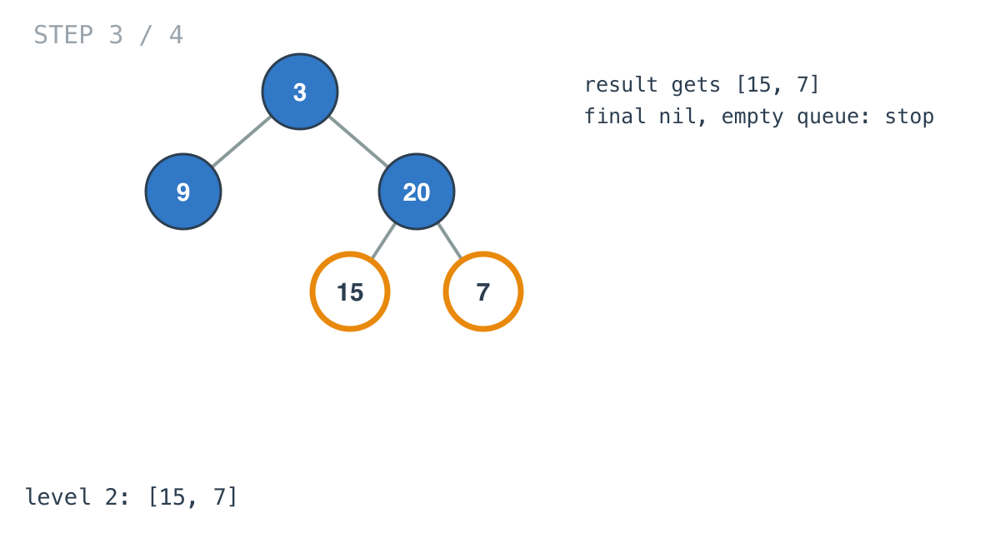
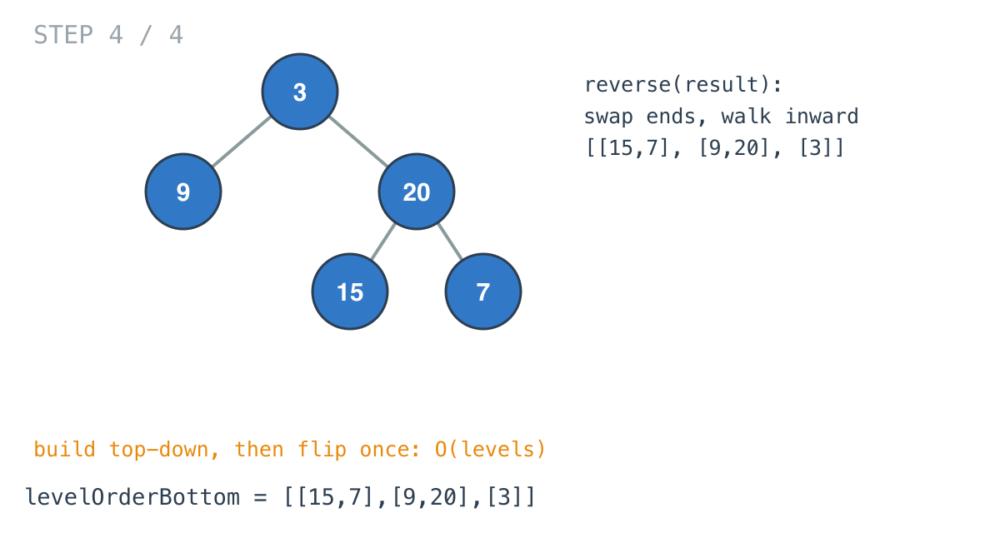

## Solution walkthrough

`levelOrderBottom(root *TreeNode) [][]int` in `main.go` runs a level-by-level BFS with a
`nil` marker between levels, then reverses the list of levels.

We'll trace Example 1: `[3,9,20,null,null,15,7]`, expected `[[15,7],[9,20],[3]]`.

1. **Empty tree.** `if root == nil { return [][]int{} }`.

2. **Seed the queue with the root and a marker.** `push(root)`, `push(nil)`, and
   `result` starts with one empty level. Popping `3` appends it to level 0 and pushes its
   children.

   

3. **The marker ends a level.** When `nil` is popped and the queue still has nodes, those
   nodes are exactly the next level: append a new empty slice, move `level` on, and push a
   fresh `nil` behind them. `9` and `20` fill level 1.

   

4. **Last level.** `15` and `7` fill level 2. The final `nil` is popped with an empty
   queue, so no new level is started and the loop ends.

   

5. **Flip once.** `reverse` swaps the first and last levels and walks inward:
   `[[15,7],[9,20],[3]]`. Only the order of levels changes; each level stays left to
   right.

   

**Complexity:** O(n) time, O(n) space.
