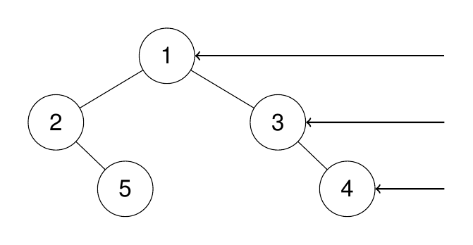
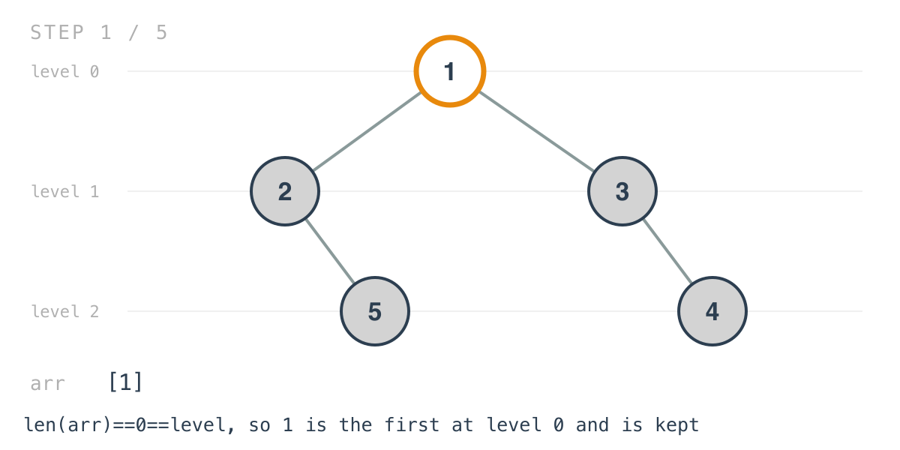
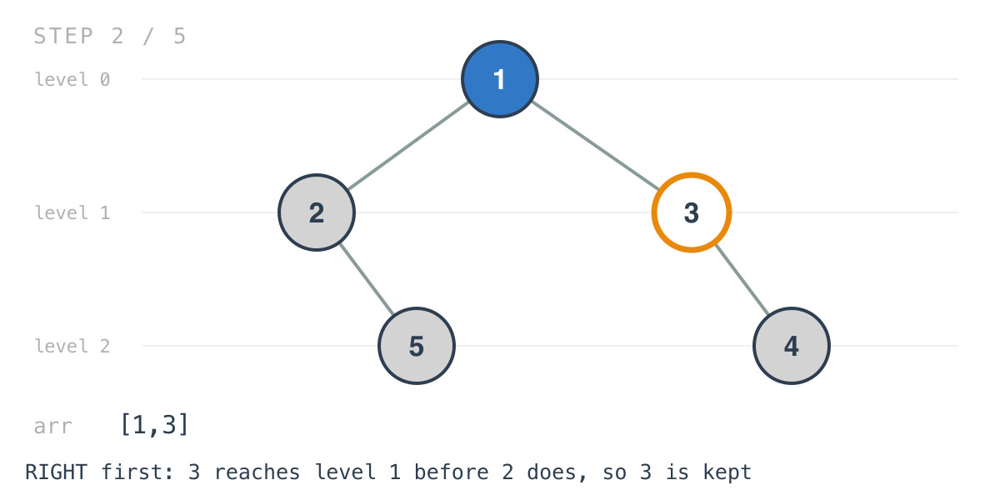
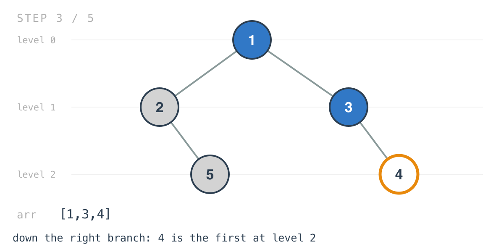
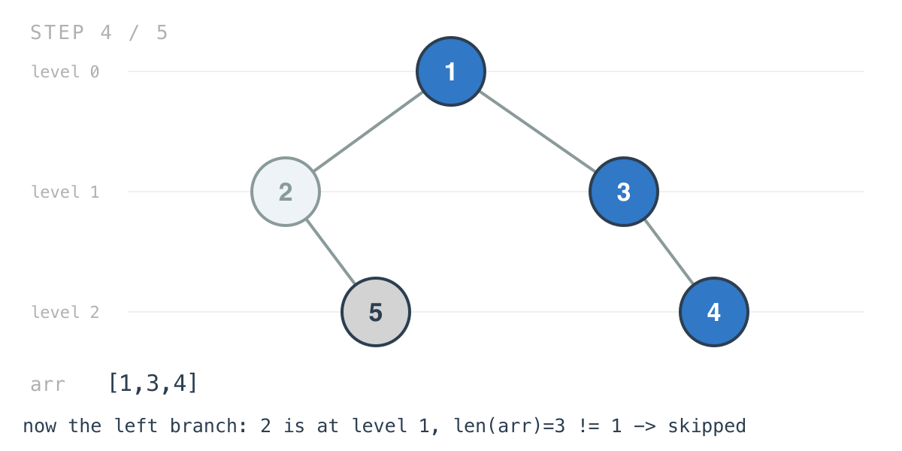

# Binary Tree Right Side View

*365 Days of LeetCode Challenge — Day 31/365*

🔗 [LeetCode #199](https://leetcode.com/problems/binary-tree-right-side-view/) · Difficulty: Medium

Some problems are hard because the algorithm is hard. This one is interesting because the
algorithm is four lines, and three of them look like they could not possibly be enough.

It is also a good example of a thing worth practising deliberately: turning a picture in a
problem statement into a sentence you can write code from.

### The problem

Stand on the right side of a binary tree and return the values of the nodes you can see,
top to bottom.



### The intuition

The picture the problem paints has a plainer description: from each level, you see exactly
one node — the rightmost one.

So the answer holds one entry per level, top to bottom. That framing sounds like BFS, and
the queue version is perfectly good: walk each level, keep the last node you popped.

This solution uses a depth-first walk instead, and gets there with two small changes to
the shape from Day 29.

The first is what gets stored. Day 29 accumulated every node at a depth; here only one per
depth is wanted, so the append is guarded by `if len(arr) == level`. Since `arr` holds one
entry per level filled so far, `len(arr)` is the next level not yet recorded — so the
condition means "this is the first node I've reached at this depth." Every later arrival
at that depth finds `len(arr)` already past it and is skipped.

The second change is the one that makes it correct, and it's a single line-order decision:
recurse into `Right` before `Left`. Reverse the usual order, and the first node reached at
any depth is the rightmost one there.

Neither piece does anything alone. The guard stores first arrivals; the traversal order
decides which arrival is first. Swap the two recursive calls and the same function returns
the left side view, which is a good way to check you've understood why it works.

One subtlety worth stating because it looks like a bug: the left subtree is still walked
in full, even though nothing from it is used in the example above. That's necessary,
because the rightmost visible node at a level isn't always in the right subtree — the
right branch can simply run out of depth first. The problem's own second example is
exactly that case. No special handling is needed: the right subtree gets first refusal at
every depth, and where it has nothing, the left subtree's node is the first arrival.

### Builds on

- [Day 29: Binary Tree Level Order Traversal](https://github.com/architagr/leetcode_solutions/blob/main/medium_problems/101_200/binary_tree_level_order_traversal/) — the same depth-as-an-index idea, one slot per level, reached by a depth-first walk rather than a queue

### The solution

```go
func BinaryTreeRightSideView(root *TreeNode) []int {
	arr := make([]int, 0, 100)

	if root == nil {
		return arr
	}
	arr = findRight(root, arr, 0)
	return arr
}

func findRight(head *TreeNode, arr []int, level int) []int {
	if head == nil {
		return arr
	}
	if len(arr) == level {
		arr = append(arr, head.Val)
	}

	arr = findRight(head.Right, arr, level+1)
	arr = findRight(head.Left, arr, level+1)
	return arr
}
```

Tracing `[1,2,3,null,5,null,4]`: root `1` with children `2` and `3`; `2` has a right child
`5`; `3` has a right child `4`. Expected `[1,3,4]`.

There's no visited set and no per-level buffer. `arr` is both the output and the
bookkeeping.



Because the recursion takes `Right` first, `3` reaches level 1 before `2` does.



The right branch runs to the bottom before anything on the left is touched.



Then the left branch is walked and mostly ignored. `2` sits at level 1, but `len(arr)` is
already 3.



Same for `5` at level 2.

![Step 5: 5 is skipped too, leaving [1,3,4]](images/walkthrough-5.png)

Small detail in the wrapper: `make([]int, 0, 100)` sizes the slice from the constraint
that the tree holds at most 100 nodes, so it never reallocates. And an empty tree returns
that empty slice rather than nil, which is what the tests compare against.

O(n) time, every node visited once with constant work. Space is O(h) for the recursion
stack plus O(h) for the output, which holds one value per level. Against BFS, this trades
peak memory proportional to the widest level for peak memory proportional to the height.

---

The pattern here shows up whenever a problem wants one representative per group. Decide what
"first" means by choosing the traversal order, then let a guard keep only firsts. The guard is
usually obvious; the ordering is where the thinking is, and it is easy to write the guard,
watch it fail, and go looking for the bug in the wrong half.

Full code and the step-by-step walkthrough:
[binary_tree_right_side_view](https://github.com/architagr/leetcode_solutions/blob/main/medium_problems/101_200/binary_tree_right_side_view/SOLUTION.md)

---

*Solution and code by Archit Agarwal. Write-up drafted with AI assistance from the code and problem statement.*
