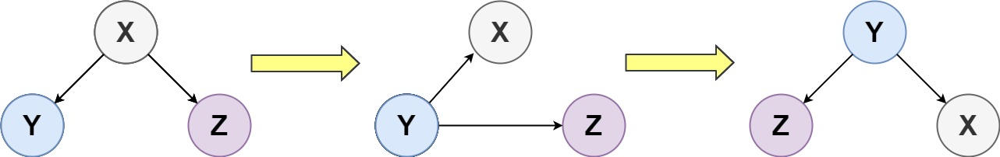
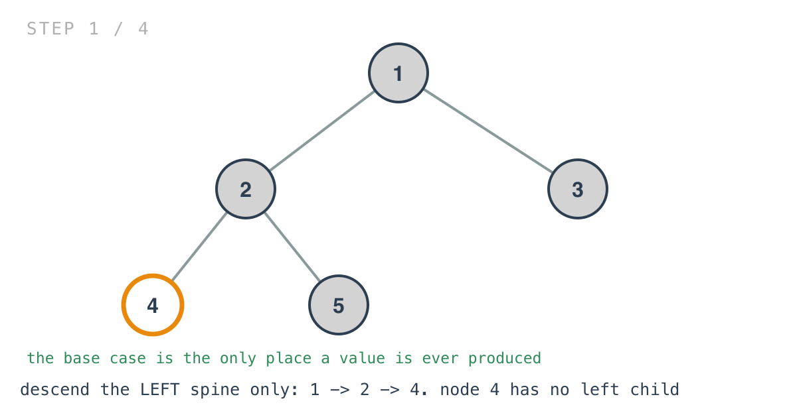
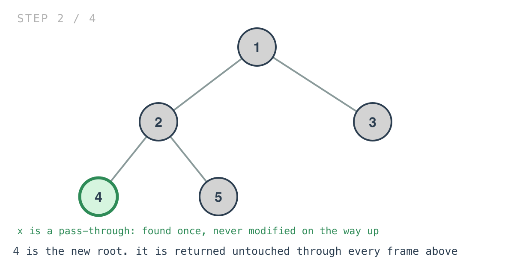
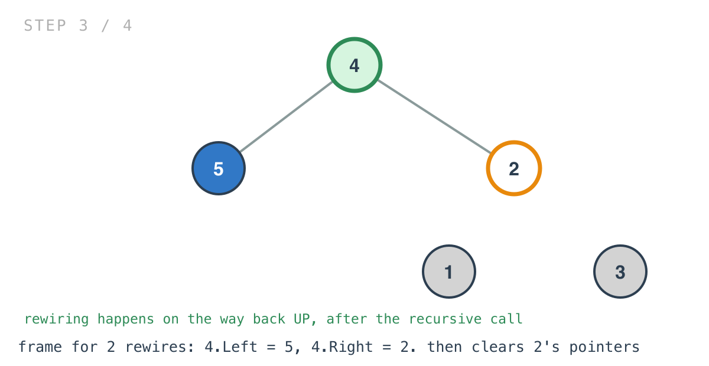
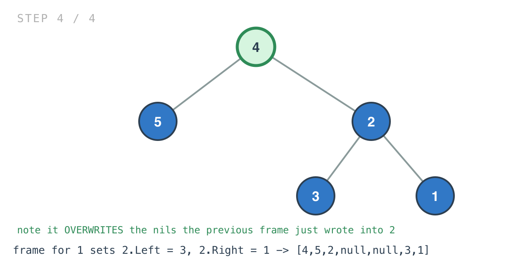

# Binary Tree Upside Down

*365 Days of LeetCode Challenge — Day 73/365*

🔗 [LeetCode #156](https://leetcode.com/problems/binary-tree-upside-down/) · Difficulty: Medium

This one is thirteen lines long and takes longer to read than solutions three times the size.
Not because anything in it is subtle on its own, but because two things are happening in the
same function and neither is announced.

Once you separate them the function is almost boring, which is the point of writing it down.

### The problem

Turn the tree upside down: the original left child becomes the new root, the original root
becomes its right child, and the original right child becomes its left child, applied level
by level.



### The intuition

The rotation is described per node. Applied all the way down the left spine, it turns the
tree over. Two questions fall out of that: where does the new root come from, and when does
the rewiring happen?

The new root is the deepest node on the left spine — keep taking `Left` until there isn't
one. That's the base case, and it's the only place a value is ever produced.

Everything above it just passes that value along. The return value is a pass-through:
discovered once at the bottom and handed upward untouched through every frame, while the
actual work each frame does is local pointer surgery on `root` and its two children.

Those are two completely separate jobs sharing one recursion, and separating them in your
head is most of understanding this solution.

The rewiring happens on the way back up, after the recursive call. That ordering matters:
the child subtree has to be turned over before its old parent can be hung underneath it.

### Builds on

- [Day 53: Increasing Order Search Tree](https://github.com/architagr/leetcode_solutions/blob/main/easy_problems/801_900/increasing_order_search_tree/) — relinking the existing nodes into a different shape rather than building new ones, and the care that takes when you are mutating the pointers you navigate by

### The solution

```go
func upsideDownBinaryTree(root *TreeNode) *TreeNode {
	if root == nil || root.Left == nil {
		return root
	}
	x := upsideDownBinaryTree(root.Left)
	newRight := root
	newNode := root.Left
	newLeft := root.Right
	newNode.Left = newLeft
	newNode.Right = newRight
	root.Left = nil
	root.Right = nil
	return x
}
```

Tracing `[1,2,3,4,5]`: root `1` with children `2` and `3`; `2` has children `4` and `5`.
Expected `[4,5,2,null,null,3,1]`.

The recursion only ever goes left — right children are moved but never descended into,
which is why the cost is the length of the left spine rather than the size of the tree.





The three temporaries name what each node is about to become, which is the only reason the
rewiring reads clearly.



Then there's a detail that looks like a bug and isn't. Each frame ends by setting
`root.Left` and `root.Right` to nil, which appears to destroy the work just done.

It doesn't, because for every node except the original root, the parent's frame is about to
overwrite both pointers as part of its own rewiring — the frame for `1` sets `2.Left = 3`
and `2.Right = 1`, replacing the nils the frame for `2` just wrote. The clearing survives
only for the topmost call, where the original root becomes a leaf in the flipped tree and
genuinely needs both pointers cleared. It's written uniformly and takes effect once.



One last thing makes this safe: the problem guarantees every right child has a left sibling
and no children of its own. So a right child is always a leaf, and reattaching it as
someone's left child can't drag a subtree along with it. Without that guarantee, the
rotation wouldn't be well defined.

O(h) time, where h is the length of the left spine. Space is O(h) for the recursion stack.

---

The pattern is worth naming, because it recurs: a recursion where the returned value and the
work are unrelated. The value is found at one specific place and chaperoned upward; the work
happens at every frame and never touches it.

When you meet a recursive function that is hard to hold in your head, checking whether it is
really two functions sharing a traversal is a good first move.

Full code and the step-by-step walkthrough:
[binary_tree_upside_down](https://github.com/architagr/leetcode_solutions/blob/main/medium_problems/101_200/binary_tree_upside_down/SOLUTION.md)

---

*Solution and code by Archit Agarwal. Write-up drafted with AI assistance from the code and problem statement.*
