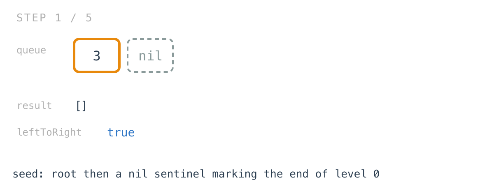
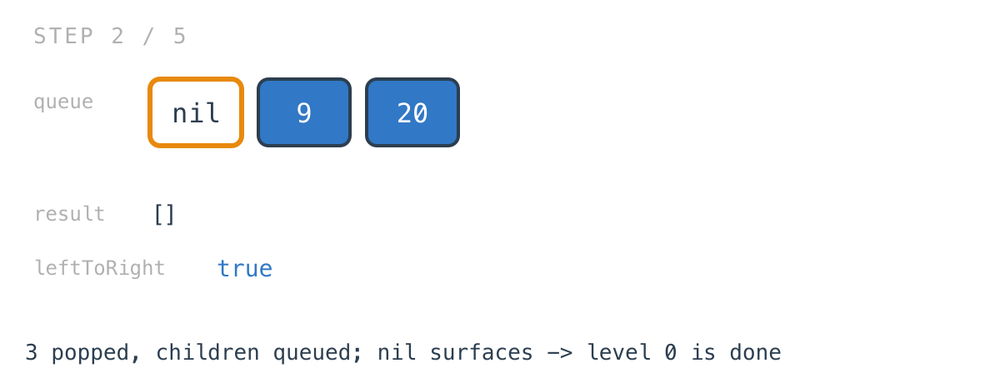
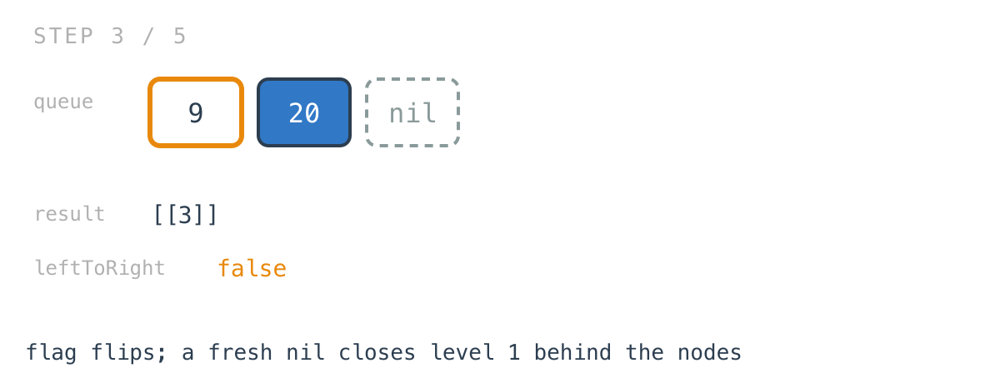
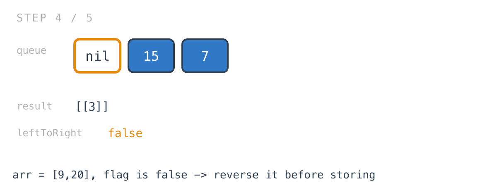
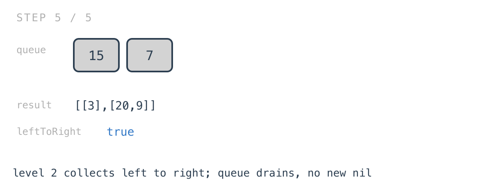

# Binary Tree Zigzag Level Order Traversal

*365 Days of LeetCode Challenge — Day 16/365*

🔗 [LeetCode #103](https://leetcode.com/problems/binary-tree-zigzag-level-order-traversal/) · Difficulty: Medium

Yesterday ended on a claim worth testing: a depth-first walk can group nodes by level, but it
never learns where a level ends, and some problems need that.

This is that problem, and it arrives one day later on purpose. Zigzag looks like level order
with a cosmetic twist. The twist is what forces a different traversal.

### The problem

Return the nodes' values grouped by level, with the direction alternating: first level
left to right, second right to left, and so on.


### The intuition

Yesterday's level order came out of a depth-first walk, with no queue and no idea when a
level ended. That worked because grouping by depth doesn't need level boundaries — a node
appends into its own slot whenever it happens to arrive.

Zigzag needs the boundary. To decide whether a level gets reversed you have to know the
level is finished, and "finished" is exactly the thing a DFS never learns. So this one
goes back to BFS.

The boundary comes from the same trick as Day 1: push a `nil` into the queue right behind
the root. Everything ahead of that `nil` is the current level. When the `nil` surfaces,
the level just drained, and a fresh `nil` goes on the back to close the next one — but
only if the queue still holds nodes, otherwise you'd loop forever on a sentinel with
nothing after it.

With the boundary in hand, the zigzag is almost an afterthought. Collect each level left
to right as usual, and reverse every second one before it goes into the result. A
`leftToRight` flag flips at each boundary and decides.

Reversing after collection is one of three ways to do this, and the others are worth
knowing about. You could push children in alternating order so the queue delivers each
level pre-zigzagged, or prepend rather than append when building the level. Reversing is
the one that keeps the traversal and the zigzag as separate ideas, which is why it reads
easily: the BFS half is identical to a non-zigzag BFS, and the alternation is four lines
bolted on top.

### Builds on

- [Day 15: Binary Tree Level Order Traversal](https://github.com/architagr/leetcode_solutions/blob/main/medium_problems/101_200/binary_tree_level_order_traversal/) — the same output grouped the same way, solved without level boundaries, which is what makes the contrast here worth drawing
- [Day 1: Maximum Depth of Binary Tree](https://github.com/architagr/leetcode_solutions/blob/main/easy_problems/101_200/maximum_depth_of_binary_tree/) — the nil sentinel pushed into the queue to mark where a level ends

### The solution

```go
func zigzagLevelOrder(root *TreeNode) [][]int {
	if root == nil {
		return [][]int{}
	}
	result := make([][]int, 0)
	queue := make([]*TreeNode, 0)
	queue = append(queue, root, nil)
	// pop and push closures elided - see the repo
	leftToRight := true
	arr := make([]int, 0)
	for len(queue) > 0 {
		node := pop()
		if node == nil {
			if len(queue) > 0 {
				push(nil)
			}
			x := make([]int, len(arr))
			copy(x, arr)
			if !leftToRight {
				x = reverseArr(x)
			}
			result = append(result, x)
			arr = make([]int, 0)
			leftToRight = !leftToRight
			continue
		}
		arr = append(arr, node.Val)
		if node.Left != nil {
			push(node.Left)
		}
		if node.Right != nil {
			push(node.Right)
		}
	}
	return result
}
```

Tracing `[3,9,20,null,null,15,7]`: root `3` with children `9` and `20`, and `20` with
children `15` and `7`. Expected `[[3],[20,9],[15,7]]` — level 1 reversed, the others not.



Children go on the back left-then-right, so each level arrives left to right regardless of
what will be done to it afterwards.



The re-push guard is load-bearing. Without `len(queue) > 0`, the last sentinel would be
re-added to an otherwise empty queue and the loop would spin on it forever.



The copy isn't defensive either. `arr` gets reused for the next level and `reverseArr`
mutates in place, so appending `arr` directly would put the same backing array into
`result` several times and the answer would come out as repeats of the last level.



After `15` and `7` are collected the queue holds only the sentinel; popping it finds an
empty queue, so no replacement goes on and the loop ends.



`reverseArr` is a two-pointer swap with `l <= r`. The `<=` means an odd-length slice swaps
its middle element with itself once, which is harmless and keeps the condition simple.

O(n) time — every node is pushed and popped exactly once, and the reversals total O(n)
across the tree since each element is swapped at most once. Space is O(w) for the queue,
where w is the width of the widest level, plus O(n) for the output. That width is BFS's
real memory cost, and it's the opposite trade to yesterday's recursion, whose peak was the
tree's height.

---

Two days, the same output shape, two traversals, and the deciding question was not which is
faster. It was whether the algorithm needs to know that a level is complete.

That question is worth asking early on anything phrased per level. If the answer is no, a
recursion keyed on depth is shorter and its memory scales with height. If the answer is yes,
reach for the queue and the sentinel, and accept that your peak memory is now the widest level
instead.

Full code and the step-by-step walkthrough:
[binary_tree_zigzag_level_order_traversal](https://github.com/architagr/leetcode_solutions/blob/main/medium_problems/101_200/binary_tree_zigzag_level_order_traversal/SOLUTION.md)

---

*Solution and code by Archit Agarwal. Write-up drafted with AI assistance from the code and problem statement.*
