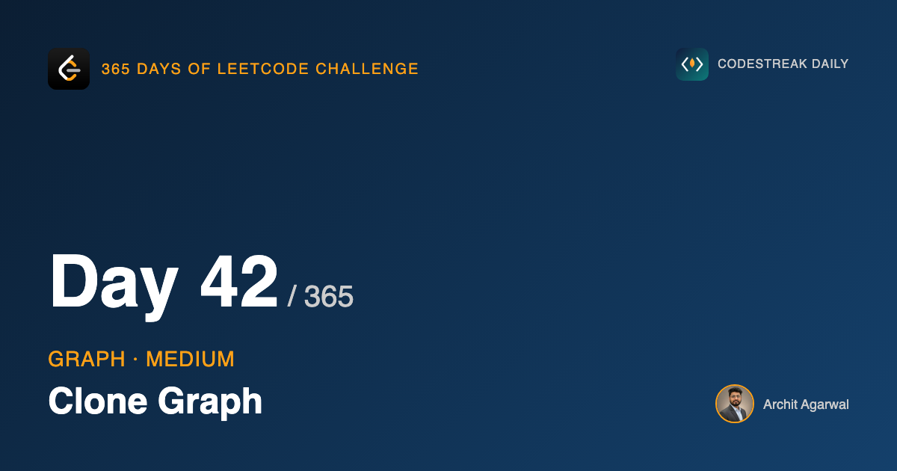
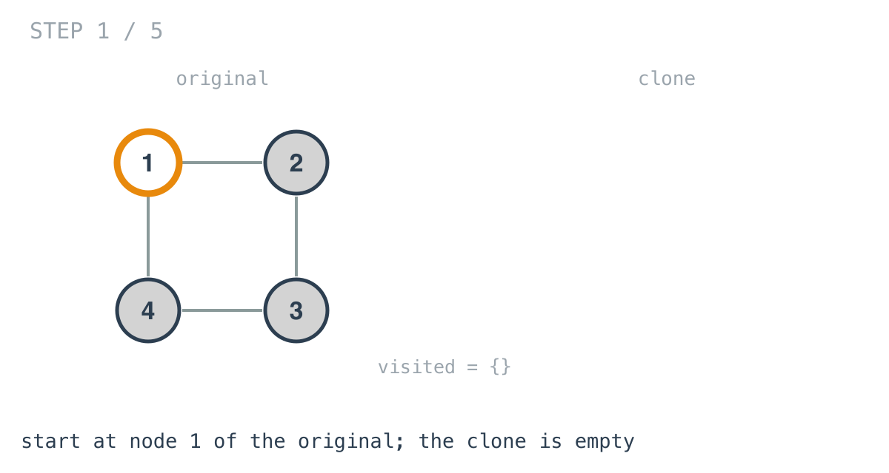
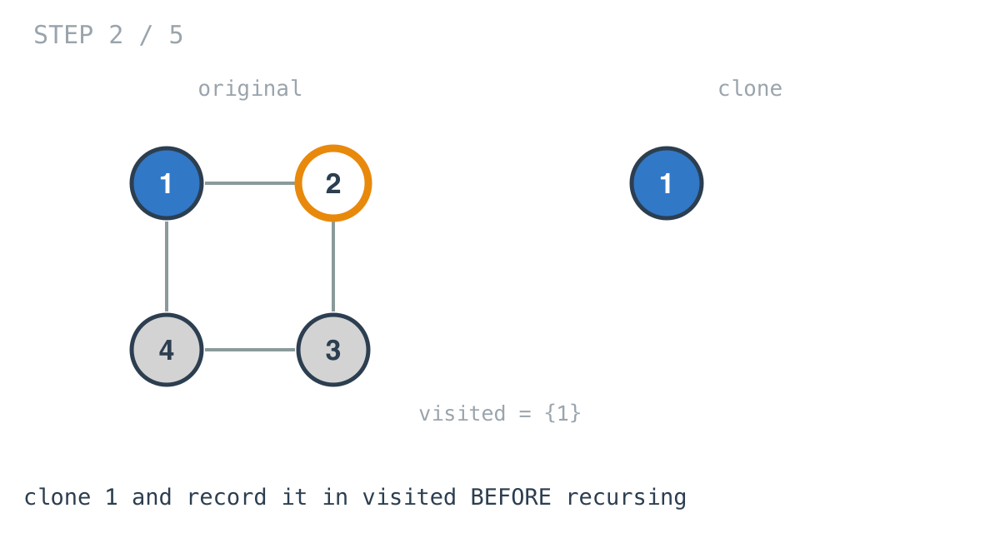
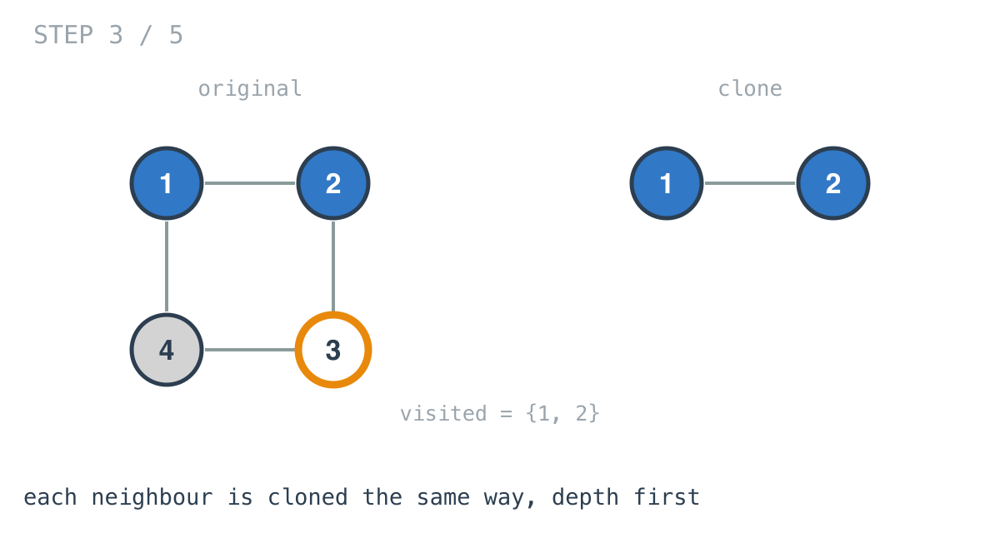
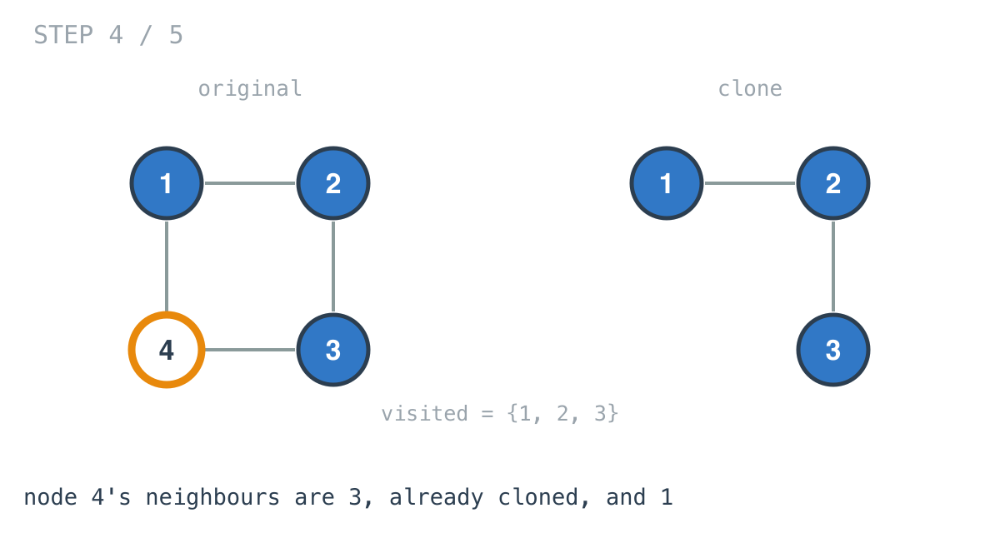
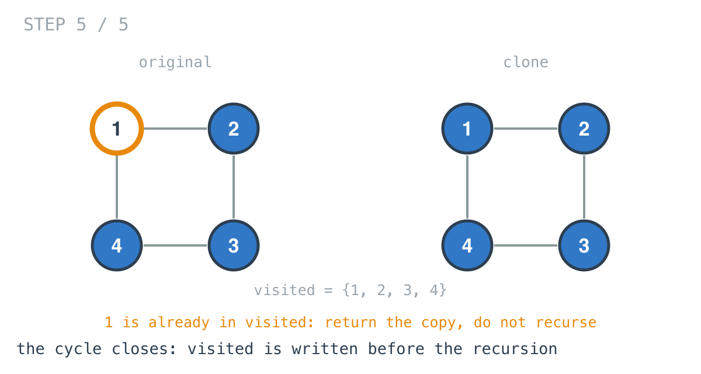

*365 Days of LeetCode Challenge — Day 42/365*

**[133. Clone Graph](https://leetcode.com/problems/clone-graph/)** (Medium)

You are given a reference to one node of a connected undirected graph. Return a deep copy: entirely new nodes, the same structure, nothing shared with the original.

## Start from the version that works on trees

Copying a binary tree is about four lines. Allocate a node, copy the value, recurse into the left child, recurse into the right child, return.

It is worth being explicit about *why* that works, because the reasons are exactly what a graph takes away.

A tree has no cycles, so recursion strictly descends and is guaranteed to terminate at the leaves. And every node has exactly one parent, so every node is reached by exactly one route and therefore copied exactly once.

A graph has neither property, and losing each one breaks the copy in a different way.

**Cycles break termination.** If A and B are neighbours of each other, then cloning A requires cloning B, which requires cloning A. The recursion has no base case to fall into. It runs until the stack gives out.

**Shared nodes break the shape.** Suppose the graph is a diamond: A points at B and C, and both B and C point at D. Even with no cycle anywhere, a naive recursion copies D once while cloning B and again while cloning C. The result has the right number of values and the wrong structure. B's copy and C's copy point at two different D-copies, where the original had one shared node.

That second failure is the sneaky one, because the output looks plausible. Print the values and everything matches. Only the identity is wrong.

## One map, two problems

```go
visited := make(map[int]*Node)
```

A map from each original node to the copy of that node.

```go
newNode, ok := visited[node.Val]
if ok {
	return newNode
}
```

Before cloning anything, ask whether this node has already been cloned. If it has, hand back the copy that exists rather than making a second one.



Both failures above are fixed by that one lookup:

The **cycle** terminates, because the second time the traversal reaches a node, the lookup succeeds and the function returns instead of descending again.

The **shape** survives, because every original node maps to exactly one copy for the lifetime of the traversal. When B and C both ask for D's copy, they get the same pointer, and the diamond stays a diamond.

I want to underline the second one, because it explains a design choice that is easy to get wrong. If the only problem were infinite recursion, a plain `visited` set of nodes already seen would be enough. It is not enough. The structure has to be rebuilt, and rebuilding it requires knowing *which copy* corresponds to each original. The map is not tracking visitation. It is tracking correspondence.

## The order inside the function is the whole trick

```go
newNode = new(Node)
newNode.Val = node.Val
visited[node.Val] = newNode

if len(node.Neighbors) > 0 {
	newNode.Neighbors = make([]*Node, len(node.Neighbors))
	for i, nNode := range node.Neighbors {
		newNode.Neighbors[i] = clone(nNode, visited)
	}
}
```



Read the order carefully. The new node is created, given its value, and **put into the map**. Only then are its neighbours cloned.

At the moment it enters the map it is half built: it has a value and no edges at all. That is not an accident or an optimisation, it is the termination argument.

Consider what happens if you recurse first and record afterwards. Cloning node 1 recurses into node 2, which recurses into node 3, which recurses into node 4, which recurses back into node 1. Node 1 is not in the map yet, because it is still inside its own neighbour loop and has not reached the recording line. So it clones node 1 again, and descends again, forever.

The map has to contain the unfinished node for the cycle to close on something.







When the walk arrives at node 1 for the second time, coming from node 4, the lookup succeeds and the existing half-built copy is returned immediately. Node 4's neighbour list gets a pointer to the same copy the traversal started from, and by the time everything unwinds, that copy has its own neighbours filled in too.

If this feels familiar it should. Day 37 sank a grid cell *before* recursing into its neighbours, for the same reason: a re-entrant call needs to find evidence that the node is already being handled. There it was writing `'2'` into a grid; here it is writing a pointer into a map. Same idea, different storage.

## One line to check before you reuse this

```go
visited[node.Val]
```

The map is keyed by the node's **value**, not by the node itself.

For this problem that is fine, because the constraints state that `Node.val` is unique for each node. Value and identity happen to coincide.

They usually do not. On any graph where two distinct nodes can hold the same value, this code silently merges them into one node in the output, and the bug is invisible unless you are checking structure rather than values.

Keying by `*Node` works regardless. Pointers are comparable in Go, they can be map keys, and node identity is precisely what the map is meant to track. If you lift this code into a problem without the uniqueness guarantee, change the key before anything else.

## Two smaller details

**The nil check.** `if node == nil` handles the empty graph. Because the graph is stated to be connected, a nil can only ever be the top-level argument, never something encountered partway through a traversal.

**The neighbour slice is sized up front.** `make([]*Node, len(node.Neighbors))` and then filled by index, rather than built with `append`. It avoids the regrowth, and more importantly it keeps neighbour order identical to the original, which matters because the judge compares adjacency lists positionally.

## Complexity

- **Time: O(V + E).** Every node is cloned exactly once. Every edge is followed once from each endpoint, and the second of those two traversals stops immediately at the map lookup.
- **Space: O(V)** for the map, plus a recursion stack that can reach O(V) deep on a path-shaped graph.

## Builds on

- [Day 37: Number of Islands](https://github.com/architagr/leetcode_solutions/blob/main/medium_problems/101_200/number_of_islands/) — recursive DFS where marking a node before recursing is what stops it looping back

Full code and the step-by-step walkthrough:
[clone_graph](https://github.com/architagr/leetcode_solutions/blob/main/medium_problems/101_200/clone_graph/SOLUTION.md)

---

*Solution and code by Archit Agarwal. Write-up drafted with AI assistance from the code and problem statement.*
