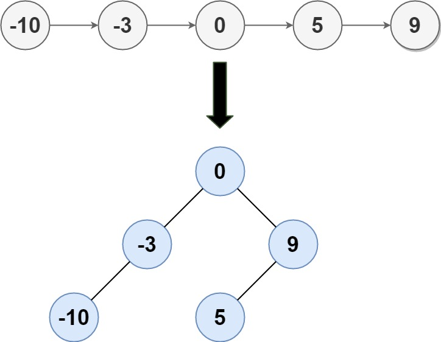
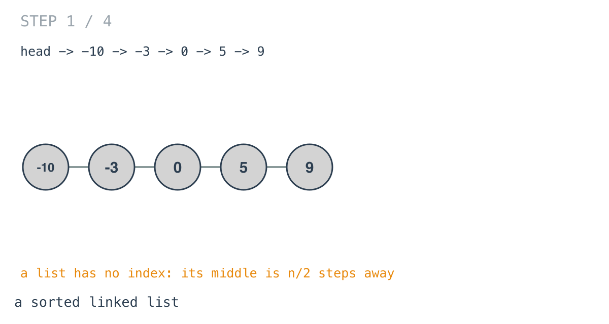
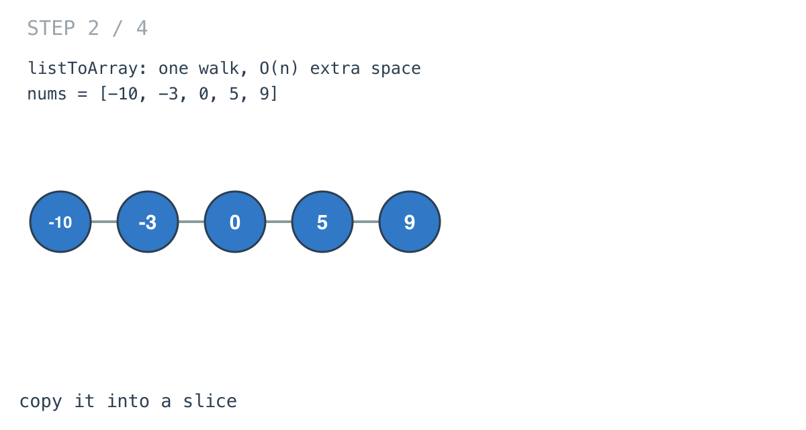
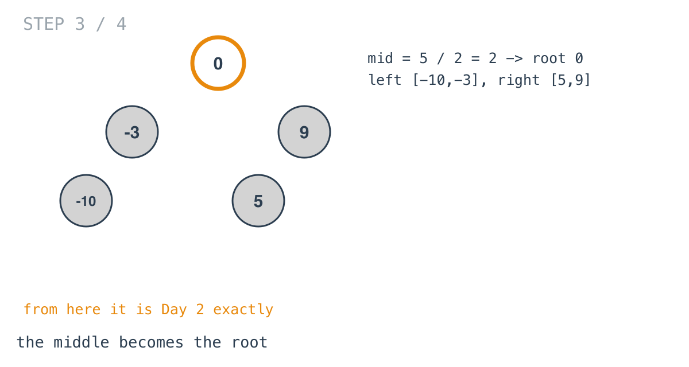
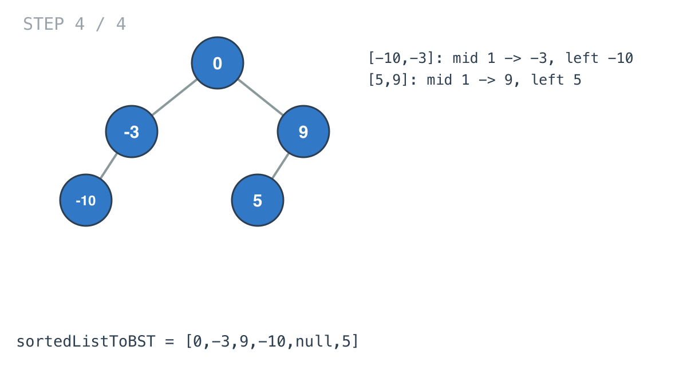

## Solution walkthrough

`sortedListToBST(head *ListNode) *TreeNode` in `main.go` copies the list into a slice with
`listToArray`, then builds with `sortedArrayToBST`, the same middle-as-root recursion as Day 2.

We'll trace Example 1: `[-10,-3,0,5,9]`, expected `[0,-3,9,-10,null,5]`.

1. **A list can't jump to its middle.** Getting to the third node means walking past the
   first two.

   

2. **Copy it once.** `listToArray` walks the list and appends each value:
   `[-10, -3, 0, 5, 9]`. After this, the middle is one index away.

   

3. **Middle as root.** `mid := n / 2` is 2, value 0. `nums[:mid]` and `nums[mid+1:]` are
   the two halves.

   

4. **Recurse on each half.** `[-10,-3]` has middle index 1, so -3 is its root with -10 on
   the left. `[5,9]` gives 9 with 5 on the left. The tree is `[0,-3,9,-10,null,5]`, the
   example's answer.

   

An empty list gives an empty slice, and `sortedArrayToBST` returns nil for it.

**Complexity:** O(n) time, O(n) space.
