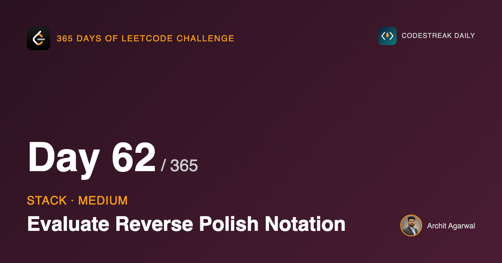
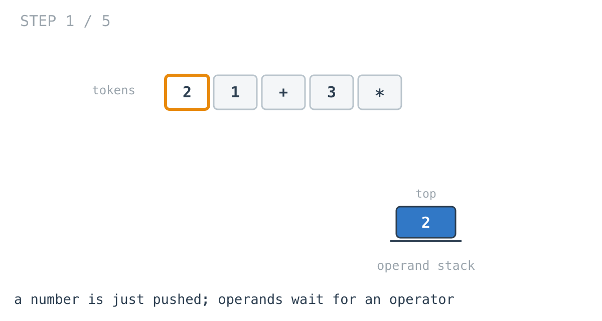
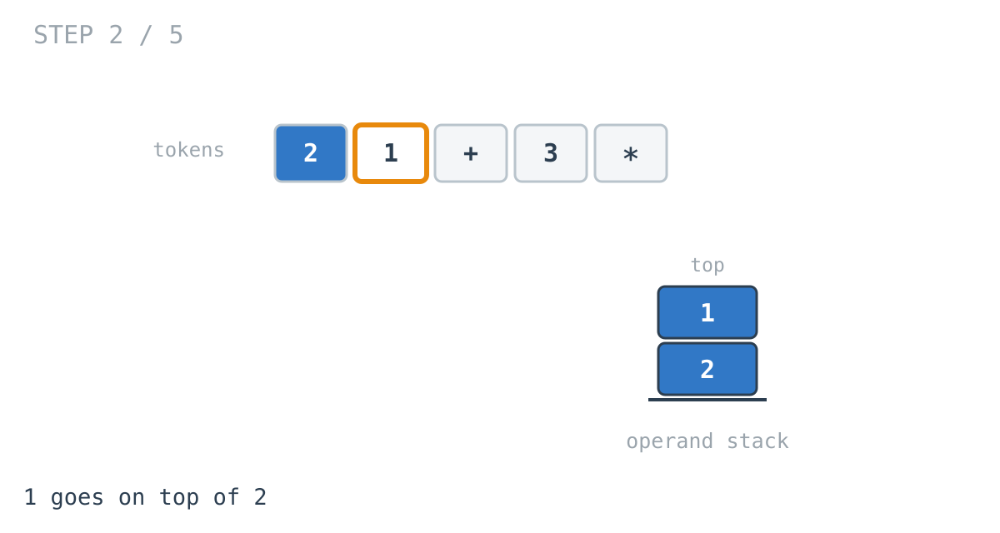
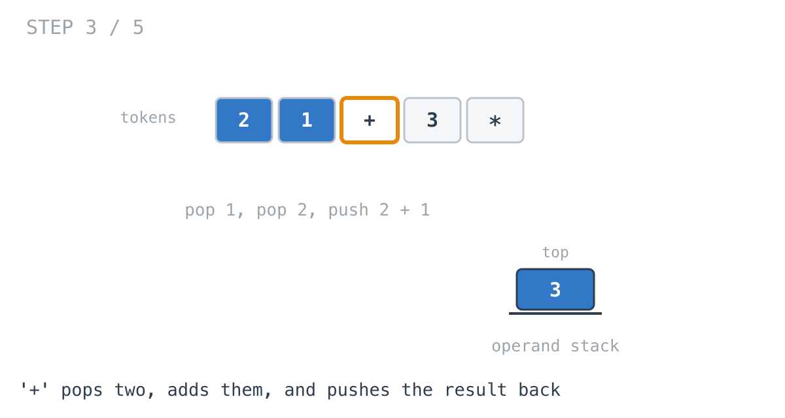
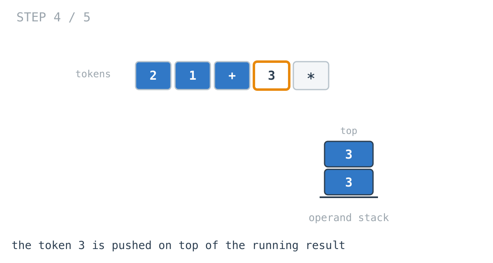
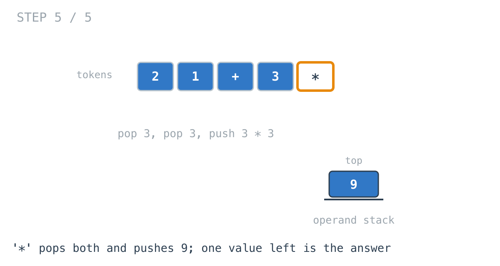

*365 Days of LeetCode Challenge — Day 62/365*

**[150. Evaluate Reverse Polish Notation](https://leetcode.com/problems/evaluate-reverse-polish-notation/)** (Medium)

Evaluate an arithmetic expression given in Reverse Polish (postfix) notation, where each operator comes after the operands it applies to.

## Why postfix exists at all

It is worth understanding what the notation buys before writing any code, because the algorithm is a direct consequence of it.

Consider `2 + 1 * 3` in ordinary infix. What does it mean? You cannot tell from the symbols alone. You need a convention — multiplication binds tighter than addition — and when the convention is not what you want, you need parentheses: `(2 + 1) * 3`.

That is a real cost. Infix notation is ambiguous on its own, and the disambiguation lives *outside* the expression, in rules the reader has to know and in brackets the writer has to remember.

Now write the same two meanings in postfix:

- `2 1 3 * +` is `2 + (1 * 3)`
- `2 1 + 3 *` is `(2 + 1) * 3`

No precedence rules, no parentheses, and no ambiguity anywhere. Each operator applies to exactly the two values immediately preceding it, and that is all there is to say.

The expression is already in evaluation order. That is the property this problem is really about, and everything below follows from it.

## Which makes the algorithm almost trivial

Read the tokens left to right.

A number cannot be used yet — whatever will consume it has not appeared. So it waits.

An operator can be used immediately, and it consumes the two most recent waiting values, replacing them with its result.

Only the two most recent can be its arguments. That is the same reasoning day 58 used about brackets — when a closer arrives, only the most recent opener can match it — with operands in place of brackets. Most recent in, first out.

```go
for _, val := range tokens[1:] {
	switch val {
	case "+":
		a, b := poplast(), poplast()
		push(a + b)
	case "-":
		a, b := poplast(), poplast()
		push(b - a)
	case "*":
		a, b := poplast(), poplast()
		push(a * b)
	case "/":
		a, b := poplast(), poplast()
		push(b / a)
	default:
		x, _ := strconv.Atoi(val)
		push(x)
	}
}
```







An operator shrinks the stack by one: two values go in, one comes out. That is why a well-formed expression ends with exactly one value left.





## The trap

Everything above is straightforward. This part is where the problem actually catches people, and it is one line.

```go
a, b := poplast(), poplast()
push(b - a)
```

A stack returns things in the opposite order to how they went in. So the **first** pop gives you the operand that was written **second** — the right-hand operand — and the second pop gives you the left.

For `+` and `*` this does not matter at all, because addition and multiplication commute. `a + b` equals `b + a`.

That is precisely why the bug is dangerous. Write the operands in the wrong order and half your operators still work perfectly. The tests that use addition pass. The mental model feels confirmed.

Then subtraction and division disagree:

- `["5","3","-"]` means `5 - 3`, which is `2`. With `a - b` you compute `3 - 5` and get `-2`. A number. A plausible-looking number.
- `["6","2","/"]` means `6 / 2`, which is `3`. With `a / b` you compute `2 / 6`, and Go's integer division truncates toward zero, so you get `0`.

Neither of those crashes. Neither looks obviously wrong in isolation. You find them by testing the non-commutative operators specifically, which is a good habit to take away from this problem generally: when an operation has an asymmetry, test the asymmetry.

On truncation — Go's integer `/` rounds toward zero, and the problem specifies exactly that behaviour, so no adjustment is needed. In a language that floors instead, `-7 / 2` would give `-4` where this problem wants `-3`.

## Two things this implementation could shed

**The `pointer` field.** The function maintains it alongside the slice:

```go
push := func(x int) {
	stack = append(stack, x)
	pointer++
}
```

`pointer` is always `len(stack) - 1`. The closures keep them in step and nothing is wrong today, but it is two pieces of state that must agree rather than one that cannot disagree. This is the same observation as day 60's `this.len`, and it keeps recurring because it is an easy habit to fall into.

**The hand-written first token.**

```go
x, _ := strconv.Atoi(tokens[0])
stack = append(stack, x)
...
for _, val := range tokens[1:] {
```

The first token is pushed manually, and the loop skips it.

This works — a valid postfix expression always begins with an operand. But the `default` branch inside the loop already pushes numbers, so starting the loop at `tokens[0]` would handle it identically with one special case fewer.

It is the same shape as day 22's merge, where a dummy head removed a hand-written first step. The difference is that there the special case had to be replaced with something; here it can simply be deleted.

## What the end assumes

```go
return stack[pointer]
```

A well-formed postfix expression leaves exactly one value on the stack, because every operator removes two and adds one.

If more than one remained, the input had too many operands. If a pop found an empty stack, it had too few. The problem guarantees a valid expression, so neither situation is checked for.

Worth naming, because this is the difference between an exercise and a parser. Code evaluating expressions from a config file or a user would need both checks, and would need to decide what to do about division by zero, which this also assumes away.

## Complexity

- **Time: O(n).** One pass over the tokens with constant work each, aside from `Atoi`, which is proportional to the digits in a number rather than to the length of the expression.
- **Space: O(n)** for the stack. The worst case is an expression front-loaded with operands, like `1 2 3 4 5 + + + +`.

## Builds on

- [Day 58: Valid Parentheses](https://github.com/architagr/leetcode_solutions/blob/main/easy_problems/1_100/valid_parentheses/) — the same "only the most recent entries can be resolved right now" reasoning, with operands in place of brackets

Full code and the step-by-step walkthrough:
[evaluate_reverse_polish_notation](https://github.com/architagr/leetcode_solutions/blob/main/medium_problems/101_200/evaluate_reverse_polish_notation/SOLUTION.md)

---

*Solution and code by Archit Agarwal. Write-up drafted with AI assistance from the code and problem statement.*
