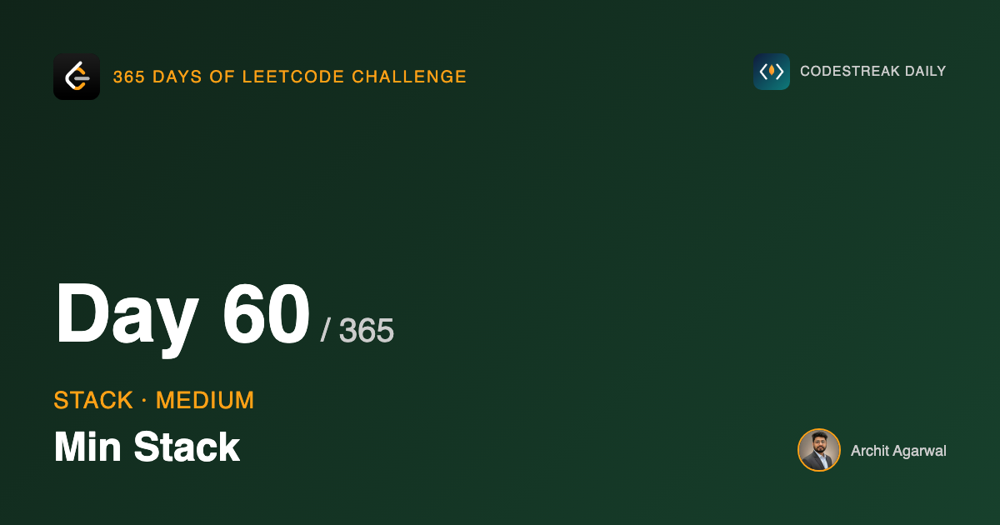
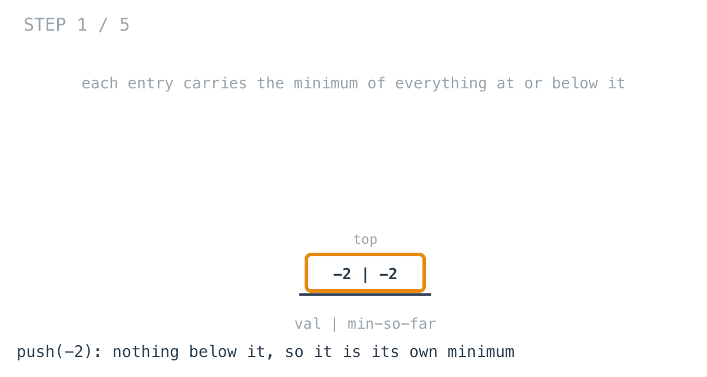
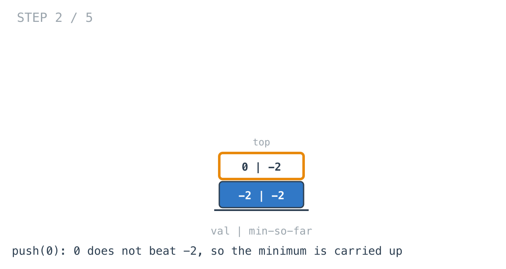
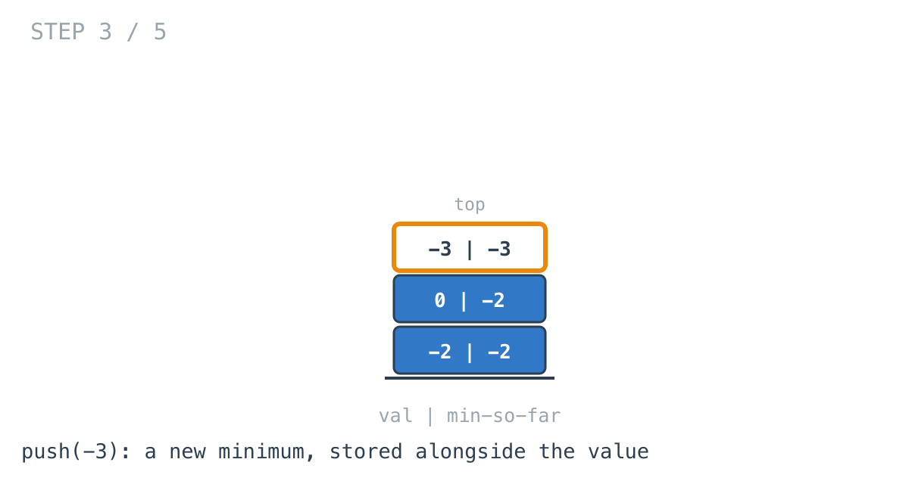
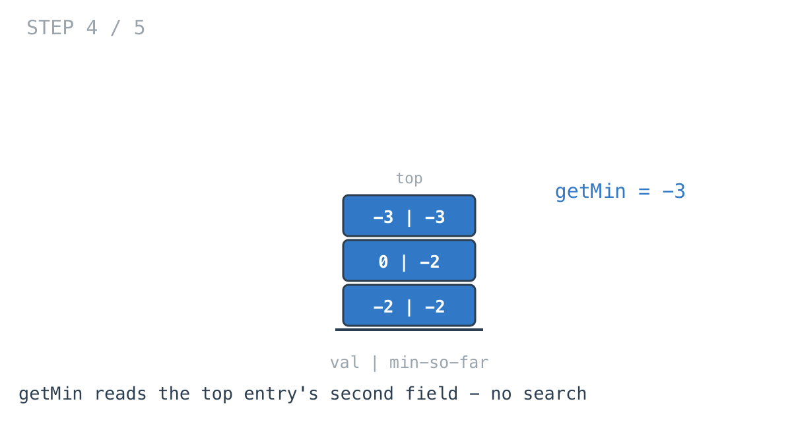
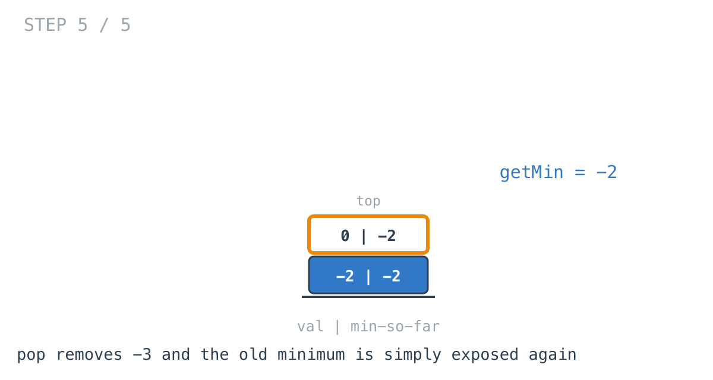

*365 Days of LeetCode Challenge — Day 60/365*

**[155. Min Stack](https://leetcode.com/problems/min-stack/)** (Medium)

Design a stack that supports `push`, `pop`, `top`, and retrieving the minimum element — all in constant time.

This is a design problem rather than an algorithm problem, and the difference matters. There is no clever traversal to find. What there is, is a decision about what to store, and that decision is forced by a failure worth walking into deliberately.

## Two fixes that do not work

**Scan the stack when asked.** `getMin` walks every element and returns the smallest. Correct, trivial, and O(n) per call. The problem says constant time, so this is ruled out by the specification rather than by taste.

**Keep a single `min` field.** On push, compare the new value against the stored minimum and update if it is smaller. `getMin` returns the field. Push stays O(1), `getMin` becomes O(1).

This one feels right, and it survives every push you throw at it.

Then you pop.

Pop the element that *is* the current minimum, and the field now holds a value that is no longer in the stack. There is nothing to recompute it from. The only way to recover the real minimum is to scan — which is the thing the field existed to avoid.

## The failure is the insight

It would be easy to treat that as a dead end and go looking for a different trick. It is better to ask precisely what went wrong.

The single field assumed the minimum is a property of *the stack*. It is not.

The minimum is a property of **the stack at a particular height**. A stack of three elements has a minimum; the same stack after a pop is a different stack with possibly a different minimum. Popping does not modify the minimum so much as travel back to an earlier one.

And the earlier one was known. It was correct at the time. The single-field design computed it, then overwrote it on the next push.

Stated that way, the fix is obvious: stop overwriting it.

## Store it per entry

```go
type dataNode struct {
	val, min int
}
```

Every entry records two things: the value that was pushed, and the minimum of everything at or below it at the moment it was pushed.

```go
func (this *MinStack) Push(val int) {
	defer func() { this.len++ }()
	if len(this.dataArr) == 0 {
		this.dataArr = append(this.dataArr, dataNode{val: val, min: val})
		return
	}
	currMin := this.GetMin()
	if currMin > val {
		currMin = val
	}
	this.dataArr = append(this.dataArr, dataNode{val: val, min: currMin})
}
```



The first entry is its own minimum, because there is nothing beneath it.



0 does not beat -2, so the existing minimum is copied up into the new entry.

That copying is worth noticing. It looks redundant — why store -2 twice? Because each entry is answering a question about its *own* height, and at height two the answer genuinely is -2. The duplication is what makes every height self-sufficient.



-3 does beat it, so this entry records a new minimum.



```go
func (this *MinStack) GetMin() int { return this.dataArr[this.len-1].min }
```

A field read. No scan, no comparison, no branch.

## The step that justifies the whole design



Now look at `Pop`:

```go
func (this *MinStack) Pop() {
	defer func() { this.len-- }()
	this.dataArr = this.dataArr[:this.len-1]
}
```

There is no minimum-maintenance code in it. None. It removes the top element and that is all.

And the minimum is correct afterwards, because removing the top exposes an entry whose `min` was computed when *that* entry was on top — and is still accurate, because nothing below it has changed since.

The previous minimum is restored for free. Not recalculated, not looked up, not adjusted. It was simply never overwritten.

That is the pleasing part of this problem. The hard operation in the naive design was pop, and in this design pop is the operation that does nothing.

## Two things in this implementation worth naming

**The `defer` in `Push` is doing something subtle.**

```go
defer func() { this.len++ }()
...
currMin := this.GetMin()
```

`Push` calls `GetMin`, which reads `dataArr[this.len-1]`. Because the increment is deferred, `this.len` at that moment still describes the stack *before* this push, so `GetMin` reads the old top. That is exactly what is needed.

It is correct, and a reader has to reconstruct the ordering to convince themselves. Incrementing explicitly would be more obvious; the `defer` earns its place by covering the early `return` in the empty-stack branch without repeating the line.

**`this.len` always equals `len(this.dataArr)`.** The struct carries both.

Nothing is wrong with it — they are kept in step everywhere. But it is two things that must agree rather than one thing that cannot disagree, and the second kind is better. Removing the field and using `len(this.dataArr)` throughout would make the inconsistency unrepresentable.

## The other standard solution

The common alternative is two stacks: one holding values, one holding only the minima, pushed to whenever a value is less than or equal to the current minimum.

It uses less space when new minima are rare, which in practice is most of the time.

It also has an edge case this version does not. Push onto the min-stack only on strictly-less-than, and a duplicated minimum gets popped once while two copies remain in the value stack, and the minimum is silently wrong from then on. The fix is to push on less-than-or-equal, and it is exactly the kind of detail that is easy to get wrong under time pressure and hard to spot in testing.

Storing a pair per entry costs more memory and has no such case. For a first implementation I would take that trade.

## Complexity

- **Time: O(1)** for all four operations, and genuinely constant rather than amortised — there is no loop anywhere in this implementation.
- **Space: O(n)**, two integers per element rather than one.

## Builds on

- [Day 58: Valid Parentheses](https://github.com/architagr/leetcode_solutions/blob/main/easy_problems/1_100/valid_parentheses/) — the same structure, now asked to answer a question about its contents rather than just hold them

Full code and the step-by-step walkthrough:
[min_stack](https://github.com/architagr/leetcode_solutions/blob/main/medium_problems/101_200/min_stack/SOLUTION.md)

---

*Solution and code by Archit Agarwal. Write-up drafted with AI assistance from the code and problem statement.*
