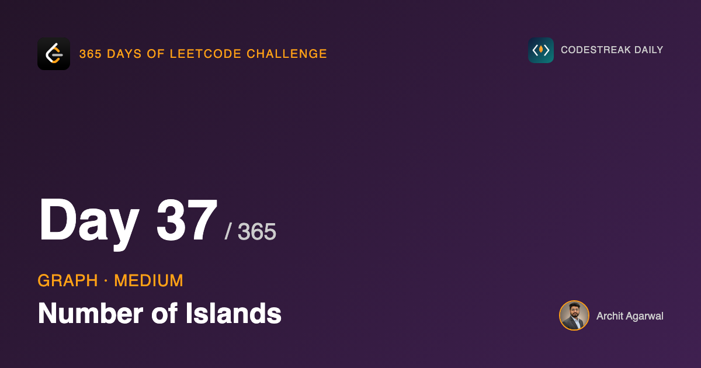
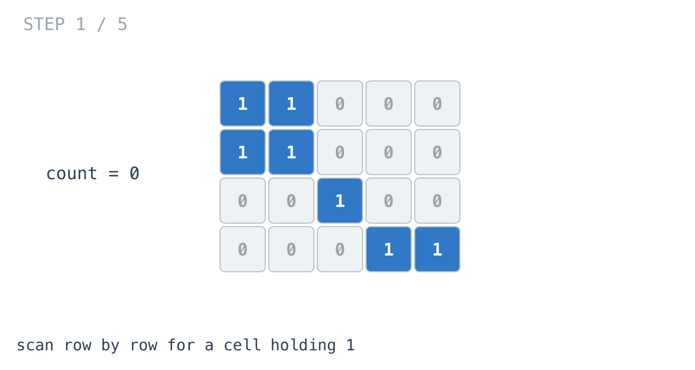
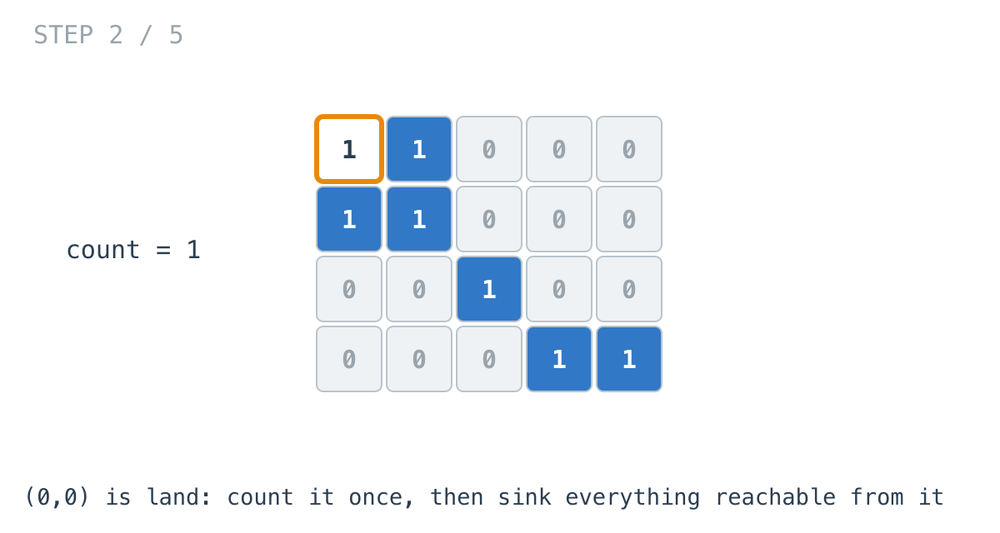
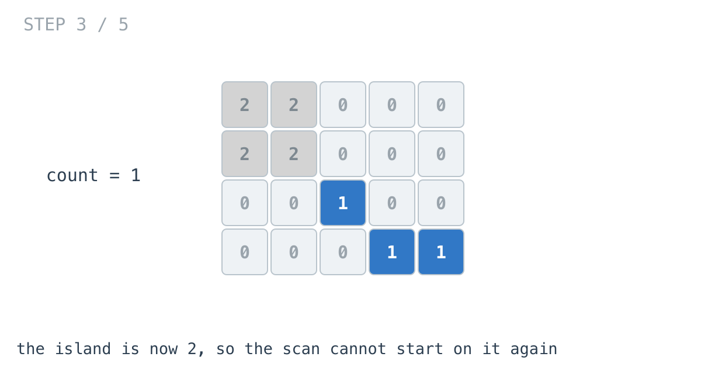
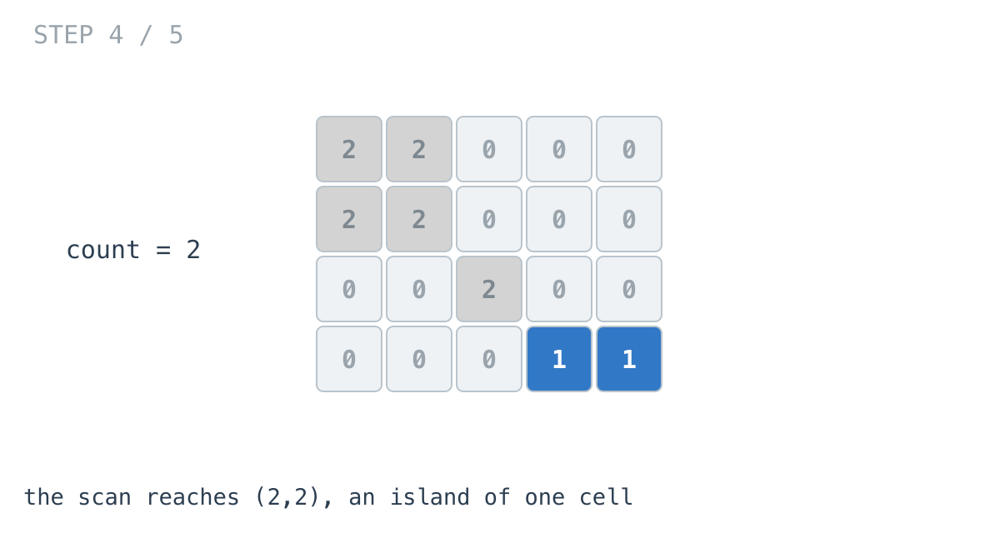
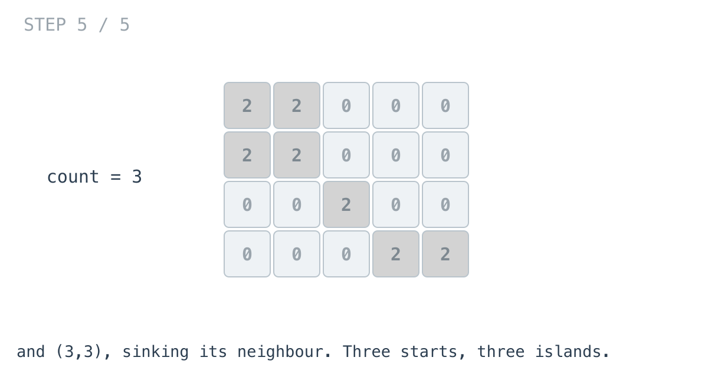

*365 Days of LeetCode Challenge — Day 37/365*

**[200. Number of Islands](https://leetcode.com/problems/number-of-islands/)** (Medium)

Count the connected groups of `1`s in a grid, where connected means touching horizontally or vertically. Diagonals do not count.

## The word "graph" does not appear in this problem

That is the entire reason it is worth doing.

Yesterday's problem announced itself. It gave you nodes, it gave you edges, it asked about a path. Today's gives you a rectangle of characters and asks you to count blobs, and if you have not met the idea before there is nothing pointing you at graph traversal at all.

But a cell is a node. Its neighbours are the cells above, below, left and right. That is a graph, stated in a different vocabulary.

And it is a graph with a convenience: there is no adjacency list to build. Yesterday half the work was converting a flat edge list into something a traversal could use. Here the edges are implied by position. Node `(i, j)`'s neighbours are `(i±1, j)` and `(i, j±1)`, computed with arithmetic rather than looked up in a structure. The expensive half of yesterday's problem is free today.

Recognising this is worth considerably more than one problem. Mazes, flood fill in an image editor, shortest route across a map, region growing in image segmentation: all the same shape, all solved by noticing the grid is a graph.

## Counting components

Yesterday's traversal answered "what can I reach from here?" That question has a useful consequence: run it from every node that has not been reached yet, and count how many times you had to start, and you have counted the connected components of the graph.

That is this problem exactly.

```go
func numIslands(grid [][]byte) int {
	count := 0
	for i := 0; i < len(grid); i++ {
		for j := 0; j < len(grid[i]); j++ {
			if grid[i][j] != '1' {
				continue
			}
			count++
			dfs(&grid, i, j)
		}
	}
	return count
}
```





When the scan finds land it adds one to the count and then removes that entire island from the grid.







I want to be precise about what `count` is measuring, because it is easy to describe loosely. It is not counting islands. It is counting *how many times the scan found land that no previous traversal had already swallowed*. Those two numbers are equal, and the second one is what the code does.

## The traversal

```go
func dfs(grid *[][]byte, i, j int) {
	if i < 0 || j < 0 || i >= len(*grid) || j >= len((*grid)[0]) || (*grid)[i][j] != '1' {
		return
	}
	(*grid)[i][j] = '2'
	dfs(grid, i-1, j)
	dfs(grid, i+1, j)
	dfs(grid, i, j-1)
	dfs(grid, i, j+1)
}
```

Seven lines, and two of them are worth dwelling on.

## One guard instead of four checks

The condition at the top handles three separate situations: the coordinate is off the grid, the cell is water, or the cell is land that has already been consumed.

Putting all three at the top of the function is what allows the four recursive calls to be completely unguarded. You can throw any coordinate at `dfs`, valid or not, and it works out for itself whether there is anything to do.

The alternative is checking before you recurse, which means the bounds test appears four times at every call site, and one of those four copies is where the typo goes.

The ordering inside the condition is also load-bearing. The bounds tests come before `(*grid)[i][j]`, and Go evaluates `||` left to right with short-circuiting, so the index is only ever evaluated once it is known to be in range. Write the value check first and the function panics on exactly the out-of-range coordinates the bounds check exists to catch.

## Sinking before recursing is about termination, not speed

```go
(*grid)[i][j] = '2'
dfs(grid, i-1, j)
```

Yesterday I made a point about marking nodes as they enter the queue rather than as they leave it, and the reason there was efficiency: marking late lets a node be enqueued several times.

Here the same rule is load-bearing for a different reason. In a grid, adjacency is mutual. If cell A is above cell B, then B is below A, and each one lists the other as a neighbour.

So if the cell is not sunk before recursing, `dfs(A)` calls `dfs(B)`, which sees A as an unvisited neighbour and calls `dfs(A)`, which calls `dfs(B)`. The recursion does not terminate. It is not slow, it is a stack overflow.

Sinking first means the re-entrant call hits the guard, sees `'2'` rather than `'1'`, and returns immediately.

## Why `'2'` rather than `'0'`

Either would work, since the guard only tests for `'1'`.

Writing `'2'` leaves the finished grid legible: `'0'` is water that was always water, `'2'` is land that a traversal consumed. Nothing in this solution reads that distinction, but when you are stepping through a failing case it is the difference between seeing what happened and guessing.

## The side effect

This function destroys the grid it was given. It returns a count and leaves the caller holding a rectangle full of `'2'`.

For a LeetCode submission that is completely fine and nobody will ever notice.

In code with a second caller it is the same problem day 23 went out of its way to avoid, and the failure has the same shape: the bug does not appear in this function, it appears in whatever touches the grid next. The fixes are the same too. Copy the grid first, or keep a separate visited structure and pay for the allocation.

I would not change this solution for the sake of it. I would want anyone reading it to have noticed.

## Complexity

- **Time: O(m x n).** The scan visits every cell once. Across every fill combined, each cell is entered at most once more, because a sunk cell is rejected at the guard.
- **Space: O(m x n)** in the worst case, and that worst case is the recursion stack rather than any data structure. A grid that is entirely land recurses as deep as it has cells.

That stack depth is the real argument for writing this as an iterative BFS instead when the grid is large. Same time complexity, bounded memory, a queue you can see. The recursive version is shorter and reads better, and on LeetCode's input sizes it is never going to blow up.

## Builds on

- [Day 1: Maximum Depth of Binary Tree](https://github.com/architagr/leetcode_solutions/blob/main/easy_problems/101_200/maximum_depth_of_binary_tree/) — the same recursion shape: visit, recurse into every child, let the base case stop you

Full code and the step-by-step walkthrough:
[number_of_islands](https://github.com/architagr/leetcode_solutions/blob/main/medium_problems/101_200/number_of_islands/SOLUTION.md)

---

*Solution and code by Archit Agarwal. Write-up drafted with AI assistance from the code and problem statement.*
