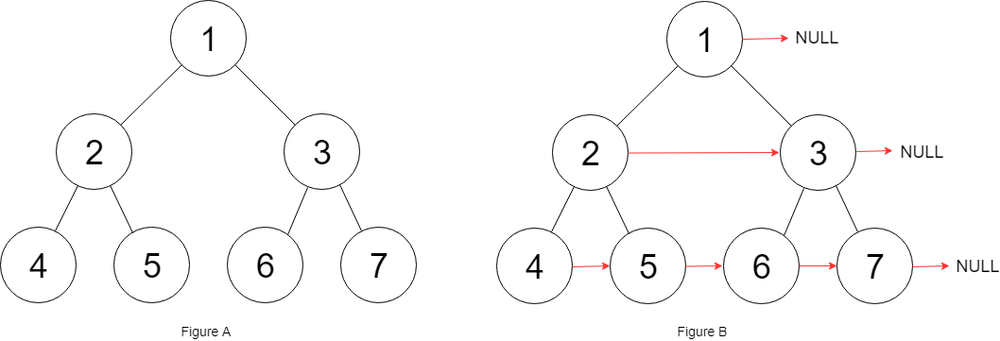
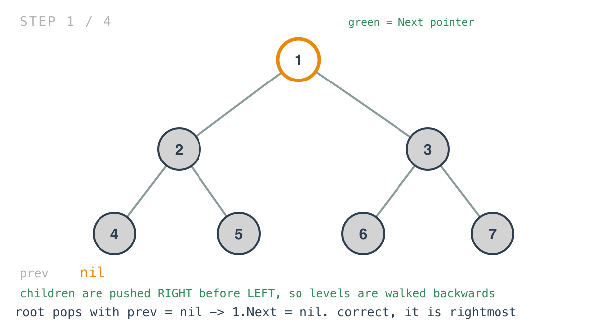
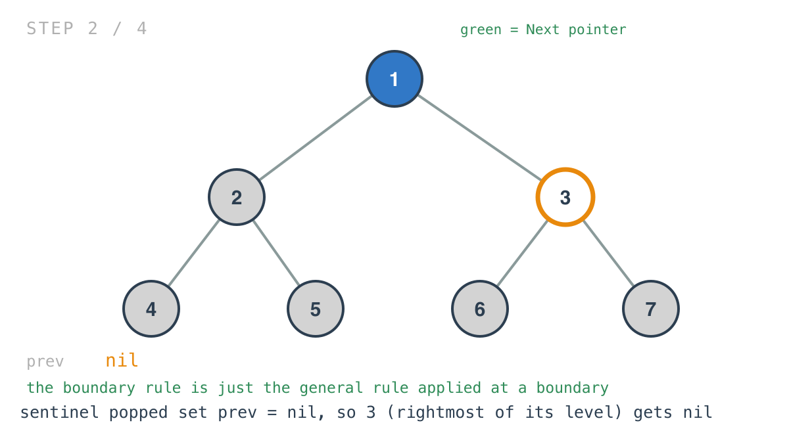
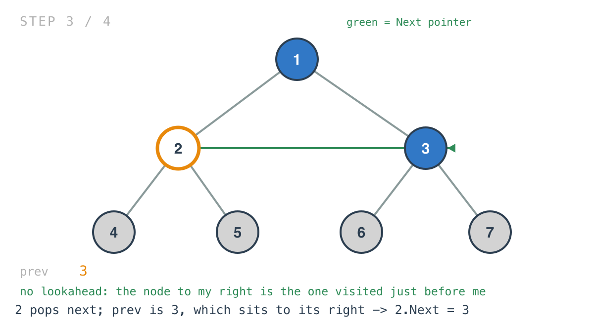
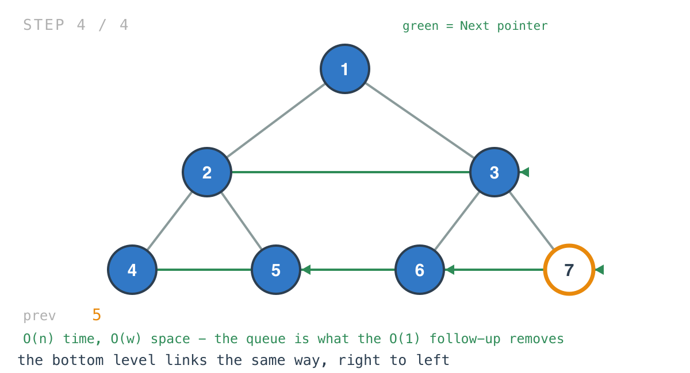

## Solution walkthrough

The implementation is `connect(root *Node) *Node` over `bfs`, in `main.go`. The `Node` type
here carries a fourth field, `Next`, which is what the problem asks to populate.



We'll trace `[1,2,3,4,5,6,7]` — a perfect tree of three levels. Expected result: each level
threaded left to right, with the rightmost node of each level pointing at nil.

1. **Nil-sentinel BFS, as in Day 30.** `push(root)` then `push(nil)`; popping the sentinel
   means a level just drained, and a fresh one is pushed if the queue still holds nodes.

2. **Children are pushed right before left.**

   ```go
   if current.Right != nil {
       push(current.Right)
   }
   if current.Left != nil {
       push(current.Left)
   }
   ```

   That single inversion is the whole idea. The BFS now visits each level from right to
   left.

3. **Which makes the link assignment trivial.**

   ```go
   current.Next = prev
   prev = current
   ```

   Walking backwards, the node to your right is the node visited just before you. So
   `current.Next = prev` reads exactly like the requirement, with no lookahead and no
   writing into a node already passed.

   The root pops first with `prev` still nil, and gets `Next = nil` — correct, since it's
   the only node on its level and therefore the rightmost.

   

4. **The boundary needs no special case.** When the sentinel is popped, the code runs
   `prev = current`, and `current` is the sentinel — nil. So the next node popped, which is
   the *rightmost* of the new level, gets `Next = nil`.

   That's exactly the rule for the rightmost node of a level, arrived at by the general
   assignment rather than by a branch testing for it.

   

5. **Then the rest of the level threads itself.** `2` pops after `3`, so `prev` is `3`,
   which is indeed the node to its right.

   

   

6. **The re-push guard, again.** `if len(queue) > 0 { push(nil) }` — without it the final
   sentinel would be re-added to an empty queue and the loop would spin forever. Same guard
   as Day 30 and Day 33.

7. **What this solution deliberately doesn't use.** The tree is guaranteed perfect, and
   nothing here depends on that. A perfect tree admits the well-known O(1)-space answer:
   walk each level using the `Next` pointers already established on the level above,
   threading the level below as you go, with no queue at all. This general BFS would work
   unchanged on problem 117, where the tree isn't perfect — which is the trade being made.

**Complexity:** O(n) time, every node pushed and popped once. Space is O(w) for the queue,
where w is the width of the widest level; in a perfect tree that's roughly n/2, which is
precisely what the O(1) approach exists to avoid.
