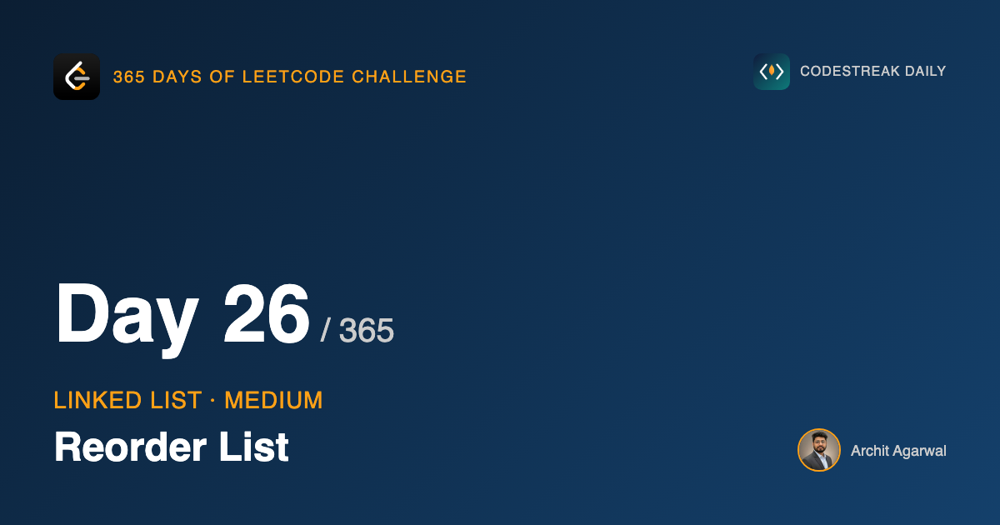
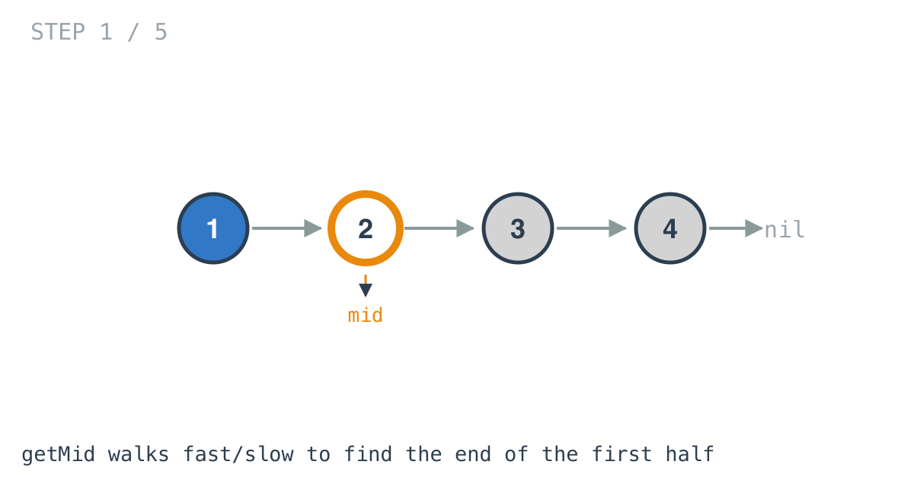
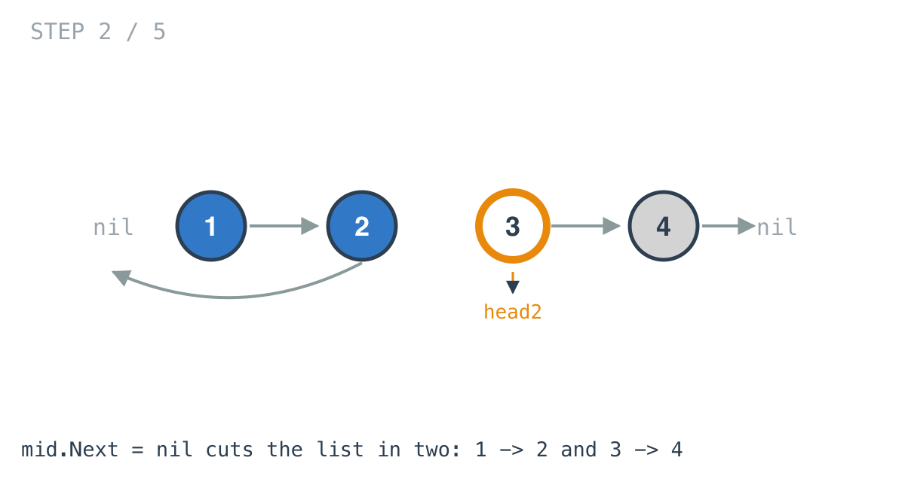
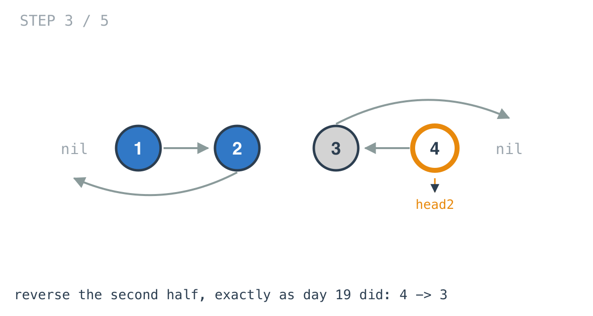
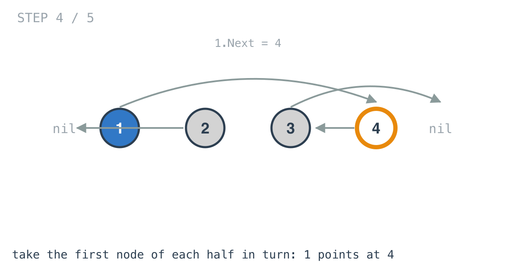
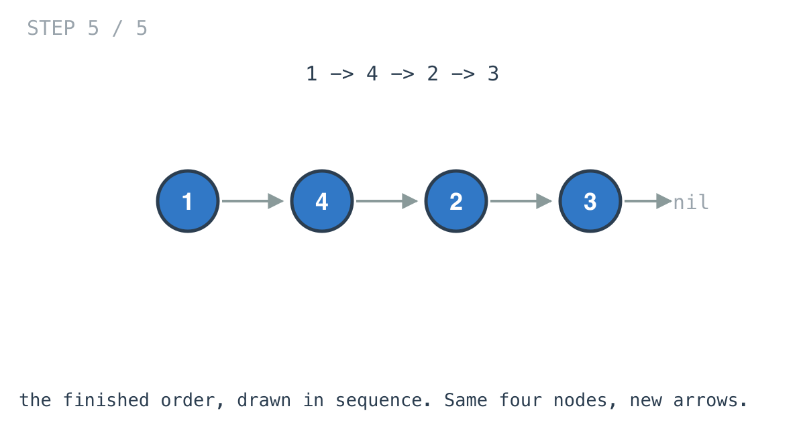

*365 Days of LeetCode Challenge — Day 26/365*

**[143. Reorder List](https://leetcode.com/problems/reorder-list/)** (Medium)

Take `L0 -> L1 -> ... -> Ln-1 -> Ln` and rearrange it into `L0 -> Ln -> L1 -> Ln-1 -> L2 -> ...`.

This is the last day of the linked list arc, and I picked it deliberately for the spot, because there is nothing new in it whatsoever. Every component is a problem from the last eight days. If the arc worked, this should feel less like a Medium and more like assembly.

## The target order is the whole problem

Look at what is being asked for:

```
L0 -> Ln -> L1 -> Ln-1 -> L2 -> Ln-2 -> ...
```

As a single sequence that is peculiar. There is no simple rule taking index i to index j, the values bounce between the two ends, and if you try to write a loop that produces it directly you will not enjoy the experience.

Now write it as two sequences instead:

```
L0, L1, L2, ...          walking forward from the start
Ln, Ln-1, Ln-2, ...      walking backward from the end
```

and take them alternately, one from each.

That is the entire insight, and everything else follows mechanically. The reorder is a merge: the list merged with its own reverse.

I find this a good example of a general thing. The difficulty was never in the manipulation. It was in the description. The problem is stated as one interleaved sequence, and it is tractable the moment you stop reading it as one sequence.

## The one obstacle

You cannot walk `Ln, Ln-1, Ln-2` on a singly linked list. There is no backward pointer.

Day 23 hit this exact wall and got over it: reverse the back half, and walking it forward is walking the original backward.

So:

1. Find where the middle is.
2. Cut there and reverse the second half.
3. Merge the two halves alternately.

## The function

```go
func reorderList(head *ListNode) {
	mid := getMid(head)
	head2 := mid.Next

	mid.Next = nil
	head2 = reverseList(head2)

	head = mergeList(head, head2)
}
```

`getMid` is day 20. `reverseList` is day 19. `mergeList` is day 22 with the value comparison taken out, because here the alternation is unconditional rather than decided by which head is smaller.

## Finding the middle, in the variant that matters

```go
for fast.Next != nil && fast.Next.Next != nil {
	fast = fast.Next.Next
	slow = slow.Next
}
```



Day 20's walk introduced this problem with the condition `fast != nil && fast.Next != nil`, and then flagged that harder problems usually want the version that stops one node earlier. This is the second problem in four days that wants it, after day 23.

The reason is identical in both cases. The node coming back is the node whose `Next` gets set to `nil`, so it has to be the last node of the first half. Day 20's own condition hands back the first node of the *second* half, which is one node too far along, and the cut then happens in the wrong place.

There is a second consequence, which is where the odd node goes when the length is odd. This variant leaves the extra node in the first half. The expected output for `[1,2,3,4,5]` is `[1,5,2,4,3]` — five items, with 3 landing last — and that only comes out right if the first half is the longer of the two.

## The cut

```go
head2 := mid.Next
mid.Next = nil
```



Save the second half, then terminate the first.

I want to give that second line more attention than it looks like it deserves, because it is one assignment that reads like housekeeping and the solution is silently broken without it.

If `mid.Next` is left alone, the first half does not end. It runs directly into the second half. And the merge walks both halves at the same time, relinking as it goes, so the first half's walk is treading on nodes the second half's walk is also moving. You get a cycle, or a truncated list, or something that passes on a four-element input and fails on a six-element one.

One assignment. It is the difference between two lists and one list pretending to be two.

## Reversing

```go
head2 = reverseList(head2)
```



Day 19's walk, with `next` hoisted out of the loop instead of declared inside it. Point each node at its predecessor, return the one that ends up first.

## The merge

```go
t, t1, t2 := a1, a1.Next, a2.Next

for a2 != nil {
	t.Next = a2
	a2.Next = t1
	t = t1
	a2 = t2
	if t1 != nil {
		t1 = t1.Next
	}
	if t2 != nil {
		t2 = t2.Next
	}
}
```



Structurally this is day 22, with the comparison removed. There is no "which head is smaller" question, because the alternation is fixed: one from the front, one from the back, repeat.

Three pointers are in flight instead of day 22's two, and the reason goes all the way back to day 19. That day's lesson was that you must save the next pointer before the assignment that destroys it. Here two lists are being relinked at the same time, so two successors have to be kept alive, which is what `t1` and `t2` are for.

The `if t1 != nil` and `if t2 != nil` guards handle the halves differing in length by one. When the shorter half runs out, advancing its saved pointer would read through `nil`.



## Returning nothing

`reorderList` has no return value, and that is right rather than an oversight.

Every step of this relinks nodes that already exist. Nothing is allocated, no node changes address, and the node the caller's `head` points at is still the first node of the reordered list when the function finishes. There is no new head to hand back.

The `head = mergeList(head, head2)` on the last line assigns to a local parameter and is invisible outside the function. It reads oddly, and it is harmless precisely because the caller's pointer was already correct.

## Complexity

- **Time: O(n).** A pass to find the middle, a pass across half the list to reverse it, a pass to merge.
- **Space: O(1).** Pointers spread across three small functions, and nothing that grows with the input.

## What the arc was for

Eight days ago this arc opened on 206, reversing a whole list, and the write-up made a point about the nodes never moving — only the arrows between them changing. Every problem since has been a variation on that, and today's is the sum of them.

If 143 looks like three function calls, that is the arc having worked. The skill being tested by problems like this is not manipulation of pointers. It is recognising that a problem you have not seen is made of problems you have.

## Builds on

- [Day 19: Reverse Linked List](https://github.com/architagr/leetcode_solutions/blob/main/easy_problems/201_300/reverse_linked_list/) — the in-place reversal, applied to the back half
- [Day 20: Middle of the Linked List](https://github.com/architagr/leetcode_solutions/blob/main/easy_problems/801_900/middle_of_the_linked_list/) — the fast/slow walk, in the variant that stops on the last node of the first half
- [Day 22: Merge Two Sorted Lists](https://github.com/architagr/leetcode_solutions/blob/main/easy_problems/1_100/merge_two_sorted_lists/) — taking alternately from two lists and relinking rather than copying

Full code and the step-by-step walkthrough:
[reorder_list](https://github.com/architagr/leetcode_solutions/blob/main/medium_problems/101_200/reorder_list/SOLUTION.md)

---

*Solution and code by Archit Agarwal. Write-up drafted with AI assistance from the code and problem statement.*
