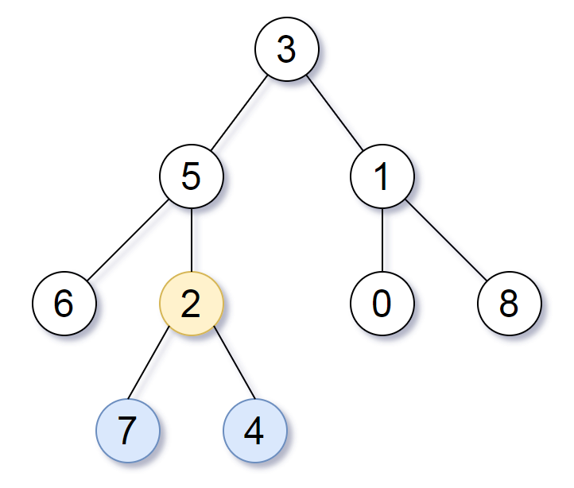
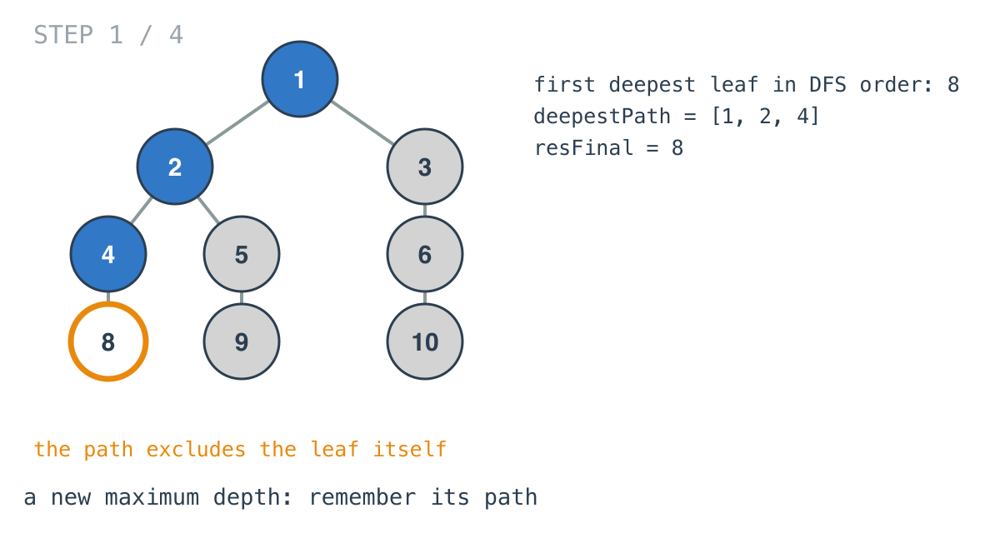
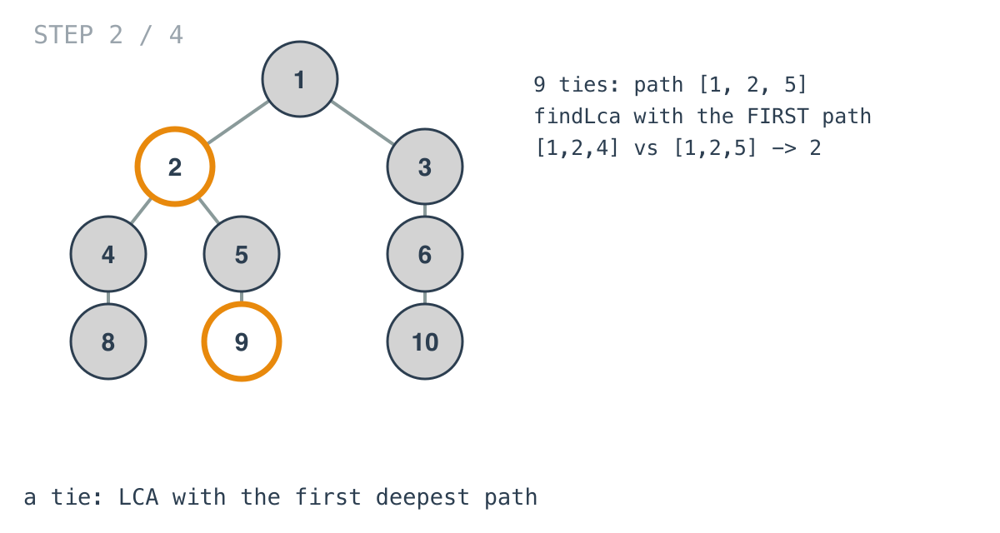
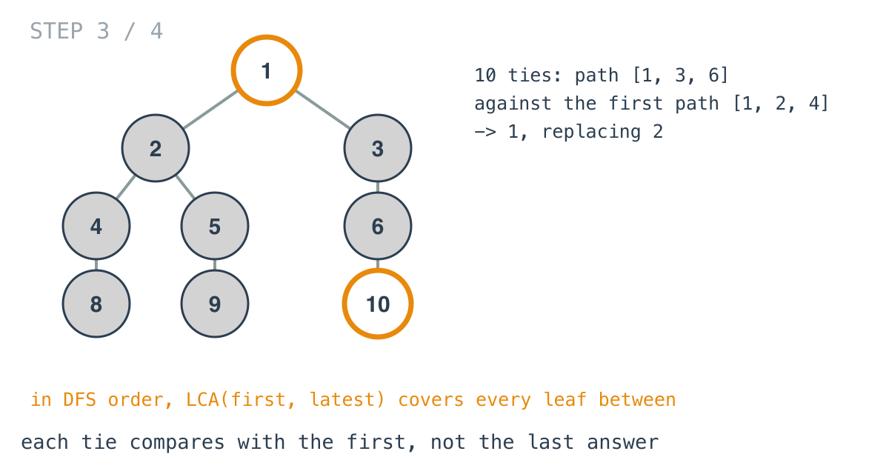
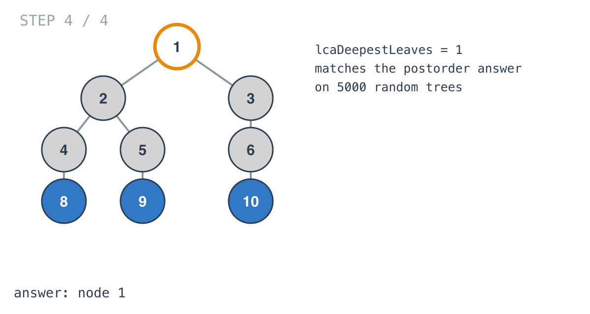

## Solution walkthrough

`lcaDeepestLeaves(root *TreeNode) *TreeNode` in `main.go` runs `process`, a DFS that carries the
list of ancestors. It remembers the first deepest leaf's path and compares every tying leaf
against it with `findLca`.

We'll use a tree whose three deepest leaves show why that works: root 1, with 2 (children 4 and
5) and 3 (child 6); leaves 8, 9 and 10 under 4, 5 and 6.

1. **A new maximum depth.** At a leaf, `path` holds its ancestors. The first leaf at depth 3 is
   8, with path `[1,2,4]`. That's longer than `deepestPath` (empty), so `deepestPath` becomes it
   and `resFinal` becomes the leaf itself.

   

2. **A tie compares with the first path.** Leaf 9 has path `[1,2,5]`, the same length.
   `findLca([1,2,5], [1,2,4])` walks both and keeps the last equal entry: 2.

   

3. **Still the first path, not the last answer.** Leaf 10 has path `[1,3,6]`. It's compared
   with `[1,2,4]` again, giving 1, which replaces 2. Because DFS visits each subtree
   contiguously, the LCA of the first and the latest deepest leaves covers every deepest leaf in
   between.

   

4. **The answer.** Node 1. On Example 1 the same steps give 2 (leaves 7 and 4).

   

Children get `newPath`, a fresh copy of `path` plus the current node, so sibling calls never
share (and overwrite) each other's lists.

**Complexity:** O(n · h) time and space.
